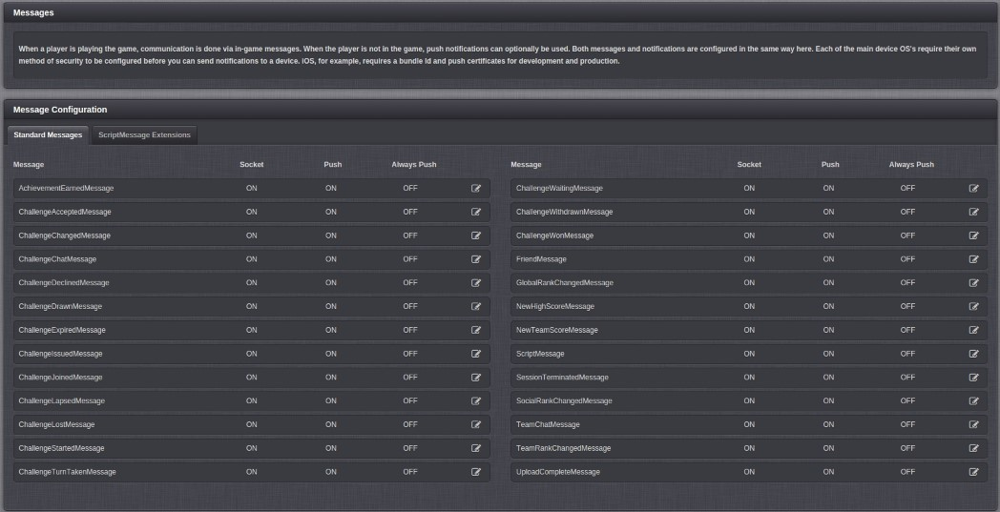
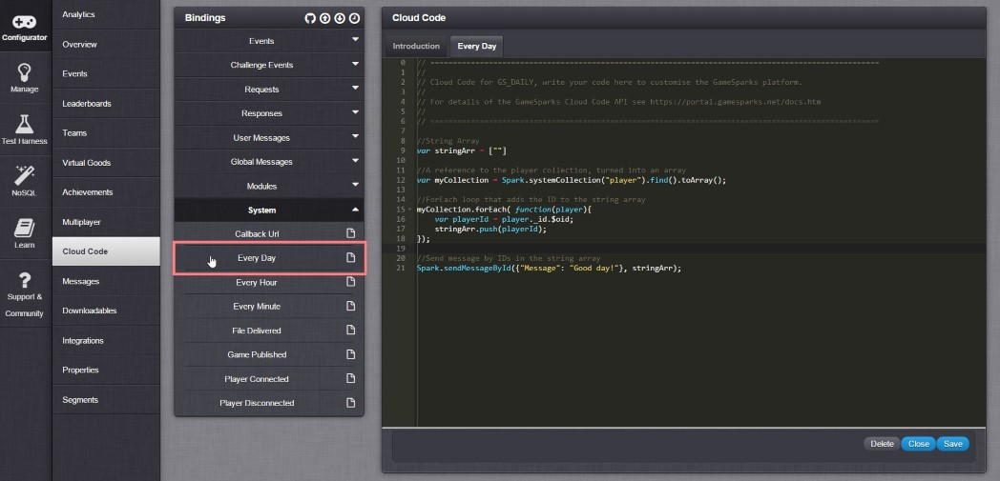

# Messages

The GameSparks platform allows you to send messages to your players.  These can be either a). in-game messages when a player is playing the game, or b). push notifications when they are not playing the game (including email if desired, via an integration with SendGrid). This section allows you to set up and configure these messages.



The Message Configuration box contains all the message types available on the platform.  Although most of these appear to relate to Challenges there are other categories supported (uploads, achievements, p2p messaging) and the 'ScriptMessage' option gives you full flexibility.

### Message Configuration

You can configure each message type by clicking on the __ icon for the desired message. You will be presented with the following screen:


* *Send Via Socket* \- Sends the message via the Socket.
* *Send As Push* \- Send the message as a push notification.
* *Suppress Push On Socket Send* \- If message is sent via the Socket, don't send it as Push as well.
* *Include In Push Count* \- Should the message be included in Push Count.
* *Message* \- The message to be sent.
* *Title* \- The title of the Message.
* *Subtitle* \- The subtitle of the Message.

### Script Message Extensions

GameSparks allows you to create custom messages using Script Message Extensions, these messages can be sent from your Cloud Code.


These Messages are uniquely identified using a ShortCode.

### Different message for different players

You can use segmentation to send player different messages through the segment configuration.. For example, you can create a segment for French players and send these players the same message but in French.


### Global, scheduled messages

The platform allows you to execute code every day, hour and minute. This allows you to send scheduled global messages. Here is an example of how to set up the messages in Cloud code in the 'Every Day' event under 'System'.  

 

```
    //String Array
    var stringArr = [""]

    //A reference to the player collection, turned into an array
    var myCollection = Spark.systemCollection("player").find().toArray();

    //ForEach loop that adds the ID to the string array
    myCollection.forEach( function(player){
        var playerId = player._id.$oid;
        stringArr.push(playerId);
    });

    //Send message by IDs in the string array
    Spark.sendMessageById({"Message": "Good day!"}, stringArr);
```

### Sending specific messages to specific players

What if you want to send a global message to specific type of player? The following loop is changed to take account the player segmentation.  

```
    //String Array
    var stringArr = [""]

    //A reference to the player collection, turned into an array
    var myCollection = Spark.systemCollection("player").find().toArray();

    //ForEach loop that adds the ID to the string array
    myCollection.forEach( function(player){
        var playerId = player._id.$oid;
        var playerSeg = Spark.loadPlayer(playerId).getSegments();
        //We want to send the global message to french players only through segmentation
        //We will only add players who's 'seg_Lang' value is 'seg_LangFrench'
        if(playerSeg.seg_Lang === "seg_LangFrench"){
          stringArr.push(playerId);  
        }

    });

    //Send message by IDs in the string array
    Spark.sendMessageById({"Message": "Good day!"}, stringArr);
```
