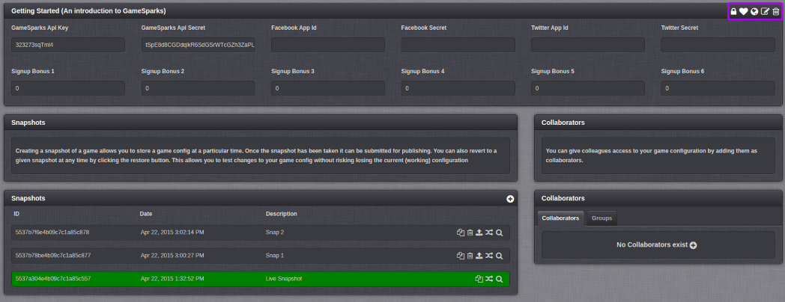

# Overview

From the Overview page you:

  * Have access to the top level information about your game.
  * Can create and manage versions of your game configurations (Snapshots).
  * Publish your game to the live servers.

The icons in the top right of the top panel (highlighted above) give you the following capabilities:

  * __ View your Games Access Secrets.
  * __ Set this game as your favorite. This will mean each time you enter the portal the current game will be shown first without having to select it.
  * __ Edit the Geo Restrictions for the game.
  * __ Edit the top level information regarding your game.
  * __ Delete this game.

### Editing the top level information for your game

The edit form has the following fields:

  * *Name* \- the name of your game, used to identify the game in the portal if you have several games
  * *Description* \- a simple description for the game
  * *Signup Bonuses* \- the amount of each of the currencies to award a new player when a new account is created

### Snapshots

The icons in the Snapshot panels give you the following capabilities:

  * __ \- Create a new Snapshot of the configuration currently in the portal.
  * __ \- Copy this Snapshot to another game.
  * __ \- Delete this Snapshot.
  * __ \- Publish this Snapshot to the live servers.
  * __ \- Revert the portal to the version contained in the Snapshot.
Click [here](/Documentation/Key Concepts/Snapshots.md) for more information about Snapshots, Versioning and Publishing.

### Access Secrets

A number of secrets exist for different types of connections:

  * *Device Api Secret* \- This is used by your devices to connect to the service as a player.
  * *Server Api Secret* \- Used for callback urls.
  * *SFTP Secret* \- Used for SFTP access for file delivery (Request access via out support system).
  * *Debug Secret* \- Used by the JavaScript remote debugger.

### Collaborators

This area allows the creation of game collaborators, these will be people that can log in with their user and view/edit the game, depending on the security settings set for them. An in-depth tutorial can be found [here](/Documentation/Configurator/Capabilities.md).
