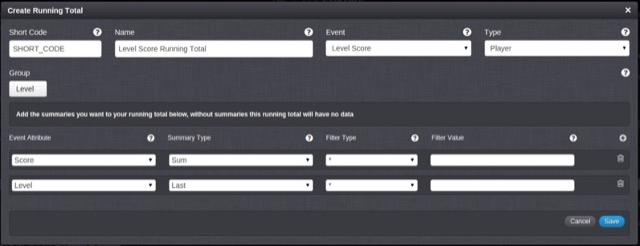
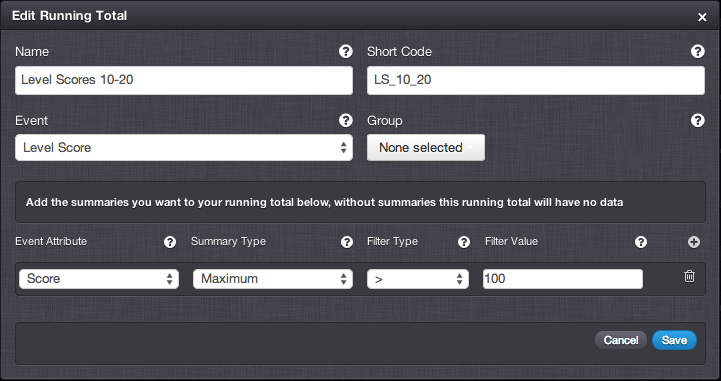
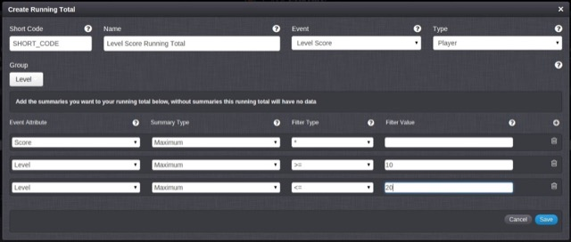

# Running Totals

[toc]

Running Totals allow you to process events using the GameSparks scoring and ranking systems. You will not need to use this page where you are creating simple Leaderboards, because the Default Calc on the Event screen will have auto created your Running Total. But for more advanced scenarios (e.g. a Leaderboard for Most Improved Player in Last [x] Weeks) you'll need to add the new custom running totals through this interface.

## Managing Running Total configurations

The Configurator Leaderboards page displays the list of Running Totals and allows you to create new Running Totals and edit or delete (non-system type) existing ones.

When a player posts an Event to the platform, all Running Totals associated with the Event are processed. An important concept is that of a *Group* attribute.

  * Running Totals without a Group attribute maintain a single record for each player that has submitted an Event that matches the criteria specified. This record can then be used within a Leaderboard to create various types of Leaderboards.
  * When a Running Total has a Group attribute(s) set there is a record maintained for a group of attributes by user.

## Creating a new Running Totals

Press the icon to create a new Running Total. The Edit/Create screen has the following fields.

  * *Short Code* - the short code of the Running Total, used by the API to allow you to identify which Running Total you want to call.
  * *Name* \- the name of the Running Total. This is used to allow you to identify it in the portal if you have several.
  * *Event* \- the Event this Running Total will process.
  * *Type* \- the Type of the running total (Player, Team).
  * *Group* \- which attributes from the Event should be used for grouping.
You can add summary fields to the running total by clicking on the plus icon. Each running total summary has the following fields
  * *Event Attribute* - the name of the Summary. This is used to allow you to identify the item in the portal if you have a number of Summaries.
  * *Summary Type*
    * *Maximum* \- the Running Total will be created to track the maximum value posted.
    * *Minimum* \- the Running Total will be created to track the minimum value posted.
    * *Sum* - the Running Total will be created to add all the values posted together.
    * *Count* - the Running Total will be created to count the number of times the player has called the event.
    * *Last *\- the Running Total will be created to track the last value posted.
  * *Filter Type & Filter Value* - allows you to control an optional filter for values tracked (<,>,* etc). Events posted that do not match the filter are ignored

*Filter Examples* Some useful examples of using filters are described below. *Only process scores over 100*

*Only include scores from levels 10 - 20.*

