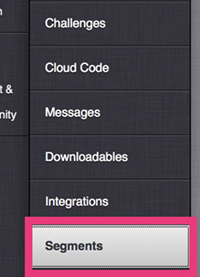
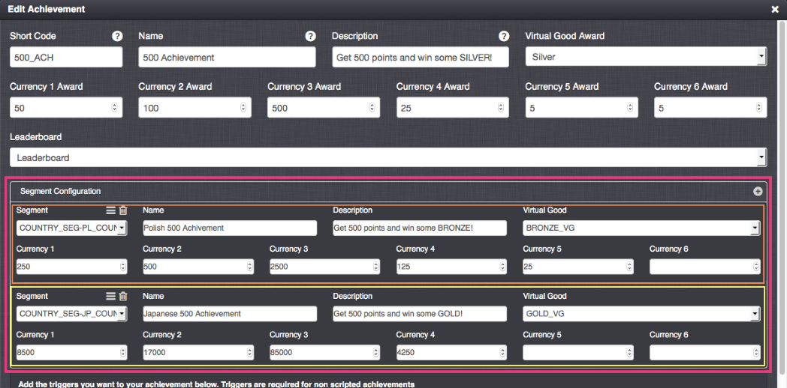
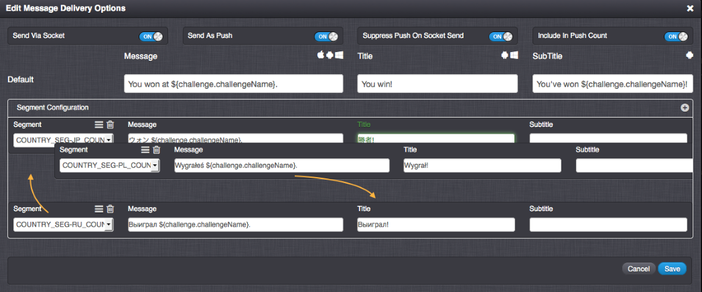

# Segments

## What are Segments?

Segments allow you to create partitions for different users and apply various rules to different areas of the platform. Segments add an extra dimension of customisation to the players behaviour.

## Example

Let's suppose I have an international blockbuster game with players connecting from all different parts of the World. In order to offer a more personalised experience for my players, I may wish to segment players by region or country. I can create a segment based on country, with segment values of the countries my players are situated in. When added to such a segment, the players will receive a different experience. For example, each segment value (or country in this case) could have different values for virtual goods, the amount of awards they receive upon obtaining an achievement, or the rates of their 6 currencies that spread across their game. What about language? A much simpler and customisable method than Geo Locations would be to introduce a language segment. Based on the users segment values for a language segment, users could receive messages for new high scores, challenges and team invitations all in their native language, as well as customising the name and descriptions of Leaderboards, Challenges, Achievements and more.

## Creating a Segment

You can create and assign multiple segments, each with their own set of values.

Segments and their respective values can be set within the Segments area: 

Within the portal, you can segment your configuration to set different parameters for different segments. For example, you can have a different price for a virtual good for a particular segment or a different virtual good award and currency reward depending on the country segment you are set to:

Segmented values within the portal can be ordered, where the order is used to find the most appropriate value for the current player.

## Social Integration with Segments

One of the most powerful features of Segmentation is that it allows for different segment types to be socially connected to different games or apps. For example, players of different nationalities or language preferences, could have segments which would socially connect them to a different version of a developer's app or game on Facebook or Twitter:

