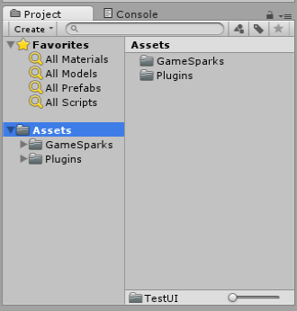
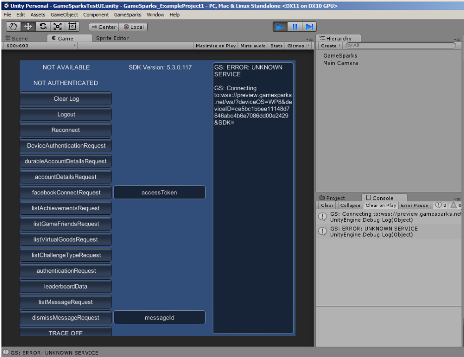
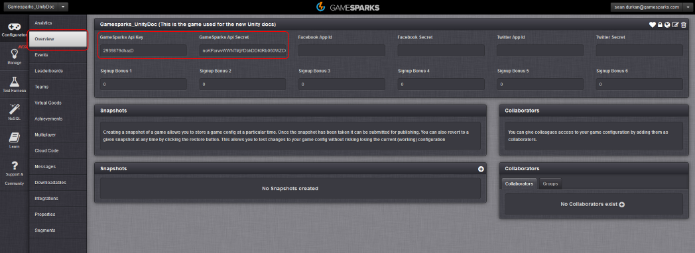
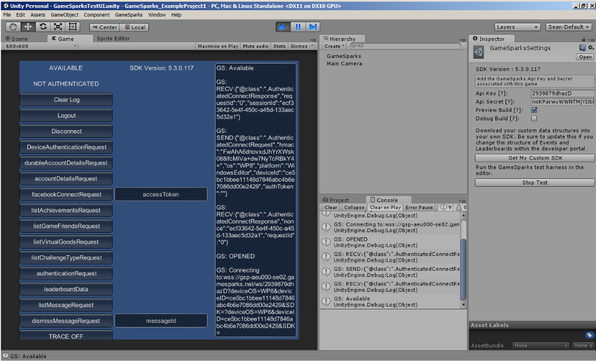

# Unity Setup

## Introduction

This tutorial will have you set up and using GameSparks in no time, even with only basic knowledge of the Unity game engine. To get started, you will need to download the GameSparks SDK. This is a Unity-package file, and so importing the SDK into Unity is very simple. You can also download our Unity example below:

Example code can be downloaded [here](http://repo.gamesparks.net/docs/tutorial-assets/UnitySetup_Tutorial.zip)

## GameSparks SDK Setup

Once you have a Unity project setup and ready, select the *Assets* tab from the top menu-bar.
From the drop-down menu, select *Import Package* and then *Custom Package* from the menu that appears.
This will prompt an explorer window to appear. From here you can navigate to where your SDK-package was downloaded. When Unity prompts you to import the package file, make sure all files are selected and click *Import*.
If the package was successfully added to project, you will see that two new folders will have been added to your project called *GameSparks* and *Plugins*.
 

## Configuring the GameSparks SDK

Now you have to link your Unity project with your GameSparks game. If you need instructions on how to create a new GameSparks game through the Portal check out the tutorial [here](./README.md).  In the GameSparks folder, that has just appeared in your project, navigate to the *Test UI* folder, and open the *GameSparksTestUI* scene.  Go ahead and play this scene and see what happens.  You will most likely see something like the scene to the right.  You can see a dialogue box on the right and some buttons indicating different requests on the left.  You can see that you get an error here *GS: ERROR: UNKNOWN SERVICE*.

### Understanding Errors - Unknown Service Error

At this stage, the GameSparks SDK still hasn't been configured or provided with any information on what it should connect to.  The error above is telling us that the SDK couldn't connect to the service. When this error occurs, check that your GameSparks details are correct.

## Enter API Key and Secret

Provide the SDK details about the game you want to connect to. For the sake of this tutorial, we are connecting to a demo game created on the GameSparks portal.  You’ll notice that there is a new tab on the top menu-bar for GameSparks. Select this and click on the *Edit Settings* option. You will see *GameSparks Settings* appear in the inspector window.  You need to update the *API Key* and *API Secret* with the key and secret from your game. These can be obtained from the Overview page of the GameSparks Portal.  Copy both the API Key and Secret into the Unity inspector window. Hit the *Test Configuration* button and you should see a whole-load of info popup in the dialogue box, eventually including a log stating that GameSparks is available. Congratulations, you are now connected to your GameSparks game.

### Still Getting - Unknown Service Error?

Still seeing the *GS: ERROR UNKNOWN SERVICE* message? Be sure there are no trailing or preceding spaces in the fields. Please check that the code you enter in the GameSparks Settings contains no space characters.

## Other SDK Settings

You can see that there are a few other settings available for the Unity SDK, but for the initial setup you don’t need to worry about them, so feel free to skip this part if you are keen to get started.

  * *Preview Build Option* - This allows you to connect the SDK to preview builds of your game.
  * *Debug Build Option* - With this option on, your game will receive extra web-sockets information.
  * *Custom SDK* - This will check your GameSparks game for custom Events, Leaderboards, etc. and create a C# file with custom functions.
You are now setup and connected to GameSparks. The next section will show you how to register and authenticate players on your GameSparks game, through the Unity game engine.
