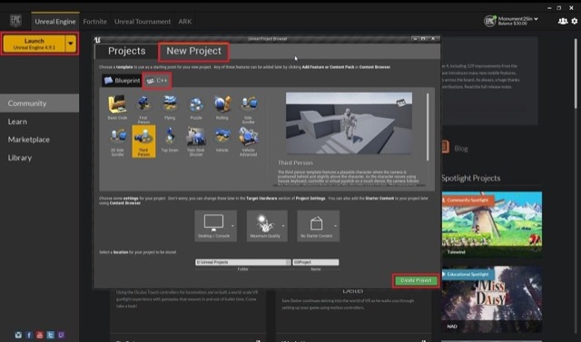
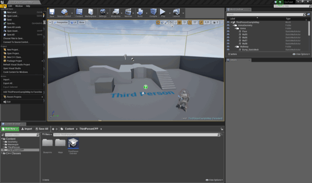
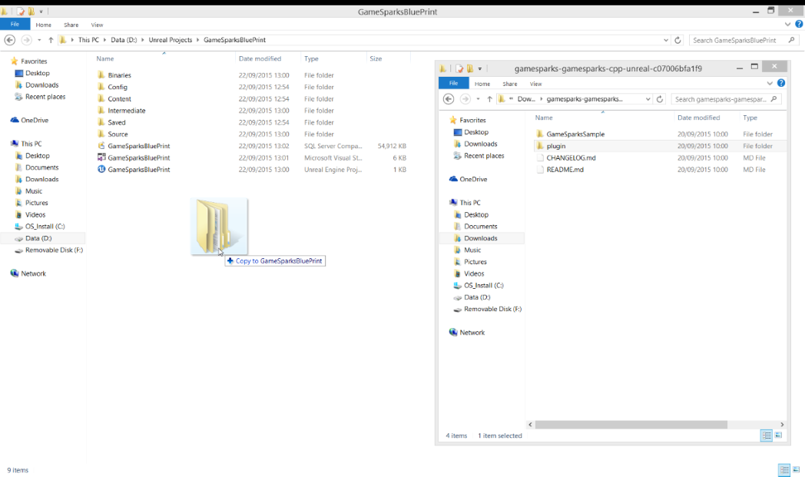
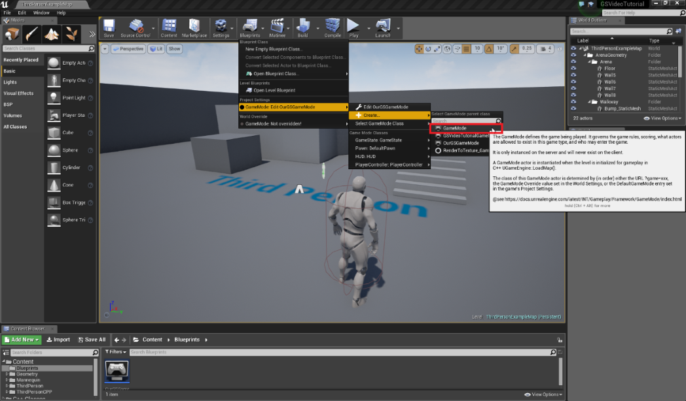
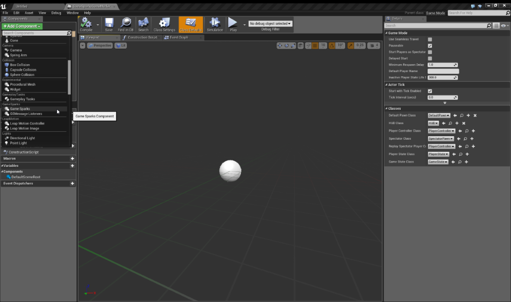
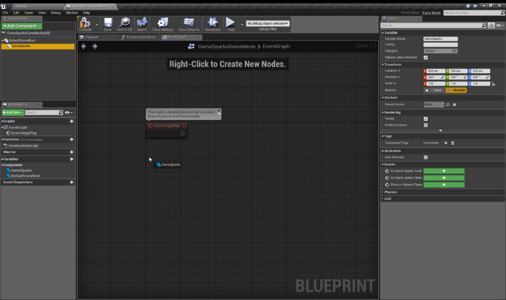
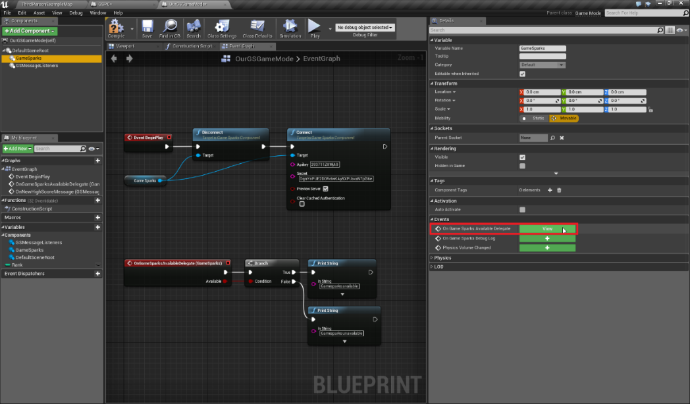

# Unreal Setup

## Introduction

This tutorial will guide you through the process of setting up your Unreal game and integrating the GameSparks plugin.

## SDK Download & Setup

Here are the things that are required to Compile and Run the Unreal Engine SDK provided by GameSparks.

  * [Unreal Engine](https://www.unrealengine.com/dashboard).
  * GameSparks [SDK](https://bitbucket.org/gamesparks/gamesparks-cpp-unreal/downloads) for Unreal Engine.
  * Compiler based on your OS.
    * Windows - [Visual Studio 2013](https://www.visualstudio.com/en-us/downloads/download-visual-studio-vs.aspx)
    * Mac OSX - [Xcode](https://developer.apple.com/xcode/download/)

Once you've downloaded the required tools and installed them successfully, you are now ready to start developing. The following tutorial will walk you through integrating the GameSparks SDK into your game, guiding you through the different steps that are needed depending on whether you are creating a new game, an existing Blueprint or a Mixed Project.

## Creating a New Mixed Project

Launch the Unreal Engine from the Epic Launcher and you will be prompted with the Unreal Engine project browser. Here, select the "New Project" tab, and then select the C++ tab. You will then need to select your game template (we've used Third Person Template in our Tutorials), name your project and click "Create Project". You have now successfully created a Mixed Project and you can skip the Blueprint Only Project tab and move on to the Mixed Project tutorial.

## Blueprint Only Project

If your game is a Blueprint only project with no C++ files, you will need to modify it to ensure you have have the right components to compile the GameSparks SDK and build your game without any issues. To do this, all you have to do is create a new C++ Class in your project. Click File>New C++ Class... in your Unreal Engine. At this point you will be prompted to select a Parent Class, here select "*None*", then click Next. Finally name your class and mark it as *private* (This is a C++ specific differentiation which won’t matter to us at this point). Hit "Create Class" to initiate the generation of C++ files for your game. Your game is now a mixed project and is ready to receive the GameSparks SDK files. This will be covered in the next section.

## Mixed Project

To enable the GameSparks SDK in your Unreal Engine Project, you will have to grab the "*plugin*" folder from the SDK you've downloaded and move it to your Project folder. Be sure to rename this folder as "*Plugins*", otherwise the folder will not be recognised by the Unreal Engine Compiler.

To compile the plugin, simply run the *.uproject* file (If you don't have Visual or XCode installed this step will not work). When the Project has been compiled, you will want to connect it to GameSparks Service, to ensure everything's working as intended. Now you must create your own custom Blueprint Game Mode, which will house the connection between the Game and the Service. To do this simply follow the steps shown.

Once the new Game Mode has been created, make a new GameSparks Component for it.

Now you will need to drag & drop the component into the Event Graph pane in Unreal Engine. This will allow you to call the GameSparks Functions within the Editor.

For this tutorial we will be using the pre-built "*Begin Play*" Event to connect to the GameSparks Service. Because a reference to the GameSparks object is available in the Event Graph, you can "Drag Off" two functions from it, one should be "*Disconnect*" and the other one should be "*Connect*". Link everything together with "*Begin Play*" Event which can be seen below. Note: The "Connect" function will require your GameSparks *API* *Key* and *Secret* to work. If you've forgotten these, refer to the Game Setup guide which can be found [here](./README.md).

At this point you'll want to receive feedback from the module to ensure that you have actually connected. To achieve this you need an "*OnGameSparksAvailableDelegate*" Event from the GameSparks component. By clicking on the GameSparks component you will see the Event has linked to it and can be clicked and dropped into the Event Graph. When you've added the "*OnGameSparksAvailableDelegate*" Event you will get an extremely useful tool to check whether your GameSparks connection is valid. You use the Event Graph to output some information about the connection to GameSparks.

The above Event Graph will try to connect to the GameSparks Service and print out a string whether the connection is valid or not. Now simply click "Play" and you should be connected to GameSparks successfully.
