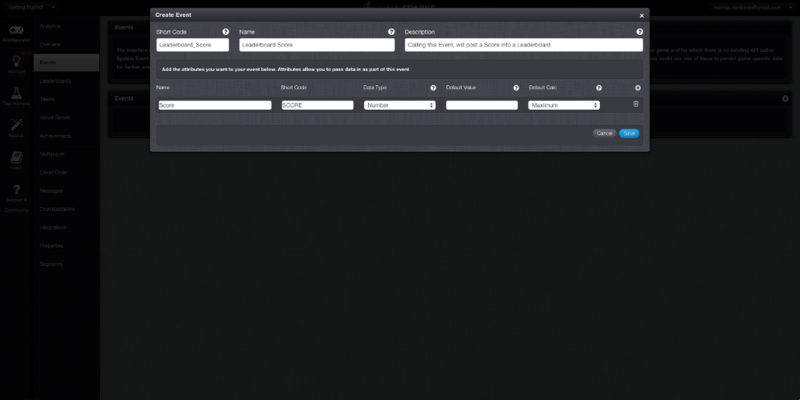
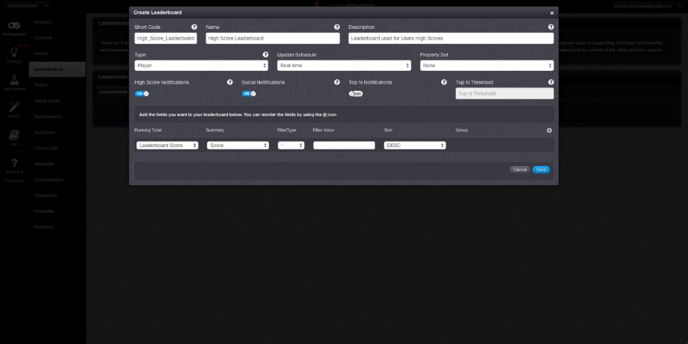
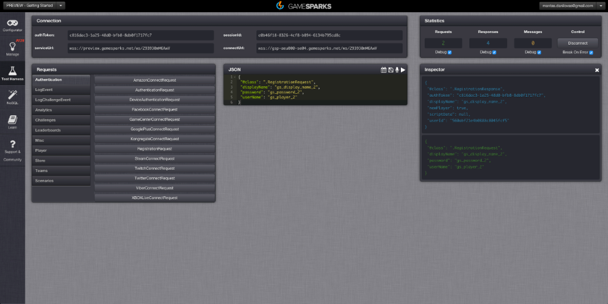
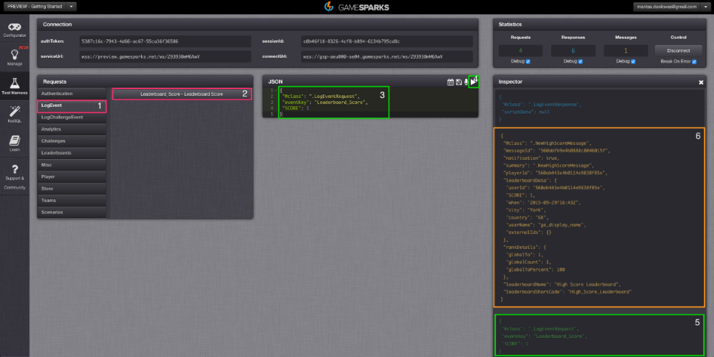
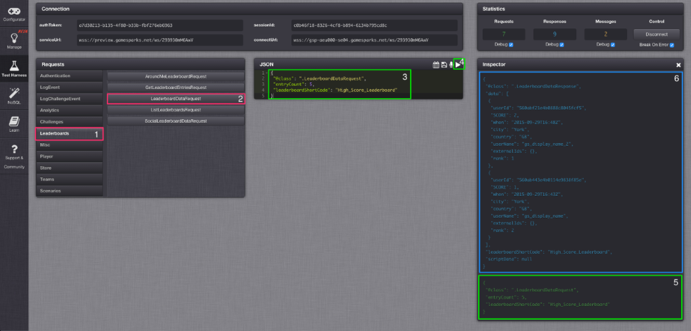

# Creating a Leaderboard

## Introduction

Leaderboards are typically restricted to tracking and reporting the leading players in a game. GameSparks leaderboards offer you much wider and flexible scope, both for tracking comparisons within your player pool and for controlling how comparisons are displayed in-game to players:
* Complex comparison scenarios - define what and how players will be compared.
* Meaningful player displays - monitor player performance and provide in-game filters to flexibly display comparisons to players.
* In-game notifications - supports dynamic messaging for your player groups.
* Rich socialisation features - provides a robust framework for building social and competitive features into your game

In this tutorial we will go over the simple processes involved in creating an Event, attaching it to a Leaderboard, posting a score, and receiving a HighScore Message.

## Event

First you will need to navigate to the Events page in your Configurator. Next, add a new Event with the following parameters (shown below). For an in-depth guide about Events click [here](/Documentation/Configurator/Events.md):

  * **Short Code** - This field is the reference by which we will call the Event, these are always unique.
  * **Name** - This field is used when representing the Event in Test Harness as well as [Cloud Code](/Documentation/Configurator/Cloud Code.md).
  * **Description** - This field is used to display what the Event is used for, this is primarily for your benefit in the Events Configurator.
  * **Attribute Name** - This field is referenced in Test Harness and Leaderboards.
  * **Attribute Short Code** - This is the reference we'll be using to pass in an attribute into the Event.
  * **Data Type** - The type of data being passed in. E.g. String, Number, JSON.
  * **Default Value** - This would be the default value that would be used for this Event attribute if it's not passed into the [logEventRequest](/API Documentation/Request API/Player/LogEventRequest.md).
  * **Default Calculation** - This determines how values are tracked in the Running Totals.

<q>**Note:** You do not need to understand the concept of Running Totals for this tutorial, just set it to Maximum because we want to track the highest score posted for your player. (To learn more about running totals, see [this](/Documentation/Test Harness/README.md) tutorial)</q>

## Leaderboard

To create a leaderboard, first you will need to navigate to the Leaderboards page in your Configurator. Next, add a new Leaderboard with the following parameters. For an in-depth guide about Leaderboards click [here](/Documentation/Configurator/Leaderboards.md). All parameters that are not listed below can be left as default: 

  * Short Code - This is the reference by which we will call the Leaderboard, these are always unique.
  * Name - This field is used as a reference in the Test Harness.
  * Description - This field is used to display what the Leaderboard is used for, this is primarily for your benefit in the Leaderboards Configurator.
  * Running Total - This will be the Name of the Event we've previously created.
  * Summary - This is the attribute you have set up in your Event.
  * Sort - How do you want your values to be sorted. E.g. DESC, ASC, NONE.

  

## Test Harness

When you've created your Leaderboard, navigate to the Test Harness. At this point follow the steps you've used in the [Authentication](/Documentation/Key Concepts/Authentication.md) tutorial to create a second player.

*Re-authenticate* using your *first* player. The authentication tutorial used username: *gs_player *and password: *gs_password*. Once this is completed, you will need to click on [logEventRequest](/API Documentation/Request API/Player/LogEventRequest.md) and select the Event you have created previously. In the JSON builder, change the Score attribute of the Event to *1* and click Play. This will log an Event, and since the Event is attached to a Leaderboard, it will post a score into that Leaderboard. The player will then receive a [NewHighScoreMessage](/API Documentation/Message API/Leaderboards/NewHighScoreMessage.md) indicating that their score has been updated in the Leaderboard. Repeat this process for the *second* player, but this time entering a score of *2*:

You can now validate that the Leaderboard has worked correctly, our sorting has taken place and both player scores have been logged by calling a [LeaderboardDataRequest](/API Documentation/Request API/Leaderboards/LeaderboardDataRequest.md), passing in the Leaderboard Short Code and the Entry Count. Note: You will have additional JSON fields pre-filled, simply remove those as they are not used in this tutorial, all you need is *leaderboardShortCode* and *entryCount*.

 
____

##  Listing Entries

 To print out the entries of a leaderboard or entries specific to a player, follow this tutorial [here](/Tutorials/Social Features/Leaderboards Entries.md).

|   |   |   |
|---|---|---|
