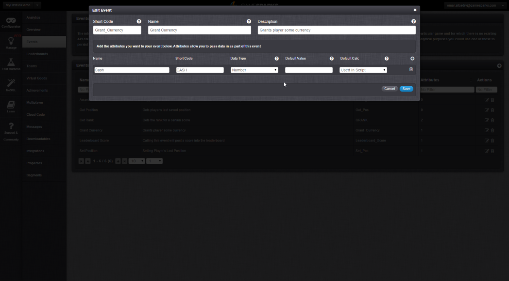
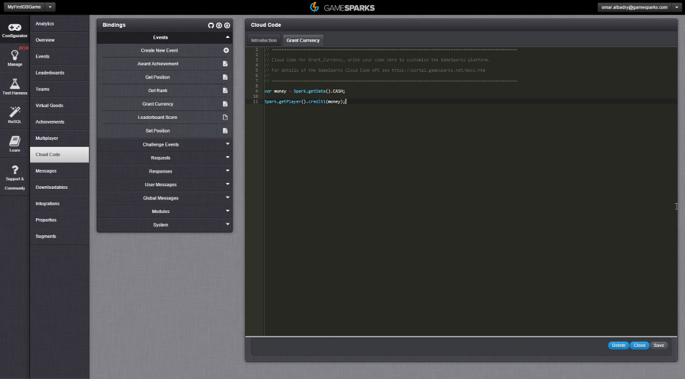
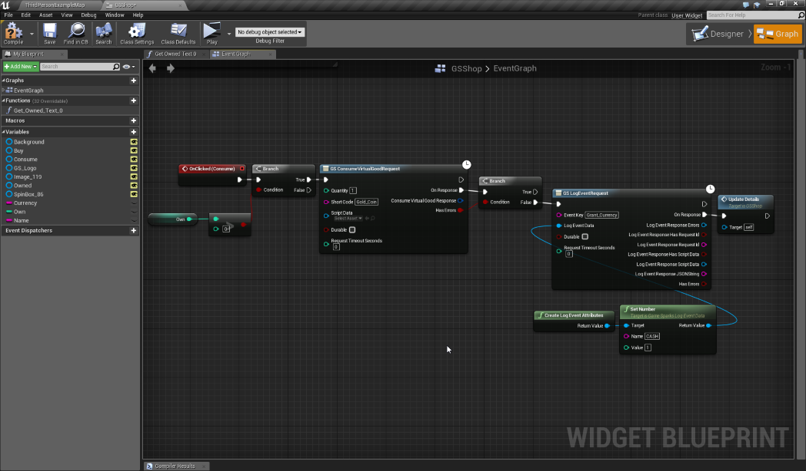
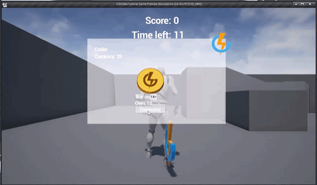

# Unreal Virtual Goods

## Introduction

After following the tutorial [Creating a Virtual Good](./README.md), you can now create the ability to buy them, consume them and retrieve a list of what exactly your authenticated player has in their inventory. * Setting up the Shop Screen*

  * Make a shop screen for the user to buy and consume Virtual Goods.
  * The shop needs to update the players Currency and the number of owned Virtual Goods.
*Buying a Virtual Good*

  * Use a GS *BuyVirtualGoodRequest* node to purchase Virtual Goods by passing in the Currency type, quantity and the Short Code values.
  * Update the details of the authenticated player straight after.
*Consuming a Virtual Good*

  * Use a GS *ConsumeVirtualGoodRequest* node to consume Virtual Goods by passing in the quantity and the Short Code values.
  * Log an Event called '*Grant Currency*' to credit the player with extra currency by passing in the '*Cash*' attribute.
  * Update the player details.
*Using the Shop*

  * Click the buy and consume buttons to change the currency and the number of Virtual Goods owned.
  * Ensure that details are being correctly updated.

[wpdm_file id=32 title="true" ]

## Using Virtual Goods

### Creating the 'Grant Currency' Event

Create an Event that credits the *authenticated* player with extra currency. Add an *attribute* that will be used to indicate the amount to credit. This event will be logged whenever the *authenticated* player *consumes* a Gold Coin Virtual Good.

In the Events *Cloud Code,* create a variable that holds the amount being passed in the event through the *'CASH' attribute* and name it 'money'. Now get the Player object using *getPlayer* and credit them currency1 by the 'money' value.

### Setting up the Shop Screen

Create a shop screen in your game, with one item for sale, the Gold Coin. The *authenticated* player is going to have the option to *buy* and *consume* gold coins. The* player* will also be able to see how many Gold Coins the they have in their inventory and how much *currency* they hold in their Currency1 slot.

When the player transitions to the shop screen, the values for players Display Name, Currency and the amount of Gold Coins owned need to be updated. To update the values, request them using *GS AccountDetailsRequest* node. To retrieve the amount of gold coins owned, use the node '*Get Number*' dragged from the *'Account DetailsResponseVirtualGoods'* port on the *AccountDetailsRequest *node with the *Short code* of the item you're looking for, for this example it is '*Gold_Coin'*.

### Clicking Buy

When the *Buy* button is clicked, a Gold Coin needs to be purchased. To buy a Virtual Good, call the *BuyVirtualGoodRequest* node which takes the type of *currency*, *quantity* and the *Short code* for the item being bought, which in this case is "*Gold_Coin*". After the player has purchased a Virtual Good, update their details so they are aware of the change.

### Clicking Consume

Check to see if the player has Gold Coins to consume. If the player has enough Gold Coins, call the *GS ConsumeVirtualGoodRequest *node which takes a *quantity* and the *Short* *Code* of the Virtual Good.* *The *ConsumeVirtualGood* Event* *automatically decrements the overall *quantity* owned in the players inventory. After the Gold Coin is *consumed,* log the '*Grant_Currency*' event to accredit the *authenticated* player with a value of 1 passed through the '*CASH' *attribute*.*

### Using the Shop

If the *authenticated* player uses the shop they should be able to *buy* and *consume* the Gold Coin Virtual Good and see their information update correctly.

