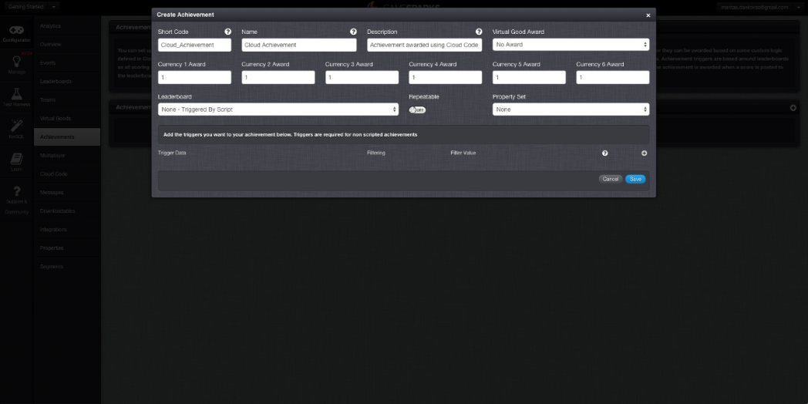
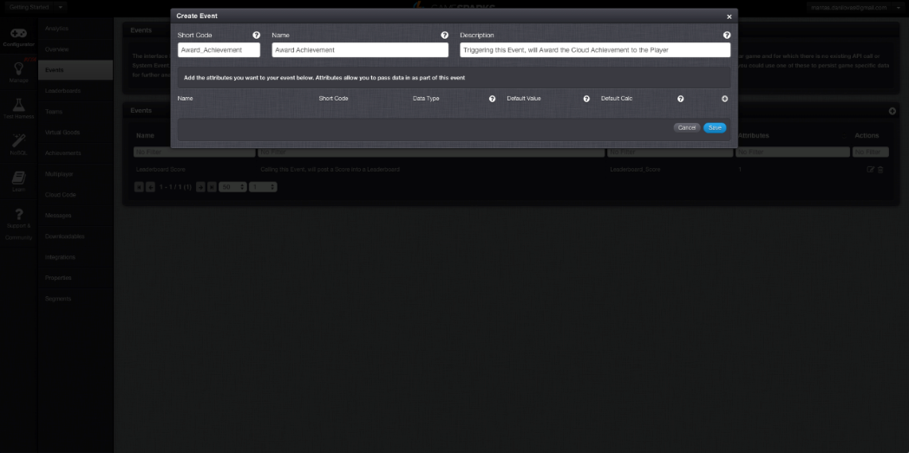
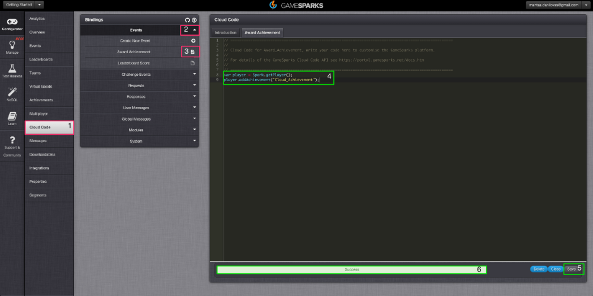
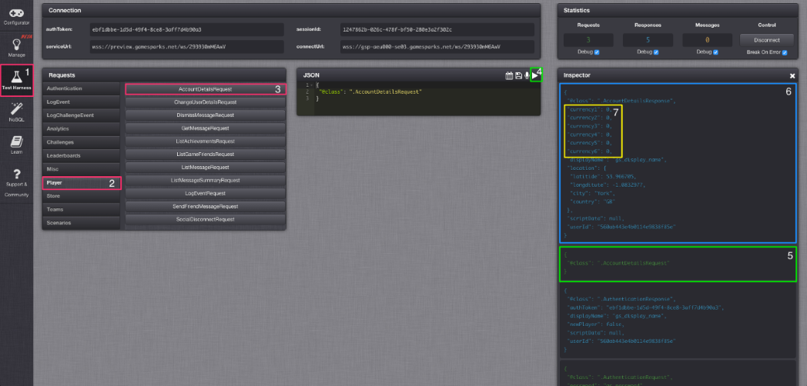
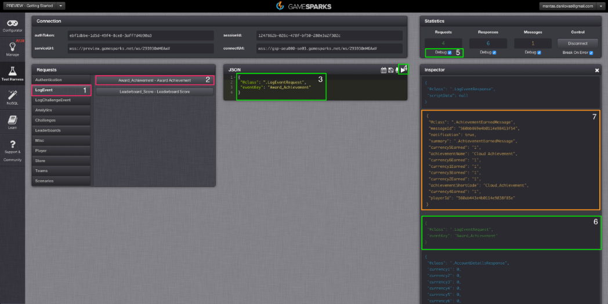
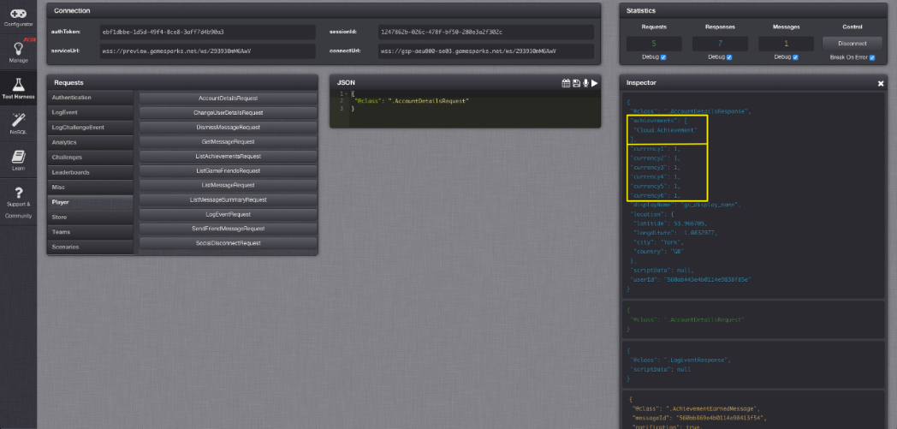

# Creating an Achievement

## Introduction

GameSparks Achievements help to support the rewarding of players for accomplishments within a game and are highly configurable with respect to both the reward, and the criteria for when it is delivered. This feature can support traditional achievements systems where virtual goods (E.g. badges or items) are won for particular tasks, or combination of tasks, being completed. They can also be used to reward level completion or XP progress bonuses, basic “crafting”, and rewards for breaking into the top [x] of a Leaderboard.

Achievements are cross-platform. This conveniently means you do not have to set them up in each store and can support cross-platform play for your game. This is because game-progress can be tracked, allowing rewards to be used across multiple platforms.

Achievements can be awarded through Leaderboard Events, or based on some custom logic defined in Cloud Code.

In this section you will learn how to award an Achievement using custom Cloud Code. To do this, you will need to create an Achievement, create an Event, Attach Custom Cloud Code to the Event and then finally run the Event.

## Achievement

First you will need to navigate to the Achievements page in your Configurator. Next, add a new Achievement with the following parameters (shown below). For an in-depth guide about Achievements click [here](/Documentation/Configurator/Achievements.md). All parameters that are not listed below can be left as default.

  * Short Code - This is the reference by which we will award the Achievement, these are always unique.
  * Name - This field is used when listing Achievements in all of the Returns.
  * Description - This field is used to display what the Achievement is used for, this is primarily for your benefit in the Achievements Configurator.
  * Currency 1-6 - The amount of each currency that will be awarded when the Achievement is earned.
  * Leaderboard - This field is used to either setup a Leaderboard or Script Trigger, for us it's Script.

## Event

Following the Achievement Creation, you will need to create a new Event, reference back to [Creating a Leaderboard](/Getting Started/Creating A Leaderboard/README.md) if needed.

## Cloud Code

After the Event has been configured, you'll need to attach some custom Cloud Code to it to award the Achievement when the Event is called. To do so, Navigate to the Configurator > Cloud Code > Events > Award Achievement (That's the Name of the Event). At this point you will notice the Cloud Code editor open for the Event. This is where you will need to add your custom Cloud Code. Simply click save and you should see a *Success* alert.

This piece of Cloud Code takes hold of the player object that is currently authenticated:

    var player = Spark.getPlayer();

This piece of Cloud Code actually awards the Achievement to the player:

    player.addAchievement("Cloud_Achievement");

Hit save and at that point the Achievement is fully configured to be awarded.

## Test Harness

Now since everything is set up, you will now need to navigate to the Test Harness and authenticate with one of the players you have previously [registered](/Getting Started/Using Authentication/README.md). At this point the Achievement you have configured awards some currency, and now you need to validate that the player currently doesn't have any currency associated with their account. To do this you will need to select Player tab and send an [AccountDetailsRequest](/API Documentation/Request API/Player/AccountDetailsRequest.md).

Now you will need to send the [LogEventRequest](/API Documentation/Request API/Player/LogEventRequest.md) for the Event you've configured earlier called "*Award_Achievement*". This will award the Achievement to the currently authenticated player and send the [AchievementEarnedMessage](/API Documentation/Message API/Player/AchievementEarnedMessage.md). Additionally if you have debug mode enabled on your requests, the debugger should activate and you will be able to step through your Cloud Code. This only happens if your Requests/Responses/Messages have Cloud Code attached to them. You can read more about debugging Cloud Code [here](/Documentation/Test Harness/Debugger.md). After you've stepped through or exited the debugger, your player will be awarded the Achievement you've configured.

Finally you can validate that the currency was awarded by calling the [AccountDetailsRequest](/API Documentation/Request API/Player/AccountDetailsRequest.md).

   

Continue the tutorial for your chosen SDK:

|   |   |   |
|---|---|---|
