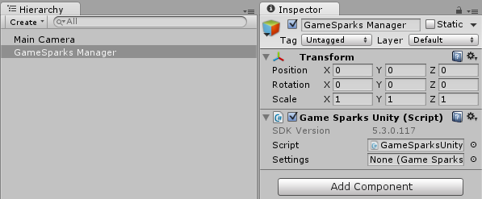
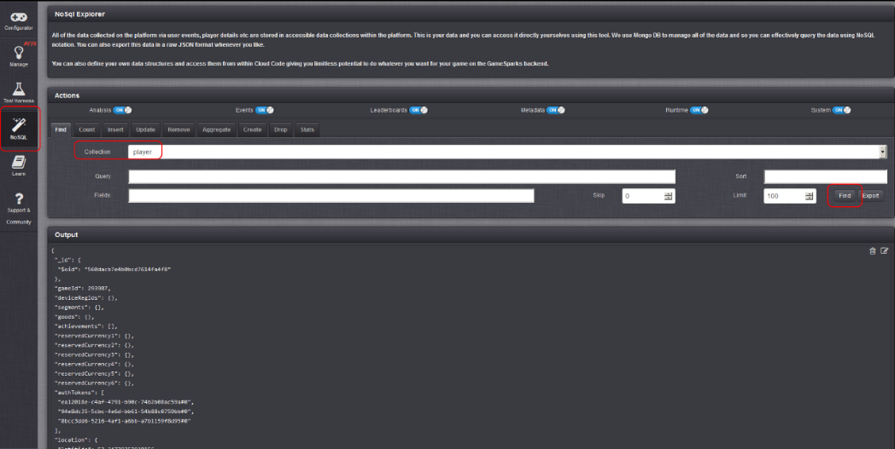

# Unity Authentication

This tutorial will get your Unity project communicating with GameSparks by registering and authenticating players to your game. In order to have a player connect to your GameSparks game and start sending and receiving game-data, they first need to be authenticated with your GameSparks game. This is like being logged into GameSparks, and before you log in, the user needs to be registered, so they are recognised by the game when they log in. You don’t need anything extra to follow this tutorial, but if you’d like to see the project you can download it here.

[wpdm_file id=23 title="true" ]

## Create the GameSparks Persistent Object

Before you start adding players to your game, you need to make sure that the GameSparks SDK is set up as a persistent object. This is so you don’t get multiple instances of the SDK running as you load between levels. To begin with, you need to add a new *GameObject* to the scene. Call this *GameObject* *GameSparksManager*, and drop the script called *GameSparksUnity.cs *onto that object. You can find the script in the GameSparks folder of your project. It’s a good idea to add this to whatever your launch-scene is. For example, if you have a loading scene or splash scene. Likewise, if you have a *Game State Manager* in your game, you could drop the script directly on your GSM. So long as your GSM is persistent, you will be good to go.

## Apply Settings to GameSparks Manager


You can see that the *GameSparksUnity* script expects a settings file. This file was automatically generated when you ran the Test-Scene in the previous tutorial. You can find the settings file in the *GameSparks -> Resources* folder.Apply them to the Settings in the *GameSparksUnity* script.


## The GameSparks Manager Singleton


Next you need to create a new script and add it to the object. This script will make sure that there is only ever one instance of the GameSparks manager running, so call it something like *GameSparksManager*. In this script you are going to create a really simple singleton. All you need is a static reference to the class itself, and in the Awake() method you will check to see if the reference is setup already. If it is not, then give a reference, and set the *GameObject* to be persistent between scenes. If it loads a different GameSparks Manager object, you will immediately destroy that object. It’s very simple, but you need it in order to ensure that there is only ever one GameSparks Manager running throughout the game.

```cs
/// <summary>The GameSparks Manager singleton</summary>
private static GameSparksManager instance = null;
void Awake() {
	if (instance == null) // check to see if the instance has a reference
	{
		instance = this; // if not, give it a reference to this class...
		DontDestroyOnLoad(this.gameObject); // and make this object persistent as we load new scenes
	} else // if we already have a reference then remove the extra manager from the scene
	{
		Destroy(this.gameObject);
	}
}
```

## Registering Players

Registration creates a new player in your game. As with any registration, a few pieces of information are needed in order to register a player:

  1. *Display Name* – The name of the player that will normally be shown in the game.
  2. *Password* – A unique key for that player to login with.
  3. *User Name* – This is distinct from the display name, as the user name can also be auto-generated in some cases where users login with their device. In which case, their device-id is used to generate the username.
Once you have this information you can register a player by calling a *RegistrationRequest*, using the following code:

```cs
new GameSparks.Api.Requests.RegistrationRequest()
  .SetDisplayName("Randy")
  .SetPassword("test_password_123456")
  .SetUserName("Test User 1")
  .Send((response) => {
  	if (!response.HasErrors) {
  		Debug.Log("Player Registered…”);
  	}
  	else
  	{
  		Debug.Log("Error Registering Player);
  	}
  }
);
```

## Authenticating Players

GameSparks allows quite a few ways to Authenticate your players, in this section you'll be covering those that are most popular.

### Player Authentication

Now that your player has been registered, you need to authorize them so they can gain access to the game-data. There are several ways you can authorise players through GameSparks, it all depends on how you want users to interact with your game. For this tutorial we will ask the player to submit their username and password. You can do this by calling the *AuthenticationRequest* method as seen in the following code sample:

```cs
new GameSparks.Api.Requests.AuthenticationRequest().SetUserName("Test User 1").SetPassword("test_password_123456").Send((response) => {
	if (!response.HasErrors) {
		Debug.Log("Player Authenticated...");
	} else {
		Debug.Log("Error Authenticating Player...");
	}
});
```    

You can see more information about the authentication request [here](/documentation/request-api/authentication-request-api/authenticationrequest).


### Device Authentication

You can also authenticate your player from the device they are currently using. To do so, you can use the *DeviceAuthenticationRequest*. By using this authentication method you can bypass the user registration, and just call this request. It will register the device and authenticate it at the same time.

```cs
new GameSparks.Api.Requests.DeviceAuthenticationRequest().SetDisplayName("Randy").Send((response) => {
	if (!response.HasErrors) {
		Debug.Log("Device Authenticated...");
	} else {
		Debug.Log("Error Authenticating Device...");
	}
}); ```   

### Facebook Authentication

If your game has the Facebook SDK integrated, or you would like your player to be able to authenticate through Facebook and get social capability integrated into your GameSparks game, you might like this check out the following tutorial on authenticating with Facebook [here](https://docs.gamesparks.net/tutorials/unity-tutorials-challenges-part-2-facebook-login).

## Testing Registration & Authentication

Before you are comfortable with the GameSparks API, you’ll probably want to check to see if your requests are working the way you want them to. There are several ways to check this.

### Response Data

For each request you send you will get a response from the server. You have already seen through our C# examples that this response allows us to check out any errors that occurred with your request, but there is other data you can extract too. For requests such as registration and authentication you can get information about the player back, such as their userID (a unique code for each player registered), their display name, username etc. Take a look at the sample project for examples.

### NoSQL Explorer

 One of the most useful and trusty tools on GameSparks portal is the *NoSQL Explorer*. By using this you can check all of the mongo information you have saved for your game. You can check results and filter information for whatever you need (check out [this](https://docs.gamesparks.net/developer-portal/nosql) tutorial for more info). You may want to check that your players have been authenticated properly, or later on, when your game is live, check your player-data. To do so, simply navigate to the *NoSQL* tab in your GameSparks portal, select the *player* collection from the Collection list, then click on the *Find* button. In the output panel you can see the player details for any player you have authenticated.Now you are setup and connected with GameSparks and you are ready to send and receive some data. Check out the next tutorial on Events and Cloud Code [here](https://docs.gamesparks.net/developer-portal/cloud-code/using-cloud-code "Using Cloud Code").


