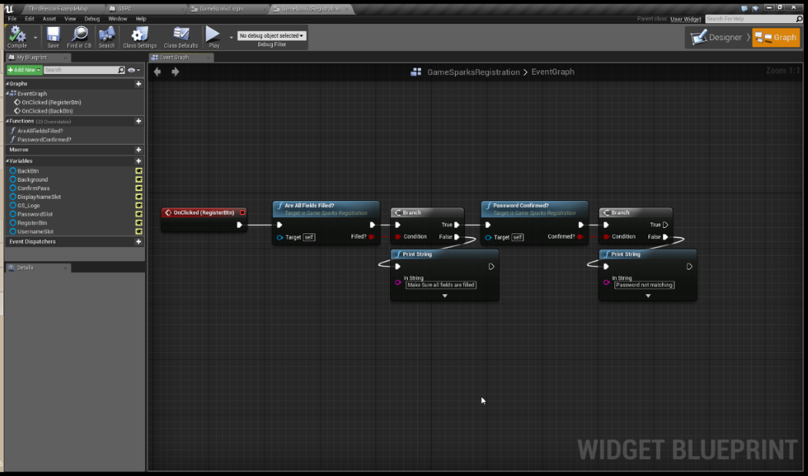
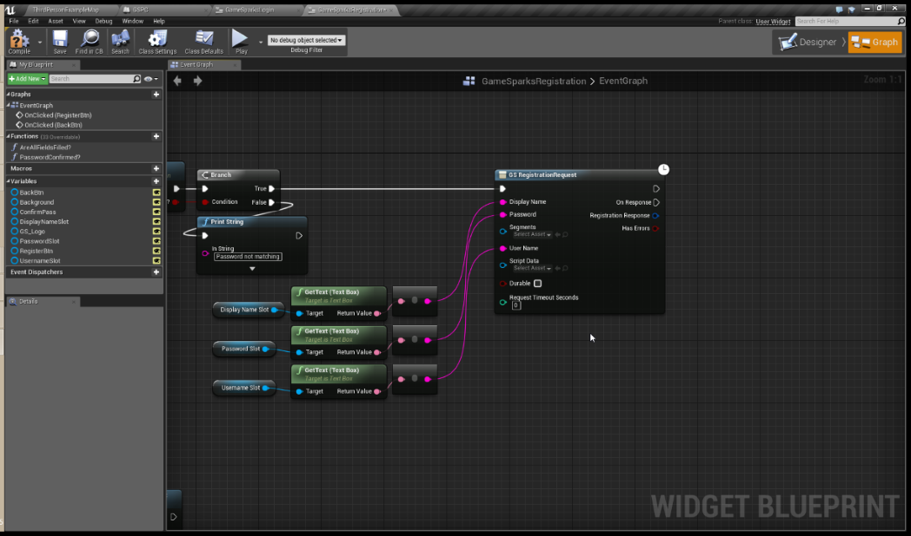
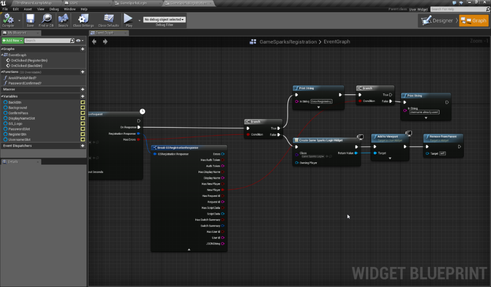
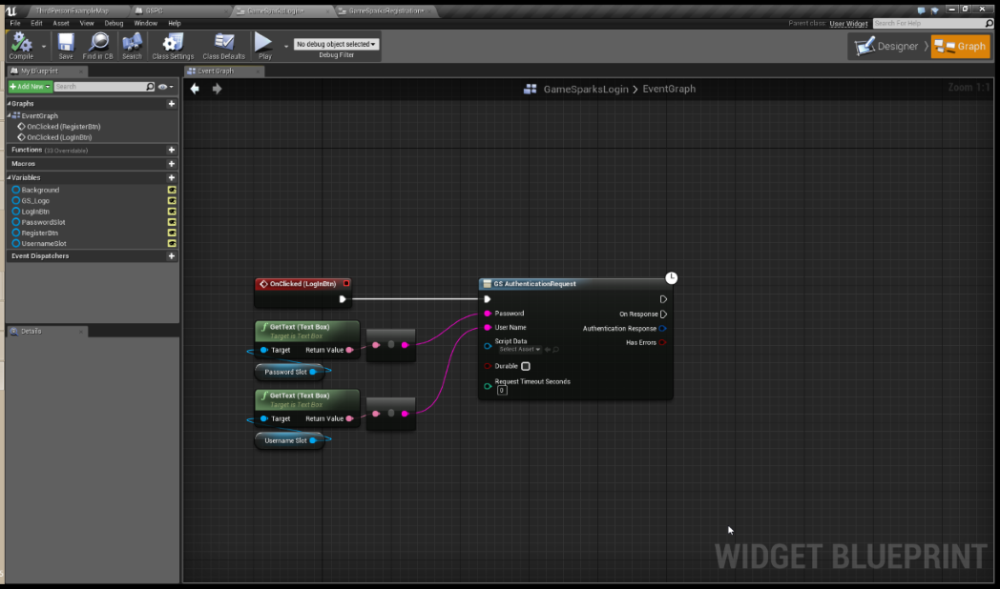

# Unreal Authentication

## Introduction

This tutorial will guide you through the process of registering and authenticating a player to your game, allowing them to begin communicating with it. Requirements:

  * Make sure you have a game [created](/Getting Started/Creating a Game/README.md).
  * Make sure you are [connected](/Getting Started/Creating a Game/Unreal Setup.md) to your game.
  * Have an input method to pass the user data into the GameSparks nodes. In this tutorial we're using Widgets. They are available for download below:
[wpdm_file id=28 title="true" ]

## Registration

The Registration menu has a basic functionality that makes sure all fields are filled in correctly and that the passwords match. This functionality exists to notify you in the UI if there are any problems that occur whilst registering.

Now we need to attach some of GameSparks nodes to the Event Graph. The first one will be the *GSRegistrationRequest* node. The GSRegistrationRequest node takes 3 strings, *Display* *Name*, *Username* and *Password*. To authenticate, a user will need to supply both the username and the password. The display name can be used for cosmetic purposes, as many users can have the same display name, but usernames must be unique. We can also limit what goes through this registration node from the engine itself. Rules can be added such as no special characters, or no spaces to prevent our Players from doing things we don’t want them to. Once that node is executed, if all the details are supplied and the registration is unique, a new player will be created in the game.

Now you need to connect all of the user inputs to the request, this is shown to the right.

After the Registration Request is sent, we can check if it has registered our user, or if the response contains errors. For instance we can check if the username is already being used by breaking the registration request up and connecting the "*New Player*" condition to a branch. Before doing so, we need to check whether the response actually had errors. After a successful Registration you will be sent to the Login Widget.

## Authentication

In your Login Widget you will need to add the *GSAuthenticationRequest* node and connect it to a button. Click and input the required valid username and password to make it work.

We can "Drag Off" a *Break* node from GSAuthenticationRequest node’s Authentication Response struct to gain access to some information that might be useful for your development. In this example, we break the struct to expose the data sent by GameSparks to expose the 'Display name' string value and use it to print a message to the player that just logged in. We’ll also make sure that if we get errors, we log that out to give your users some valuable feedback.

## Testing

Now you can run your Unreal Engine game and test your Registration and Authentication. You will need to double check that the Game Mode [created previously](/Getting Started/Creating a Game/Unreal Setup.md) is running before proceeding. Try logging into the platform without having previously Registered, an error will then be shown.

Now navigate to the Registration widget and register a new Player.

Finally, try to authenticate with the player you've just Registered, this should succeed. This concludes the authentication tutorial. You have successfully learned how to register and authenticate your players to the GameSparks platform.
