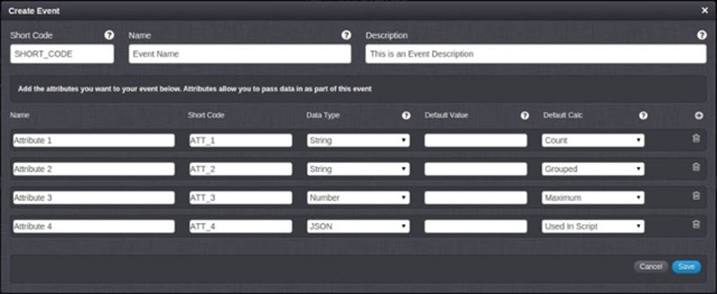

# Events

You can use Events to define custom data structures that you want to pass into the platform via the *LogEventRequest* and *LogChallengeEventRequest* API calls.

## Managing Event Configurations

The Configurator *Events* page lists Events and allows you to create new Events and edit or delete existing ones.

You can use icon button options (highlighted above):

  *  - Add a new Event.
  *  - Edit Event.
  *  - Delete Event.

## Creating a new Event Configuration

The Create/Edit screen contains the following fields:

  * *Name* \- Name of the Event, which is used to identify the game in the portal if you have a number of Events.
  * *Description* \- Description for the Event.
  * *Short Code* - Short Code of the event, which is used by the API to allow you to identify which event you want to call.

### Creating Event Attributes

Each Event can have a number of attributes associated with it.

Add an attribute by clicking the  icon.  Each attribute has a number of different configuration options that can be defined within the form:

  * *Name* \- Name of the Attribute, which is used to identify the attribute if there are several associated with an Event.
  * *Short Code* \- Short Code of the Attribute, which is used by the API to allow you to identify which Attribute you are trying to set.
  * *Data Type* \- Each attribute needs to be defined as either String, Number or JSON.
  * *Default Value* \- Allows a specific value to be used if the user request does not contain this attribute.
  * *Default Calculation*
    * *Maximum* \- A running total will be created to track the maximum value posted.
    * *Minimum* \- A running total will be created to track the minimum value posted.
    * *Sum* \- A running total will be created to add all the values posted together.
    * *Count* \- A running total will be created to count the number of times the player has called the event.
    * *Used In Script* \- The Event will not be used in a running total.
    * *Grouped* \- The running total will use this attribute to group other attributes. This will lead to a running total with an entry per attribute/user combination.

<q>**Note:** [Running Totals](/Documentation/Configurator/Running Totals.md) is further explained in the next page.</q>
