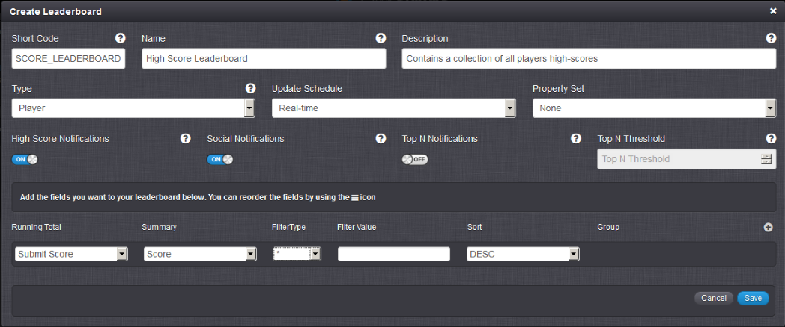
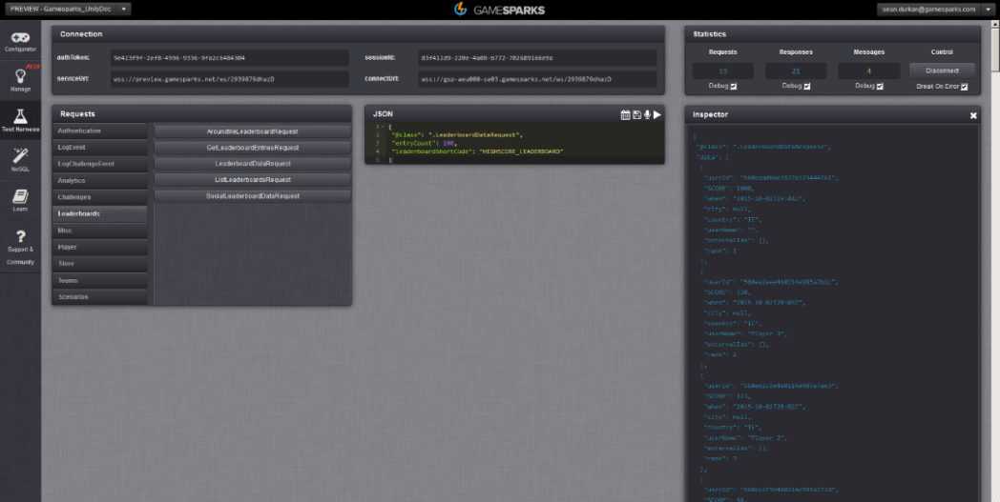
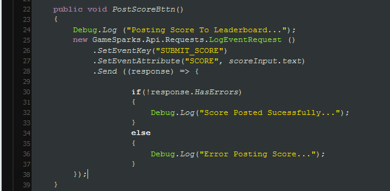
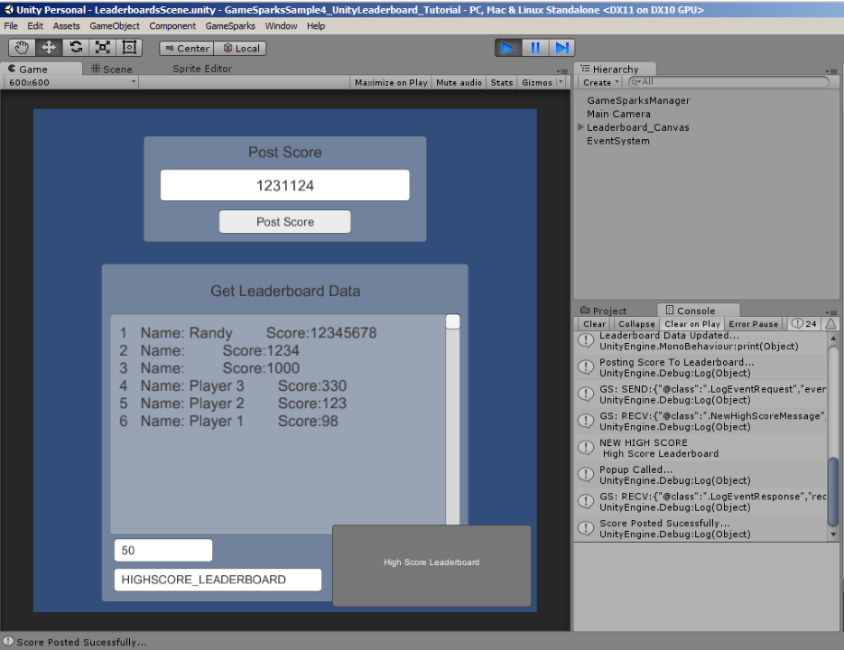

# Unity Leaderboard

## Introduction

This tutorial will go over the process of creating a Leaderboard, along with an Event which will be used to post scores to that Leaderboard. You will then see how the scores can be submitted in Unity and how you can retrieve Leaderboard data and receive a High Score Messages in Unity. You don’t need anything extra to follow this tutorial, but if you’d like to see the project you can download it here.

</br>
**Example Unity Leaderboard** code can be downloaded [here](http://repo.gamesparks.net/docs/tutorial-assets/UnityLeaderboard_Tutorial.zip)

## Creating the Score Event

The first thing you need to do is create an Event that will push the player’s score to the Leaderboard. If you need a reminder on how to create Events, check out the previous tutorial [here](/Getting Started/Using Cloud Code/README.md). For this tutorial, your new Event needs one attribute, which will be the score, and you can call the Event something like *Submit Score*. You can see the options for creating an Event are as follows:

*   *Short Code* – This field is the reference by which you will call the Event, these are always unique.
*   *Name* – This field is used when representing the Event in Test Harness as well as in Cloud Code.
*   *Description* – This field is used to display what the Event is used for, this is primarily for your benefit in the Events Configurator.
*   *Attribute Name* - This field is the name of the attribute you want to pass into the Event. In your case this will be ‘Score’.
*   *Attribute Short* *Code* – This is the reference you'll be using to pass in an attribute into the Event from Unity. In your case this will be ‘SCORE’.
*   *Data Type* – The type of data being passed in. E.g. String, Number, JSON.
*   *Default Value* – This would be the default value that would be used for this Event attribute if it’s not passed into the LogEventRequest , i.e. a score of zero would be default.
*   *Default Calculation* – This determines how values are tracked in the Running Totals. In your case you want the score to record the maximum, which means the leaderboard will only record the player’s highest score. If they submit a lower score to the board, it will not be recorded.

You can see more details about Events [here](/Documentation/Configurator/Events.md).


## Creating the Leaderboard

Next you'll need to create your Leaderboard. You can do this by going to the *Configurator* panel in the GameSparks Portal and selecting the *Leaderboards* tab. Add a new Leaderboard by clicking on the *[+]* button. Most of the details you see here can be left as default but you can get more information about these attributes [here](/Documentation/Configurator/Leaderboards.md). The important variables for us are the *Short Code*, *Name* and *Description*. If this is the first event you have created in your own game you will see that the *Submit Score* Event already pops into that field. This is because it is the only applicable Event you have in your game at the moment.



## Testing the Leaderboard


Now you are ready to send some scores to your Leaderboard, but before you go into Unity, you should test this Leaderboard in the *Test Harness*. After authenticating yourself as a Player, find your Event in the *LogEvent* tab, enter a score and send the Event. Immediately after you send the request, you will see orange message appear in the inspector on the left. This is a High Score Message and when you go back into Unity you are going to setup an Event listener to execute some code whenever a player gets this Message.


### Getting the Leaderboard Data

You can also check your Leaderboard data entries from the test harness using the *LeaderboardDataRequest*. You can find this in the *Leaderboards* tab on your *Test Harness*. This request gives you a lot of control over the entries it will return, however you are only concerned with the leaderboard *Short Code*, and the *entry count* (the number of entries this request will return). You can check out more information about this request [here](https://api.gamesparks.net/#leaderboarddatarequest). When you send the request you will see the list of Leaderboard entries returned on the inspector on the right.Now you are ready to start sending and receiving Leaderboard data in Unity.


### Getting the Leaderboard Data in Unity


You have already seen how to send a logEventRequest, in Unity, in the previous tutorial on Cloud Code. You can check out [here](/Getting Started/Using Cloud Code/Unreal Cloud Code.md). The code is as follows:

```
new GameSparks.Api.Requests.LogEventRequest().SetEventKey("SUBMIT_SCORE").SetEventAttribute("SCORE", "1234").Send((response) => {
	if (!response.HasErrors) {
		Debug.Log("Score Posted Successfully...");
	} else {
		Debug.Log("Error Posting Score...");
	}
});
```

To get the Leaderboard data back, you need to call a *LeaderboardDataRequest* the same way you did using the Test Harness.

```
new GameSparks.Api.Requests.LeaderboardDataRequest().SetLeaderboardShortCode("HIGHSCORE_LEADERBOARD").SetEntryCount(100).Send((response) => {
	if (!response.HasErrors) {
		Debug.Log("Found Leaderboard Data...");
		foreach(GameSparks.Api.Responses.LeaderboardDataResponse._LeaderboardData entry in response.Data) {
			int rank = (int) entry.Rank;
			string playerName = entry.UserName;
			string score = entry.JSONData["SCORE"].ToString();
			Debug.Log("Rank:" + rank + " Name:" + playerName + " \n Score:" + score);
		}
	} else {
		Debug.Log("Error Retrieving Leaderboard Data...");
	}
});
```

The important thing here is to get the information back out of the Leaderboard Data. *response.Data* contains a collection of Leaderboard data you can iterate through and  get the entry details back. *LeaderboardData* has a lot of information you can access, and you can check out more information about it [here](https://api.gamesparks.net/#leaderboarddata). Now, running the Request will print out the details of each of the Leaderboard entries in the console.







## Message Listeners

Finally you'll want to hook up the *NewHighScoreMessage* listener so that you can have some custom code execute when the player receives a new High Score. In Unity player messages have listeners you can assign delegate functions to. Then, each time the player receives a message the method will execute and you can get details about the message from within these methods. Its best to apply the listener in an *Awake()* method, as the player could have messages waiting on the server for them that they might miss if the code cannot execute the moment they log on.

```
void Awake() {
	GameSparks.Api.Messages.NewHighScoreMessage.Listener += HighScoreMessageHandler;
}
void HighScoreMessageHandler(GameSparks.Api.Messages.NewHighScoreMessage _message) {
	Debug.Log("NEW HIGH SCORE \n " + _message.LeaderboardName);
}
```

Now, to test this out, enter a new High Score for your player in the Unity sample project. You should see the “NEW HIGH SCORE” message appear in the console window.



