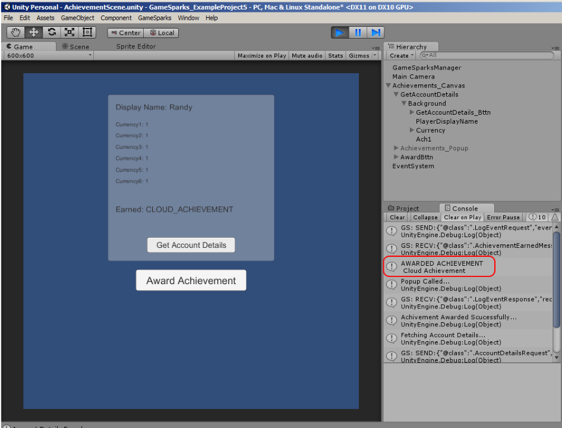

# Unity Achievements

## Introduction

In this tutorial you will you will be introduced to Achievements using the GameSparks platform. This tutorial assumes that you are already familiar with creating Events and setting up message-listeners in Unity. You can check out tutorials on these topics [here](/Getting Started/Creating a Leaderboard/README.md). It also assumes that you followed the [previous](/Getting Started/Creating an Achievement/README.md) tutorial on creating an Achievement and the Event that will be used to reward the Achievement.

**Example Unity Achievements** code can be downloaded [here](http://repo.gamesparks.net/docs/tutorial-assets/UnityAchievements_Tutorial.zip)

## Awarding Achievements

Once you have your Achievement setup, you have to call a *LogEventRequest* for the Event you created previously. You can check out how to send these kinds of requests in a previous tutorial [here](/Getting Started/Using Cloud Code/README.md). Once you have called the *LogEventRequest* awarding your player the Achievement, you should see the Achievement Earned Message pop up in the console. The next step is to hook up the *AchievementEarnedMessage* listener so you can have some custom code execute when your player is awarded an Achievement.

```
    void Awake() {
    	GameSparks.Api.Messages.AchievementEarnedMessage.Listener += AchievementMessageHandler;
    }
    void AchievementMessageHandler(GameSparks.Api.Messages.AchievementEarnedMessage _message) {
    	Debug.Log("AWARDED ACHIEVEMENT \n " + _message.AchievementName);
    }
```

By running this code in the sample project, you should get the *AWARDED ACHIEVEMENT* message in the console.



## Checking Achievements Earned

If you want to check to see if the Achievement was actually earned, you can use the *AccountDetailsRequest* call. This will return a lot of information about your player, including the Achievements earned, the currency they currently owned, amongst others.

```
    	new GameSparks.Api.Requests.AccountDetailsRequest().Send((response) => {
    		if (!response.HasErrors) {
    			Debug.Log("Account Details Found...");
    			string playerName = response.DisplayName; // we can get the display name
    			List < string > achievementsList = response.Achievements; // we can get a list of achievements earned
    			// we can grab all the currency-types into a list //
    			List < int > currencyList = new List < int > () {
    				int.Parse(response.Currency1.ToString()), int.Parse(response.Currency2.ToString()), int.Parse(response.Currency3.ToString()), int.Parse(response.Currency4.ToString()), int.Parse(response.Currency5.ToString()), int.Parse(response.Currency6.ToString()),
    			}; // Then we can print this data out or use it wherever we want //
    			Debug.Log("Player Name: " + playerName);
    			foreach(string s in achievementsList) {
    				Debug.Log("Player Earned: " + s);
    			}
    			for (int i = 0; 9 < currencyList.Count; i++) {
    				Debug.Log("Currency" + i + "    " + currencyList[i].ToString());
    			}
    		} else {
    			Debug.Log("Error Retrieving Account Details...");
    		}
    	});
```

You can also test this out in the *Test Harness* by going to the *Player* tab and sending an *AccountDetailsRequest*.
