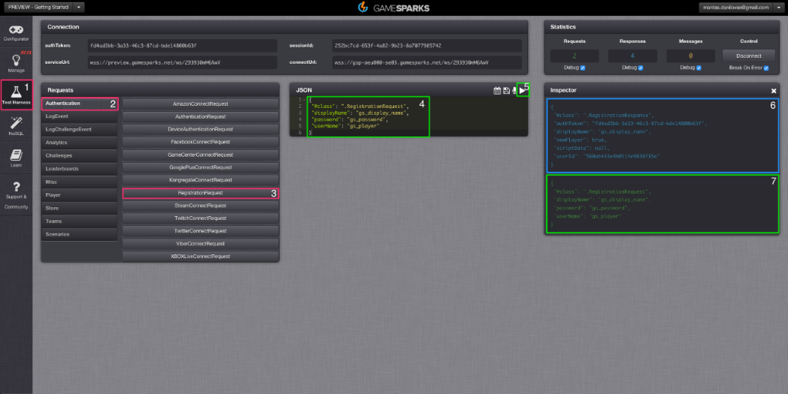
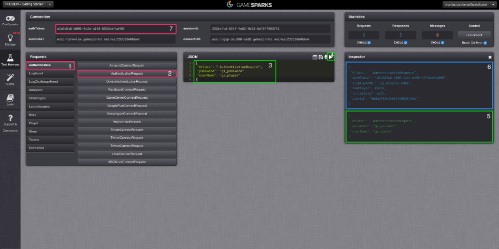

# Using Authentication

## Introduction

Before a player can perform any operations they need to authenticate with the platform. There are a few authentication options, and some can be used in combination with others. The full list of Authentication Types can be found [here](/Documentation/Key Concepts/Authentication.md), however for this tutorial we'll be using basic username/password Registration and Authentication.

## Authenticating and Registering

To test your game and see if it is ready for Authentication, you will have to navigate to the [Test Harness](/Documentation/Test Harness/README.md), Click *Authentication* and then *RegistrationRequest*. Then simply enter the desired registration details in the JSON builder for your player and hit Play. At this point you will see GameSparks receiving the [RegistrationRequest](/API Documentation/Request API/Authentication/RegistrationRequest.md). When processed, the server will send you a RegistrationResponse.

<q>**Note:** You might have to remove some additional or unwanted fields (that are auto-generated) to match the example and take note of the player you've just registered. This will be required for upcoming Getting Started tutorials.</q>

Receiving a successful response is an indication of a successful registration. To validate this:
1. We can select the *AuthenticationRequest*.
2. Add our players' details into the JSON builder.
3. After clicking Play, we'll send an [AuthenticationRequest](/API Documentation/Request API/Authentication/AuthenticationRequest.md) and receive an AuthenticationResponse.

In addition to receiving a successful Response, you'll also notice that you've received an *authToken* for the current player's session.
 
You have now successfully Registered and Authenticated a player. The next tutorial will show you how to set up the SDK of your choice for authentication with GameSparks.

<q>**Deleting Players!** You can delete registered players through Cloud Code using the *SparkPlayer.deletePlayer* method, but we urge you to exercise caution when doing this - see [Updating Player Records](/Tutorials/Social Authentication and Player Profile/Updating Player Records.md).</q>

## SDK Instructions

* [Unity](/Getting Started/Using Authentication/Unity Authentication.md)
* [Unreal](/Getting Started/Using Authentication/Unreal Authentication.md)
* [ActionScript](/Getting Started/Using Authentication/ActionScript Authentication.md)
* [Android](/Getting Started/Using Authentication/Android Authentication.md)
* [Lua](/Getting Started/Using Authentication/Lua Authentication.md)
