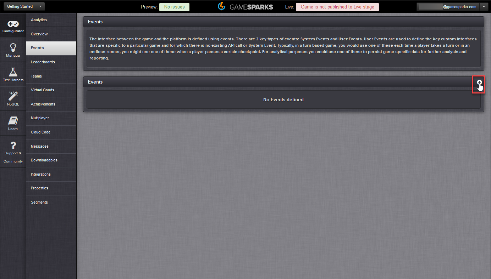
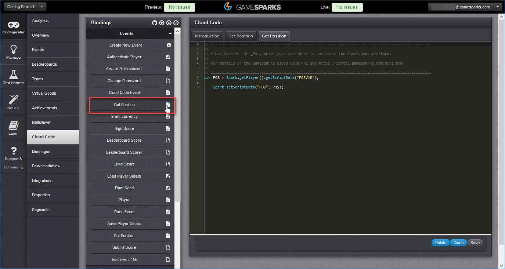
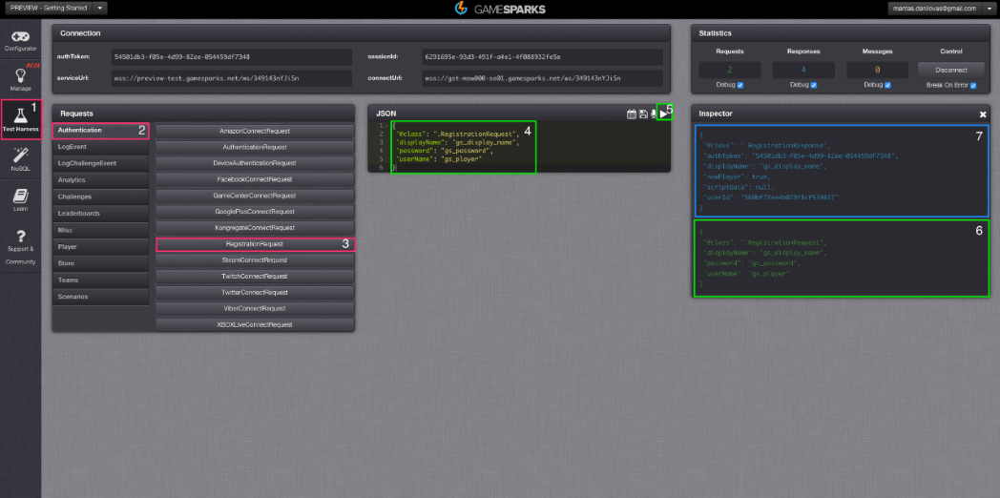

# Using Cloud Code

## Introduction

Cloud Code plays a key role in the GameSparks Services. You can use it to create custom logic and control the behavior of the configurable components you have built into your game.

When an Event, Request, or Response is sent to and from the GameSparks API, you might want some other things to happen at some point. For example, suppose an *AuthenticationRequest* is received and, in sequence, an *AuthenticationResponse* is to be sent back. You might want other things to happen when the response is sent back, such as send a message to the player that submitted the request which shows their display name and welcomes them back into the game. A Cloud Code script attached to the *AuthenticationResponse* is how you would do this.

It's easy to see from this very simple example how you can use Cloud Code to achieve just about any behavior you want in your game - it's up to you! In general terms, you can deploy Cloud Code at *key interception points for the execution of scripts* to get just the effect you want when you want. You can read more about this main aspect of working with GameSparks [here](/Documentation/Key Concepts/Cloud Code.md).

When you build Cloud Code and attach it to a configured component, such as an Event, you can use the Test Harness to try out and check that you will get the behavior you want.
The Test Harness is an invaluable tool, because it allows you to send API requests to the GameSparks platform in their raw form and check the responses returned by the server.

In this tutorial, you'll learn how to persist some meaningful data in mongoDB using Cloud Code - you'll be storing and retrieving X, Y, and Z player position coordinates. We'll then walk you through using the Test Harness to check your Cloud Code.

<q>**Cross Platform!** Cloud Code is platform independent and is written in JavaScript, meaning that if you wanted to use a different SDK, you wouldn't need to change the Cloud Code you've already written.</q>

## Event Creation



Since you will be Setting data to and Getting data from the database, you should create two events using the Events Configurator.

*1.* First, navigate to *Configurator > Events* and click the plus  icon. The *Create Event* dialog appears:


We'll use this first Event to set the coordinates. Here's how we've set things up:
* We've given the Event a *Short Code* of *Set_Pos*.
* We entered a *Name* and the *Description*.
* We've also added an *Attribute* to the Event. This is a parameter necessary for the Event to be executed:
  * We've used *POS* as the Attribute *Short Code*. This is the value we'll be passing in via either an SDK or the Test Harness.
  * We set the *Data Type* for the Attribute to *JSON* because we'll be passing in a few variables into the Event as a JSON object.
  * Lastly, we'll also set a *Default Value*, which will be useful when running our tests.

*2.* Click *Save*.

After you've finished setting up the Set Event, you can go ahead and make the Get Event.

*3.* In *Configurator > Events*, click the plus  icon again:
* Enter a *Short Code*, *Name*, and *Description* for the Get Event - note that we've used *Get_Pos* as the *Short Code*.
* The Get Event doesn't need any *Attributes* because no values will be passed in.


## Cloud Code

### Set Event

After creating the two Events, you can attach some *Cloud Code* to them and prepare them for use. Firstly, for the Set Position Event:

*1.* Navigate to *Configurator > Cloud Code*.

*2.* Under *Bindings*, select Events and click the edit  icon for the *Set Position* Event. A *Set Position* tab opens in the *Cloud Code* editor:

*3.* Now we can write the Cloud Code that will handle the position setting:


As seen in the image, all you need to do is *getData* that was sent with the Request, get the current player using *getPlayer* and finally set Players Script Data using *setScriptData*:


```
    var POSV = Spark.getData().POS;

    Spark.getPlayer().setScriptData("POSVAR", POSV);
```

### Get Event

To enter the Cloud Code for the Get Position Event:

*1.* Navigate to *Configurator > Cloud Code*.

*2.* Under *Bindings*, select Events and click the edit  icon for the *Get Position* Event. A *Get Position* tab opens in the *Cloud Code* editor:

*3.* Now we can write the Cloud Code:  



The Get Position Event is essentially a reverse of the Set Position Event. Here we get the Player using *getPlayer*, then we retrieve the Script Data that was Set for this player using *getScriptData*. Finally, we use *setScriptData* to Set the Position in the Response of the Event.


```
    var POS = Spark.getPlayer().getScriptData("POSVAR");

    Spark.setScriptData("POS", POS);

```

## Test Harness

*1.* Firstly, you will need to Register a new player. This can be achieved by using the [RegistrationRequest](/API Documentation/Request API/Authentication/RegistrationRequest.md). To do so, you will need to navigate to the Test Harness, select the *RegistrationRequest*, fill in the JSON details and hit play:



*2.* Now you'll want to Call the Set Position Event to set the X, Y and Z coordinates in the Players Script Data. To do so, go to the LogEvent and select your Event. Fill in the JSON details and hit play. Don't worry if your response contains no data, because at this point none has been set. 


<q>**Note:** If you had the Requests debugger ticked, it will open at this point. This only happens if the Request has some Cloud Code set on it. Either step through the code or stop debugging. You can read more about the debugger [here](/Documentation/Test Harness/Debugger.md) .</q>

*3.* You can now validate that the POS has been set in the players Script Data by Calling an [AccountDetailsRequest](/API Documentation/Request API/Player/AccountDetailsRequest.md).


*4.* Finally, you can Retrieve the data stored in the players Script Data by running the Get Position Event. This time you will see this in the Response as it was set using *Spark.setScriptData* in our Cloud Code.


## SDK Instructions

* [Unity](/Getting Started/Using Cloud Code/Unity Cloud Code.md)
* [Unreal](/Getting Started/Using Cloud Code/Unreal Cloud Code.md)
* [ActionScript](/Getting Started/Using Cloud Code/ActionScript Cloud Code.md)
* [Android](/Getting Started/Using Cloud Code/Android Cloud Code.md)
* [Lua](/Getting Started/Using Cloud Code/Lua Cloud Code.md)
