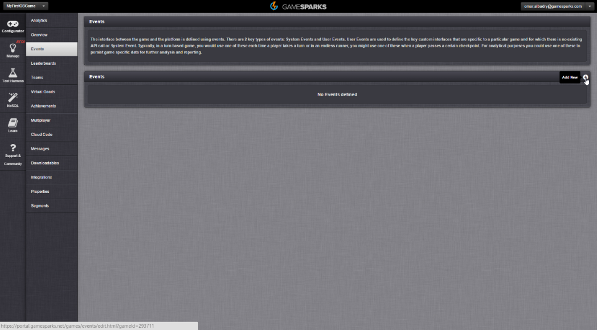
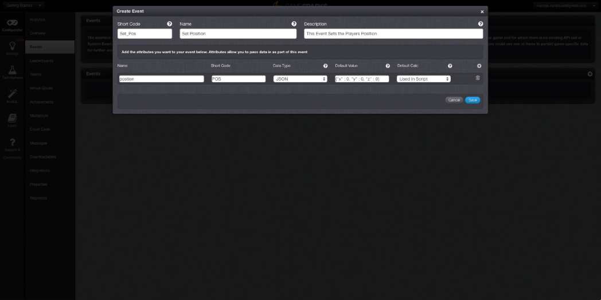
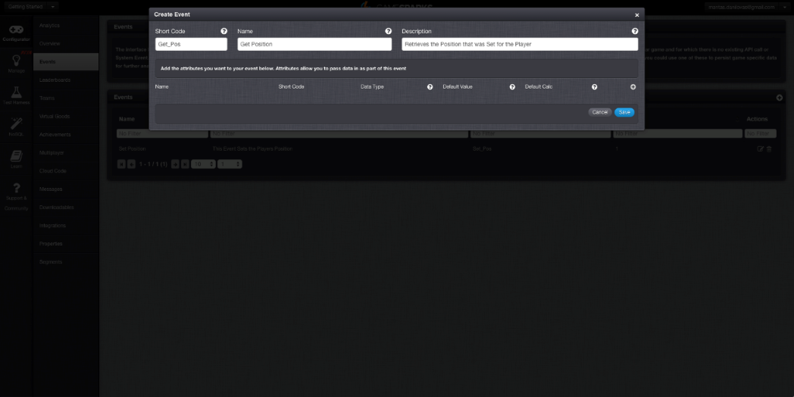
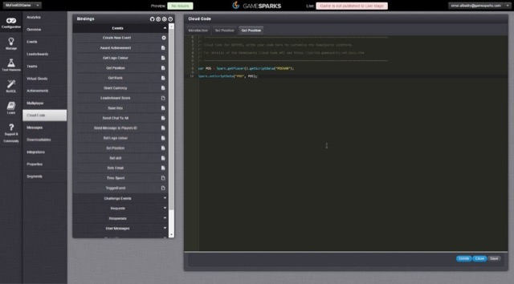
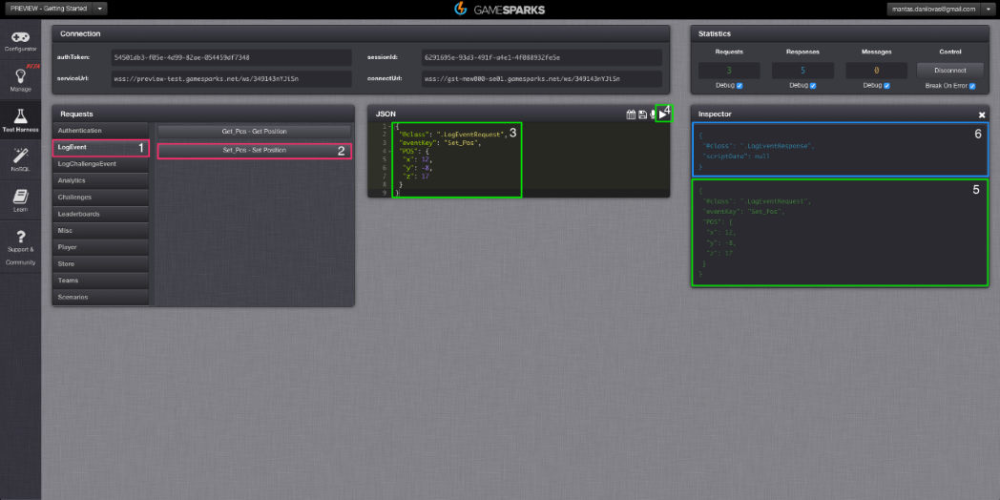
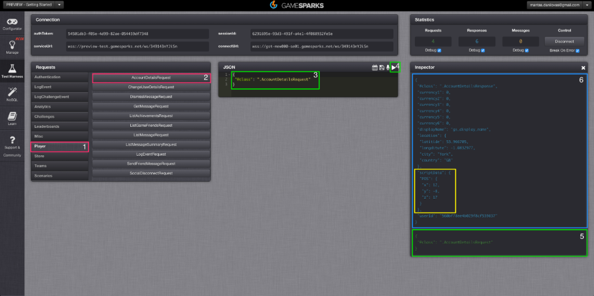
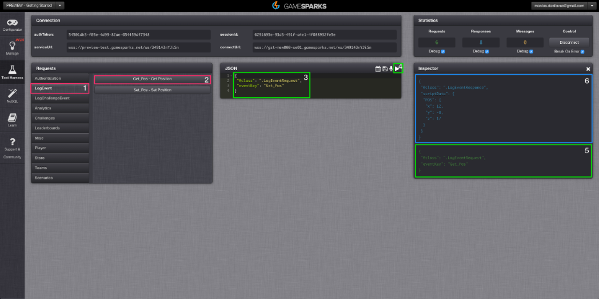

# Using Cloud Code

## Introduction

Cloud Code plays a key role in the GameSparks Services. You can use it to create custom logic and control the behavior of the configurable components you have built into your game.

When an Event, Request, or Response is sent to and from the GameSparks API, you might want some other things to happen at some point. For example, suppose an AuthenticationRequest is received and, in sequence, an AuthenticationResponse is to be sent back. You might want other things to happen when the response is sent back, such as send a message to the player that submitted the request which shows their display name and welcomes them back into the game. A Cloud Code script attached to the AuthenticationResponse is how you would do this.

When you build Cloud Code and attach it to a configured component, such as an Event, you can use the Test Harness to try out and check that you will get the behavior you want.
The Test Harness is an invaluable tool, because it allows you to send API requests to the GameSparks platform in their raw form and check the responses returned by the server.

In this tutorial, you'll learn how to persist some meaningful data in mongoDB using Cloud Code - you'll be storing and retrieving X, Y, and Z player position coordinates. We'll then walk you through using the Test Harness to check your Cloud Code.

<q>**Note:** Cloud Code is platform independent and is written in JavaScript, meaning that if you wanted to use a different SDK, you wouldn't need to change the Cloud Code you've already written.</q>

## Event Creation



Since you will be Setting data to and Getting data from the database, you should create two events using the Events Configurator. Simply navigate to the *Configurator* and click *Add New*. You will then be greeted by the Event Creation Form.



The first Event will be used to Set the Coordinates. For this tutorial, we have chosen* 'Set_Pos'* as our Short Code. After you've filled in the Name and the Description, you will need to add an *attribute* to your Event. This is a parameter necessary for the Event to be executed. We've used *'POS'* as the attribute Short Code. This is the value you'll be passing in via either an SDK or the Test Harness. Make this attribute a *JSON* because you'll be passing in a few variables into the Event as a JSON object. You can also set a *Default Value*, which will be useful when running your tests.



After you finish making the Set Event, go ahead and make the Get Event. The Get Event does not need any *attributes* because no values will be passed in. We used* 'Get_Pos'* as the Short Code for this Event.


## Cloud Code

### Set Event

After creating the two Events, you can attach some *Cloud code* to them and prepare them for use. Navigate to the *Cloud code* tab which is under the *Configurator* menu a few item under our Events tab:


Now you can write the Cloud Code that will handle the Position Setting. As seen in the image, all you need to do is *getData* that was sent with the Request, get the current player using *getPlayer* and finally set Players Script Data using *setScriptData*.


```
    var POSV = Spark.getData().POS;

    Spark.getPlayer().setScriptData("POSVAR", POSV);
```

### Get Event



The Get Position Event is essentially a reverse of the Set Position Event. Here we get the Player using *getPlayer*, then we retrieve the Script Data that was Set for this player using *getScriptData*. Finally, we use *setScriptData* to Set the Position in the Response of the Event.


```
    var POS = Spark.getPlayer().getScriptData("POSVAR");

    Spark.setScriptData("POS", POS);
```

## Test Harness

*1.* Firstly, you will need to Register a new player. This can be achieved by using the [RegistrationRequest](/API Documentation/Request API/Authentication/RegistrationRequest.md). To do so, you will need to navigate to the Test Harness, select the RegistrationRequest, fill in the JSON details and hit play:


*2.* Now you'll want to Call the Set Position Event to set the X, Y and Z coordinates in the Players Script Data. To do so, go to the LogEvent and select your Event. Fill in the JSON details and hit play. Don't worry if your response contains no data, as none has been set. 



<q>**Note:** If you had the Requests debugger ticked, it will open at this point. This only happens if the Request has some Cloud Code set on it. Either step through the code or stop debugging. You can read more about the debugger [here](/Documentation/Test Harness/Debugger.md).</q>

*3.* You can now validate that the POS has been set in the players Script Data by Calling an [AccountDetailsRequest](/API Documentation/Request API/Player/AccountDetailsRequest.md).



*4.* Finally, you can Retrieve the data stored in the players Script Data by running the Get Position Event. This time you will see this in the Response as it was set using *Spark.setScriptData* in our Cloud Code.





## SDK Instructions

* [Unity](/Getting Started/Using Cloud Code/Unity Cloud Code.md)
* [Unreal](/Getting Started/Using Cloud Code/Unreal Cloud Code.md)
* [ActionScript](/Getting Started/Using Cloud Code/ActionScript Cloud Code.md)
