# How to authenticate players using their Facebook accounts

Facebook authentication allows you to provide your players with a simple way to sign in with their Facebook account details, and allows the GameSparks platform to then use the player’s profile to drive its social features.  In this exercise you’ll go through setting up the necessary configuration with Facebook and how you can then use that to connect your players.

## Setting up a Facebook application

Go to the [Facebook developer portal](https://developers.facebook.com/) and sign in (or sign up to Facebook first).  Now select the *App->Register as a Developer* menu option.

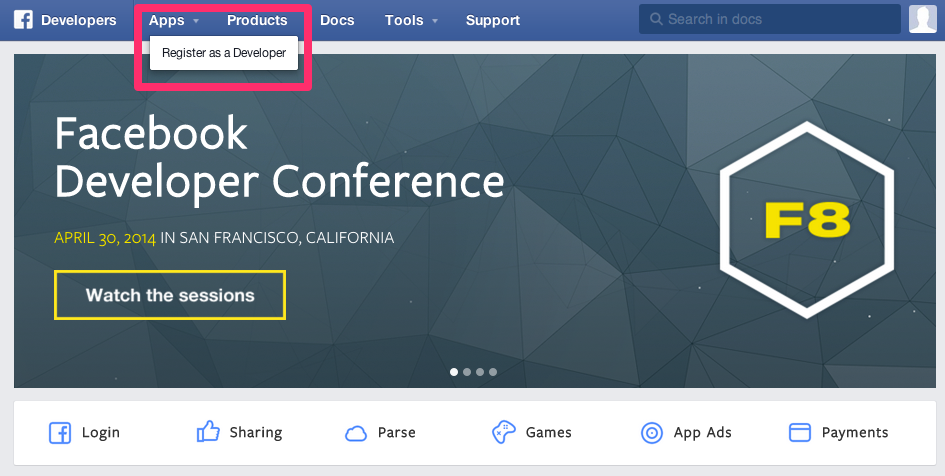

Accept the Facebook Platform Policy and the Facebook Privacy Policy in the dialog box that is presented.  Next verify your account by obtaining and entering a code via your mobile phone.

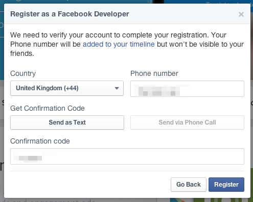

Now you’re ready to create your app.  Click* Apps->Create a New App.*

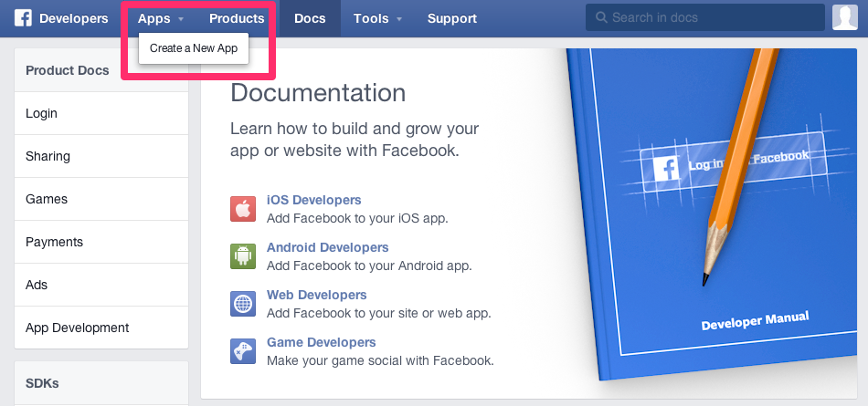

Fill in the Display Name and (optional) Namespace fields, select your Category and Sub-Category in the drop down menus then click Create App.

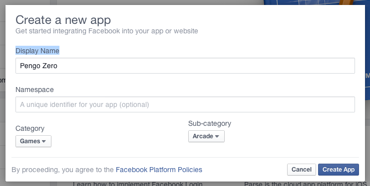

And that’s it, you now have a Facebook application.  There are various configuration options you can play around with, but for now all you’re interested in are the App ID and App Secret.

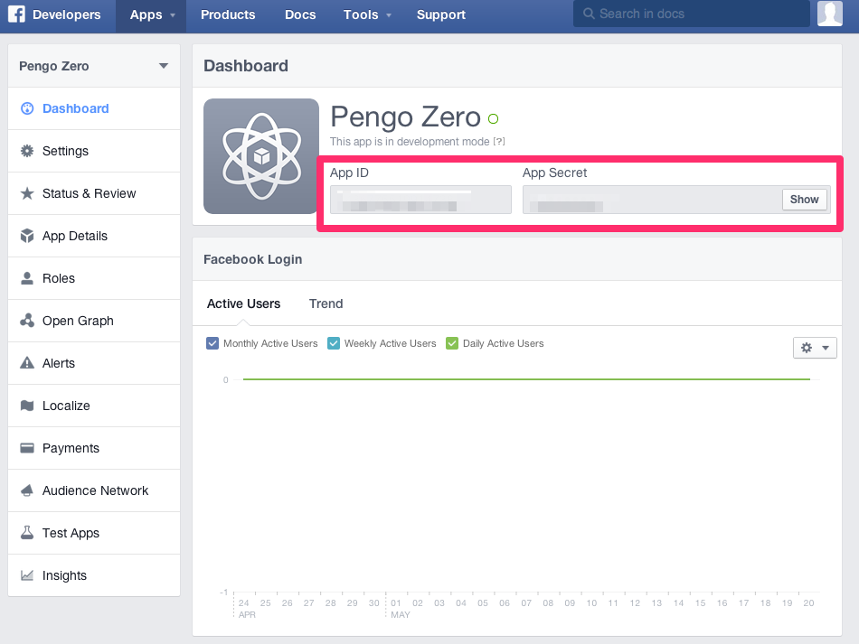

In a separate tab/window head over to [the GameSparks developer portal](https://portal.gamesparks.net/) and click the overview of your game.  Click the ‘Edit’ icon and enter the App ID and App Secret (click the Show button to reveal the secret) from the Facebook portal into the fields Facebook App ID and Facebook App Secret and then click the Save button.

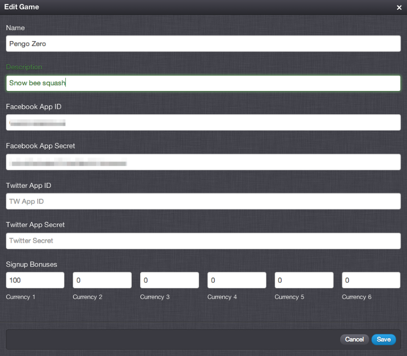

Your GameSparks game is now configured to use your newly created Facebook application: you’re setup to authenticate your players via Facebook, and the GameSparks platform can access their profile to drive its social features.

## Authenticating a player using their Facebook account

Authentication via Facebook is done using the “FacebookConnectRequest”.  To do this you need to obtain an Access Token for your player.  Facebook's authentication flows are based on the [OAuth 2.0](http://tools.ietf.org/html/draft-ietf-oauth-v2) protocol.  Facebook recommend you read their[ Facebook Login guides](https://developers.facebook.com/docs/facebook-login/) for examples of how to use the Login Dialogs on any device or environment.

For the purpose of this guide you can just get hold of the access token for a test user within the Facebook application that you created.  First select your application in the Facebook developer portal from the *Apps* menu.  Then select *Roles* from the left hand menu.  Then select the* Test Users* tab and click the *Add* button.

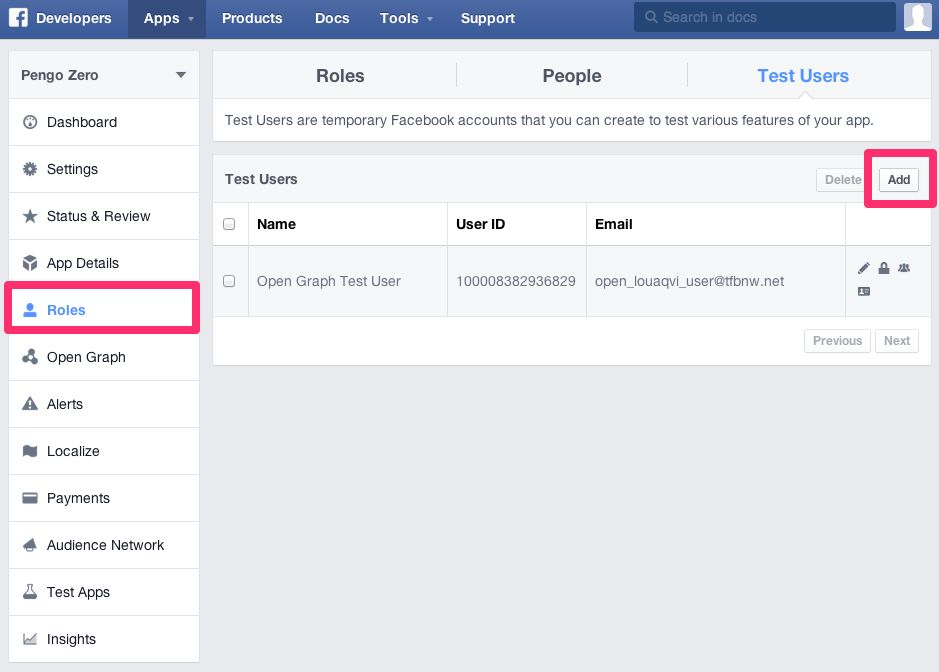

In the dialog select the number of test users that you require and switch *Authorize Test Users for This App* to YES.

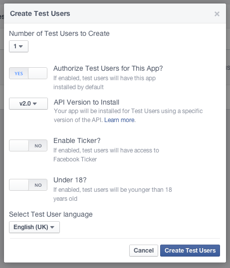

The created test user(s) will be displayed in the list.  Click the padlock icon to get an access token for the test user.

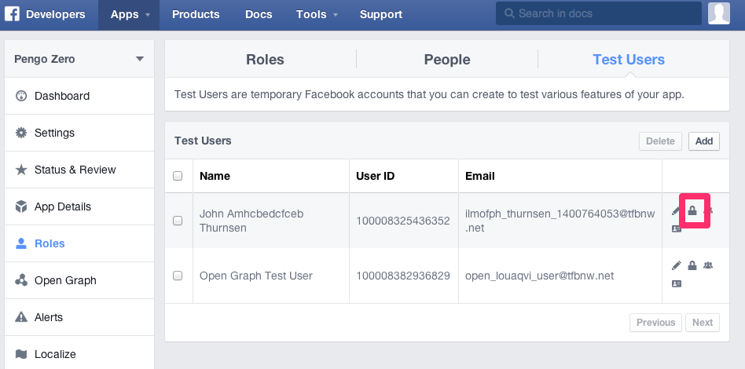

Copy the access token.  You will use it in the GameSparks portal Test Harness in the next section.


## Trying out Facebook authentication in the Test Harness

Back in the GameSparks developer portal, click on the *Test Harness *button.  Within *Authentication*, click *FacebookConnectRequest*, and fill in the accessToken field value with the access token that you obtained above and remove the 'code' field and value.  Click the send icon.  You should see an “.AuthenticationResponse” containing a “displayName” for the player that the platform has looked up from the Facebook profile.

```    
{
 "@class": ".FacebookConnectRequest",
 "accessToken": "accessToken",
 "requestId": "1400764433829"
}
```  

If the authentication with Facebook is successful you will see a response like:

```    
{
 "@class": ".AuthenticationResponse",
 "authToken": "c450ed6c-98e0-41f4-af04-539ad4099151",
 "displayName": "John Amhcbedcfceb Thurnsen",
 "requestId": "1400764433829",
 "scriptData": null,
 "userId": "537df8f1e4b01fdedfa3770f"
}
```

Now create another test user in the Facebook developer portal and click the *Manage this test user's friends* icon.

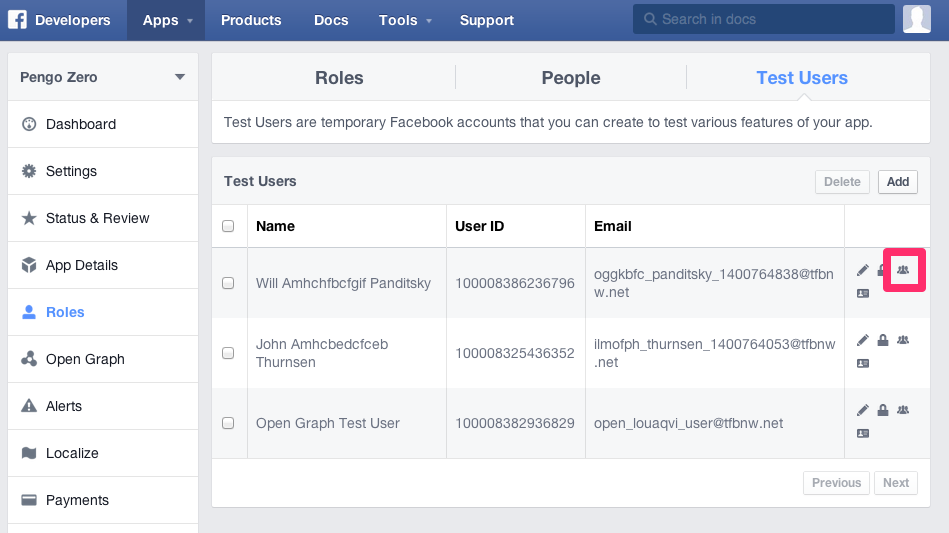

Add the other test user as a friend to this user.

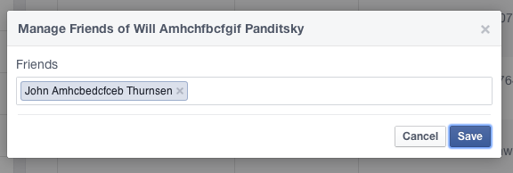

Now obtain an access token for this new test user and send a Facebook connect request to the GameSparks platform via the Test Harness.  Next in the Test Harnes click on User-> ListInviteFriendsRequest and you should see that the list of friends contains the other Facebook test user.
```
{
 "@class": ".ListInviteFriendsRequest",
 "requestId": "1400765749481"
}
```
```
{
 "@class": ".ListInviteFriendsResponse",
 "friends": [
  {
   "id": "FB:100008325436352",
   "displayName": "John Amhcbedcfceb Thurnsen",
   "profilePic": "http://graph.facebook.com/100008325436352/picture"
  }
 ],
 "requestId": "1400765749481",
 "scriptData": null
}
```

Now head on over to [Social Capabilities](/Documentation/Key Concepts/Social Capabilities.md) to see how you can make the most of social integration.
