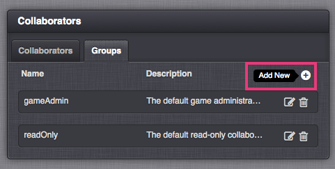
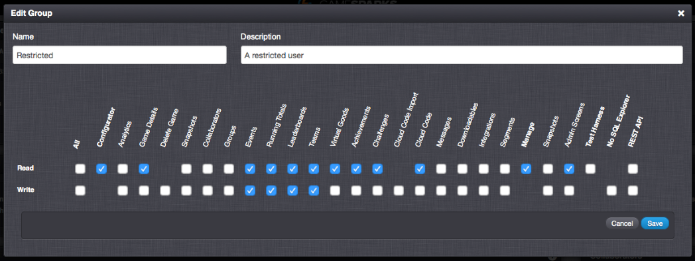
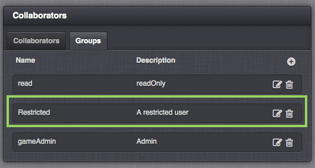
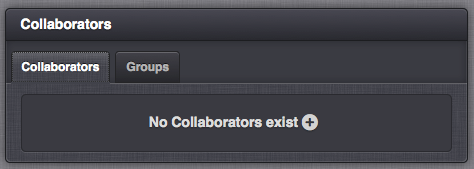
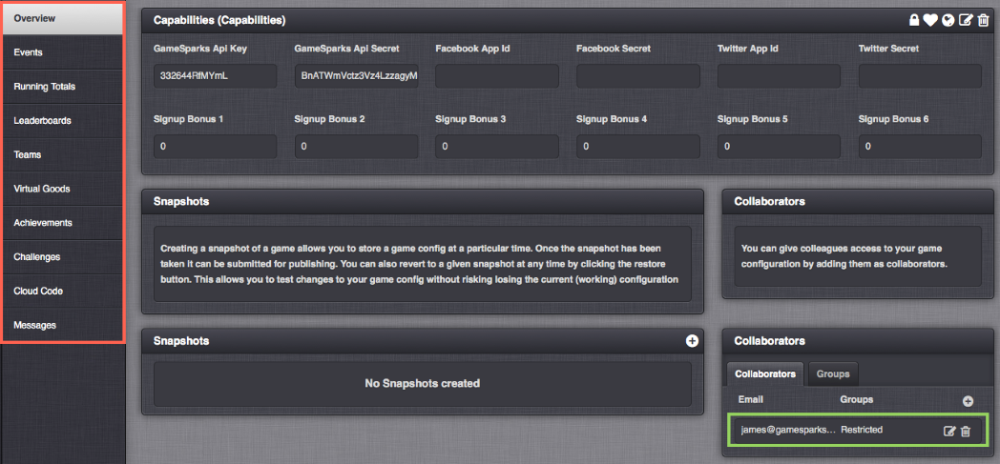
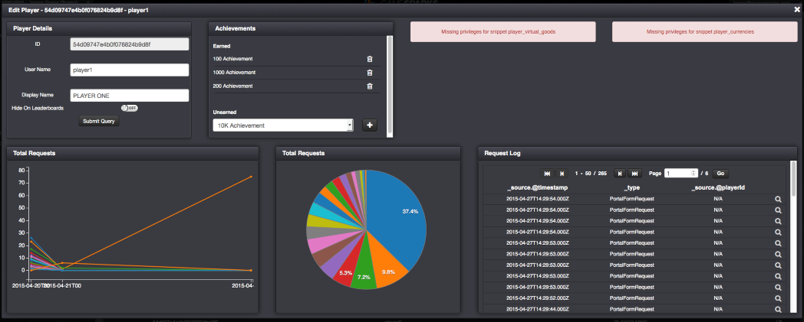

# Capabilities and User Permissions

A game Owner or Admin may wish to set specific read / write permissions for particular areas of the Portal. You may want a user of your game to make changes to Events and Leaderboards, but only view the configuration of Virtual Goods and Achievements, whilst be prevented from viewing or editing the Integrations and Downloadables sections.

We allow a highly configurable set of capabilities throughout the entire platform including a more finer granularity of permissions to be set in the Manage section for Screens and Snippets.

## Collaborators and Group Permissions

You may already be familiar with the use of Collaborators on a game. Previously, when configuring Collaborators on a game within Portal, we had just 2 types of permissions available - an Administrator and a Read-Only user, which we refer to as *gameAdmin* and *readOnly* permissions respectively. These were not configurable to the finer granularity that we allow today. However, we highly recommend that *you don't modify* the permissions on these "default" Groups (which can now be found in *Groups*), because their visibility should serve only as an intuitive template on how to configure your own Group permissions going forward.

You can control the read/write permissions for Collaborators on your game very easily:
* Create a Collaborator Group.
* Edit the Group to define the read/write permissions for Collaborators assigned to that Group.

Finally, you can refine the overall permissions conferred by a Group for specific screens and snippets in the *Manage > Admin Screens* section of the portal.

## Creating Group Permissions and Assigning to Collaborators

By default on any game, the *gameAdmin* and *readOnly* Groups are displayed. The game author and owner will always have full read/write access to everything in the Portal, regardless of how the settings are changed for other game Admins. As mentioned earlier, the game Admin users and read-only users permissions can be altered by modifying the *gameAdmin* and *readOnly* Groups respectively. However, as good practice, we strongly recommend that you do not change these default Groups. Instead, create your own custom Groups to impose permissive control over game accessibility on your Collaborators.

*1.* To create a new Group, navigate to the *Overview* page and click the  icon in the *Groups* tab under *Collaborators*:

*2.* Provide a name and description for the Group and enable Read and Write permissions for each capability in the Portal, as required:

*3.* Save the Group. It will then be displayed in the list of Groups:

*4.* Select the Collaborators tab and add a new Collaborator:

*5.* To assign the Collaborator to the new Group, select the newly created Group in the dropdown menu and save your changes:

In this example, the Collaborator is assigned the newly-configured *Restricted* Group permissions.

*6.* Login as the Collaborator and navigate to the game. Immediately, you will see that not all the options available to a game Admin are available on the screen for you as a Collaborator assigned to a specific permissions Group:

Based on the Capabilities set which is defined by the *Restricted* Group permissions, they may be able to view certain things but not edit them. For example, in my configuration of Capabilities, the *Messages* Capability only has read permissions. This means I can navigate to the Messages section, but when I try to edit any Message, I will see the following:

Based on my configuration, this is the same for Teams, Virtual Goods, Achievements and Challenges. For those Capabilities that have neither read or write permissions, they won't be visible.

## Refining Permissions for Screens and Snippets

As mentioned earlier, we can add finer permissive controls to what users can see and do with Screens and Snippets. For example, access can be given to the Screen and the corresponding Snippets with the exception of the *player_virtual_good* and *player_currencies* Snippets for the newly created Group. Therefore, when a user is logged in with only that Group, they can see the Players Screen as normal, except the information displayed for Virtual Goods and Currencies.

<q>**Note:** By default, all Screens and Snippets have Nothing Selected for Groups. Unless specific Groups are selected for Screens and Snippets, everyone will be able to view them.</q>

*7.* As the game Admin, go to the *Manage* section and Edit the *Players* Screen. Select the newly created Group in the *Groups* dropdown as well as for the *gameAdmin* Group so that Admins can also view it.

*8.* Do the same for each corresponding Snippet. Add both the newly created Group and the default *gameAdmin* group.

*9.* For Snippets *player_virtual_goods* and *player_currencies*, select only the *gameAdmin* Group.

*10.* Login as the user belonging to the newly created Group. Load the *Players* Screen and you can see that the *player_virtual_goods* and *player_currencies* Snippets cannot be viewed.

