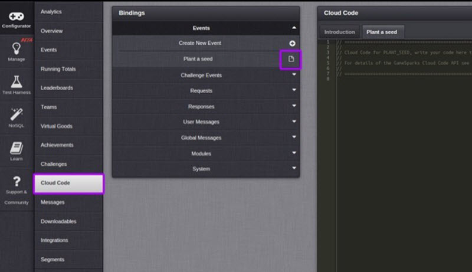
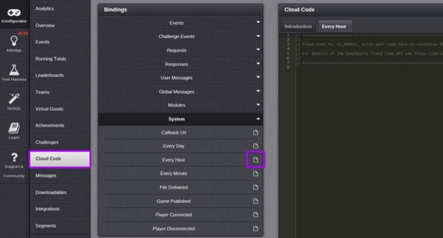

# How to schedule Cloud Code scripts

There are two ways in which you can schedule Cloud Code scripts on the GameSparks platform, the first is the ability to schedule a Module script via the [SparkScheduler](/API Documentation/Cloud Code API/Utils/SparkScheduler.md) Cloud Code object, the second is to use one of the predefined system schedulers.

## Scheduling a script via the SparkScheduler object

Imagine the scenario where you want to allow your players to plant virtual seeds within the game world and for the seed to grow into a plant after a given amount of time has passed.

First let's create an Event that the game code can trigger to indicate that the player has planted the seed. Log in to the GameSparks Portal and navigate to Configurator-> Events. Click on the plus icon __ to add a new Event. Set up the Event as follows.


Navigate to Configurator->Cloud Code->Bindings->Events and select the ‘Plant a seed’ item to open up the JavaScript editor for the Cloud Code associated with this Event.



Copy the following script to the editor and click the Save button.

```    
// Get the Event's coord data
var x = Spark.getData().X;
var y = Spark.getData().Y;

// Schedule the GROW_SEED module to run in 60s time,
// passing in the x,y coords where the seed was planted
var theScheduler = Spark.getScheduler();
theScheduler.inSeconds("GROW_SEED", 60, {"x" : x, "y" : y});
```

This script schedules the GROW_SEED module script to run in 60 seconds time. Now navigate to Configurator->Cloud Code->Modules->Create New Module. Enter "GROW_SEED" as the module name. The copy the following script to the editor and click the Save button.

```    
// Get the x,y coords of the seed
var x = Spark.getData().x;
var y = Spark.getData().y;

// Store a 'plant' item in the 'field' runtime collection
var playerId = Spark.getPlayer().getPlayerId();
var fieldCollection = Spark.runtimeCollection('field');
fieldCollection.insert({"item":"plant", "playerId" : playerId, "x": x, "y" : y});
```

This script uses the [SparkMongoCollectionReadWrite](/API Documentation/Cloud Code API/Mongo/SparkMongoCollectionReadWrite.md) object to write the data to a runtime collection.

Let’s test out this configuration in the *Test Harness*. Navigate to the GameSparks developer portal Test Harness, copy the JSON request below into the JSON field and press the 'Send' icon {sendIcon}.

```    
{
 "@class": ".RegistrationRequest",
 "displayName": "displayName",
 "password": "password",
 "userName": "gardener"
}
```

The GameSparks platform will return a response similar to this.

```    
{
 "@class": ".RegistrationResponse",
 "authToken": "b10441c4-58e0-4149-bb42-6da55acf86d5",
 "displayName": "displayName",
 "newPlayer": true,
 "scriptData": null,
 "userId": "551a91dee4b0b82116bdb649"
}
```

This player is now authenticated and could sign into later sessions using these credentials with an [AuthenticationRequest](/API Documentation/Request API/Authentication/AuthenticationRequest.md).

Now make the PLANT_SEED Event call. Copy the JSON request below into the JSON field and press the 'Send' icon {sendIcon}.

```
 {
 "@class": ".LogEventRequest",
 "eventKey": "PLANT_SEED",
 "X": 10,
 "Y": 12
}
```
The GameSparks platform will return a response similar to this.

```  
{
 "@class": ".LogEventResponse",
 "scriptData": null
}
```
The 'Plant a Seed' Cloud Code script will execute when GameSparks receives this Event. That script schedules the GROW_SEED script to run in 60 seconds time, passing in the X,Y coordinates from the Event. 60 seconds later the GROW_SEED script will execute which will result in a document being created in the *script.field* collection.

To see the results navigate to NoSQL Explorer, *NoSQL->Find *select the *script.field* collection and press the *Find* button.


## Scheduling a script via a system scheduler

The System tab in the Cloud Code section contains three time based triggers:

* Every Minute
* Every Hour
* Every Day

These scripts execute at the top of every minute, hour and day respectively. Continuing our farm based example from above let's schedule a script that clears all the plants form the virtual field every hour. Navigate to Configurator->Cloud Code->System and select *Every Hour.*



Copy the following script to the editor and click the Save button.

```    
var fieldCollection = Spark.runtimeCollection('field');
fieldCollection.remove({"item":"plant"});
```

This script removes all the documents from the 'field' collection that match the given query. In this case all the items that are plants are removed every hour.
