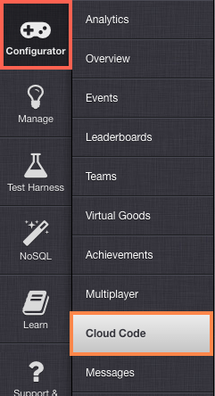
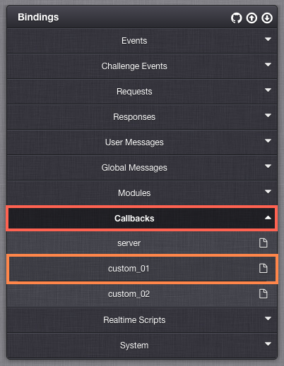

# How to use Custom Callback Urls

Callbacks are used to allow custom and separate Cloud Code scripts to be run against different Callback URLs, which in turn, are individually linked to a custom Credential created in the Integrations section.  Previously, only one Callback URL could be created per game.  This has now been enhanced to allow as many custom Callback URLs to be created as there are custom Credentials.

*1.* Before we can create a Callback URL script, first we will need to create a customised Credential. For a refresher, see the Credentials Tutorial.


*2.*  Ensure to switch on the new CB checkbox.  This tells the platform that this credential is going to be exclusively used for Callback scripts.


*3.* In the Portal's Configurator go to Cloud Code.



*4.* Select Callbacks from the Bindings list, and edit one of the custom credentials that you created in Step 1 and 2.



*5.* Enter the Cloud Code you want to be executed for the Callback. For the purposes of our tutorial, we will just write a Script to return a message.

```
Spark.setScriptData("RESPONSE_RAW", "Hello World!");
```

*6.* Now the Callback script is created, we can see this working by using an API Post Request in the following format:

https ://{stage}.gamesparks.net/callback/{apiKey}/{credential}/{credentialSecret}

Response:

```
Hello World!
```
