# C# Object Serialization for Gamesparks - Using Reflection

## Introduction

The serialization code covered in this tutorial will allow you to send objects containing most data-types to the server by serializing them directly into a form GameSparks can understand. This is recommended when you want to save game-states (for example) to GameSparks and to the client locally. Using a serializer, you can save the same game-state object to disk and to GameSparks, synchronizing the data without having to parse out individual fields and sending them to the server. Simply give the object you want to send to the method and it will create a *GSRequestData* object from this which can be sent to GameSparks.

This tutorial will cover the basics of how to achieve this but there are types excluded which may require you to develop the serializer further - if you want to add dictionaries for example.

There's also no code for serializing primitives directly because the GameSparks SDK already offers *GSRequestData* for most data-primitives, so we'd advise you to use that instead.

## Serialization Code

The basis for this tutorial is the *GameSparksSerializer.cs* class. This class will be broken down into two main methods: *GSDataToObject* and *ObjectToGSData*. To begin with, create a new C# class called *GameSparksSerializer.cs*.

### ObjectToGSData

The *ObjectToGSData* method will take a C# object and, using reflection, we'll check what fields exist in that object. It will also check if those fields are serializable, allowing you to mark certain fields in your objects to be sent to GameSparks or not.

Using reflection allows us to gain information about the Object without needing to know which specific fields exist or having to create separate methods for separate object-types.

We'll be converting the information into JSON, so we're going to use field-names as keys for our JSON data. We'll also need to store the object type as a separate field so we can create an object out of our JSON data when we want to get the object back.

We start with this method, because we need to have some data stored correctly on the server before we can get it back and convert it back into an object.

### GSDataToObject

Our object will be stored in a collection on the server as JSON data. We need to create a method to retrieve this data and parse it back into the original form. We'll therefore be passing *GSData* from the server response into the *GSDataToObject* method.


## ObjectToGSData

Create a new method called *ObjectToGSData*. We'll make this a static method because there's nothing else that relies on an instance for this method to run. The return type of this method will be *GSRequestData*.

*GSRequestData* is essentially a wrapper for the JSON data we are going to send to the server. Importantly, it provides methods for converting objects, enumerables, and primitives to GSData so that GameSparks requests can recognize the format and send it to the server. This will save us writing a lot code ourselves:

```
public static GSRequestData ObjectToGSData(object obj)
 {

 }

```

This method will have several steps:

*1.*	First we create a new *GSRequestData* object to which we'll add fields and return from this method.

*2.*	For each value we add, we include a new field called type. This will be the type of the object we are converting to *GSData* (we'll use this later to parse the field back to the correct type).

*3.*	We then iterate through every field we find for that type using the *System.Reflection.FieldInfo* class. This class gives us many details about the object’s fields. These will be explained as we go through the tutorial.

```
public static GSRequestData ObjectToGSData(object obj)
    {
        GSRequestData gsData = new GSRequestData();
        gsData.AddString("type", obj.GetType().ToString());
        foreach(var field in obj.GetType().GetFields())
        {
            // check each field here
        }
return gsData;
    }

```

Then for each *FieldInfo* variable, we'll check the following:

*1.*	Check the field is serializable.
* We want the serialize to ignore fields marked as not serializable. We can do this very easily with the *FieldInfo* class. Using the field we can get the type of that field and then use *field.IsNotSerialized*.

*2.*	Check that the value for that field is not null.
* In other words, just because the class has a field defined does not mean that there is any data for the field. In this case, there is no point sending that field to the server, so we exclude it from the serializer. We can do this using *field.GetValue()*. This method takes an object, in this case the object we are serializing.

```
public static GSRequestData ObjectToGSData(object obj)
    {
        GSRequestData gsData = new GSRequestData();
        gsData.AddString("type", obj.GetType().ToString());
        foreach(var field in obj.GetType().GetFields())
        {
            if(!field.IsNotSerialized && field.GetValue(obj) != null)
            {
                // everything in here can be serialized!
            }
        }
        return gsData;
    }

```

The next thing we want to do is actually serialize some data. So we need some data we can easily serialize. *GSRequestData* can convert some simple types to *GSData*, so we'll look at those first.

The first example we'll use is a string. We'll check if the field-type is a string and then add the corresponding value of that field from the object to the *gsData* variable:

```
public static GSRequestData ObjectToGSData(object obj)
    {
        GSRequestData gsData = new GSRequestData();
        gsData.AddString("type", obj.GetType().ToString());
        foreach(var field in obj.GetType().GetFields())
        {
            if(!field.IsNotSerialized && field.GetValue(obj) != null)
            {
                // everything in here can be serialized!
                if(field.FieldType == typeof(string))
                {
                    gsData.AddString(field.Name, field.GetValue(obj).ToString());
                }
            }
        }
        return gsData;
    }

```
The *AddString()* method takes the object you want to serialize and a key used to define it. In this case we used the name of the field as the key. This is important because using the field-name allows us to search back through fields when we are parsing back into an object.

Our *ObjectToGSData* request can now serialize any strings in any objects you want to throw at it. If you want to check what your *GSData* looks like in JSON form, you can add a log to print out the JSON before returning it:

```
public static GSRequestData ObjectToGSData(object obj)
    {
        GSRequestData gsData = new GSRequestData();
        gsData.AddString("type", obj.GetType().ToString());
        foreach(var field in obj.GetType().GetFields())
        {
            if(!field.IsNotSerialized && field.GetValue(obj) != null)
            {
                // everything in here can be serialized!
                if(field.FieldType == typeof(string))
                {
                    gsData.AddString(field.Name, field.GetValue(obj).ToString());
                }
            }
        }
        Debug.LogWarning(gsData.JSON);
        return gsData;
    }

```

### Testing

So to test this, all we need to do is create a class with a few variables. We'll create a few different types of variables that we'll serialize in the next steps of this tutorial and to prove that this code will currently only serialize strings:

```
public class MyTestClass
{
    public string myString;
    public int myInt;
    public bool myBool;
    public float myFloat;

    public MyTestClass()
    {
        this.myString = "Hello World!";
        this.myInt = 100;
        this.myBool = true;
        this.myFloat = 0.1234567f;
    }
}

```

Now pass this object into the *ObjectToGSData()* method we just created to see what gets serialized.

```

GameSparksSerialiser.ObjectToGSData(new MyTestClass());

```


If you run this code, you will see the JSON printed out in the warning log we created at the end of that method (the warning log is just to make it stand out from other logs in this case).


### Additional Data-Types

The process for adding other data-types is the same as for strings. We just check the type and then use the appropriate *Add* method from *GSDataRequest* to add that field to *gsData*:

```
if(field.FieldType == typeof(string))
        {
          gsData.AddString(field.Name, field.GetValue(obj).ToString());
        }
else if(field.FieldType == typeof(bool))
        {
          gsData.AddBoolean(field.Name, bool.Parse(field.GetValue(obj).ToString()));
        }
else if(field.FieldType == typeof(int))
        {
          gsData.AddNumber(field.Name, (int)Convert.ToInt32(field.GetValue(obj)));
        }
else if(field.FieldType == typeof(float) || field.GetValue(obj).GetType() == typeof(double))
        {
          gsData.AddNumber(field.Name, Double.Parse(field.GetValue(obj).ToString()));
        }

```

And now, if we try to serialize our test-class again, we should see all our variables listed as JSON.

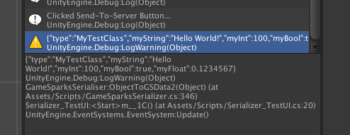

### Setting Fields as Non-Serializable

For those not familiar with serialization in C#, there are some ways to set classes and fields as serializable or non-serializable.

This is important, because there's usually some fields in your class that you want to send to the server and some you do not. There will also be some fields that are not serializable at all using this tutorial, though you can always add those yourself (this will just cover serializing the basics).

In Unity3D, for example, classes like *Button* or *GameObject* could have triggers or event-listeners you do not want to send to the server.

Stopping fields from being serialized:
* One way to stop fields from being serialized is to set them as private.
* The other is to mark them with the *NonSerialized* attribute.

You can see this in the example below:

```
[Serializable()]    
public class MyTestClass
{
    [NonSerialized()]
    public string myString;
    private int myInt;
    public bool myBool;
    public float myFloat;

    public MyTestClass()
    {
        this.myString = "Hello World!";
        this.myInt = 100;
        this.myBool = true;
        this.myFloat = 0.1234567f;
    }
}

```

Above, you can see that the *myString* field is marked with this attribute, and the *myInt* field is marked as private. So we can expect this code to only serialize the float and the bool:


### List and Arrays

The *GSRequestData* class has the ability to create JSON data from two types of lists or arrays out-of-the-box. These can be lists of numbers (float, int, double) or lists of strings. From the point of view of *GSRequestData*, it only accepts lists, so any arrays we want to send will have to be converted first.

#### Strings

The first thing we need to do is check that the field type is an array of strings. Then we will use the *GSRequestData.AddStringList()* method. As mentioned, this only accepts a list of objects, so we'll convert our array to a string-list.

To save space we'll use a conditional statement here so that we can have the method accept a list or array in the same line without if-statements:

```
else if(field.FieldType == typeof(List<string>) || field.GetValue(obj).GetType() == typeof(string[]))
        {
          gsData.AddStringList(field.Name,  (field.FieldType == typeof(List<string>)) ? field.GetValue(obj) as List<string> : new List<string>(field.GetValue(obj) as string[]));
        }

```

You can see from the code above that the conditional statement checks if we have a list first and, if so, we add it as a list. Otherwise, we create a new list from the value of that field (the array).

#### Testing

In our test-class we'll need to create an array of strings and a list of strings so we can prove that both serialize properly.

```

<<< CODE BLOCK MISSING? <<<

```


If we run the code again, we should see our array and list data printed in the JSON log:

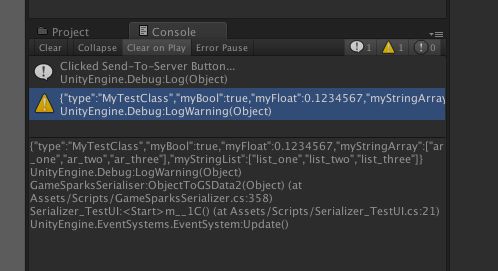

#### Numbers (Floats and Ints)

These work the same way as the string example above, only we use the *AddNumber()* method. Again, this only accepts lists, so we will have to convert any arrays before we pass them to *AddNumber()*.

```

else if(field.FieldType == typeof(List<string>) || field.GetValue(obj).GetType() == typeof(string[]))
      {
        gsData.AddStringList(field.Name,  (field.FieldType == typeof(List<string>)) ? field.GetValue(obj) as List<string> : new List<string>(field.GetValue(obj) as string[]));
      }
else if(field.FieldType == typeof(List<int>) || field.GetValue(obj).GetType() == typeof(int[]))
      {
        gsData.AddNumberList(field.Name,  (field.FieldType == typeof(List<int>)) ? field.GetValue(obj) as List<int> : new List<int>(field.GetValue(obj) as int[]));
      }
else if(field.FieldType == typeof(List<float>) || field.GetValue(obj).GetType() == typeof(float[]))
      {
        gsData.AddNumberList(field.Name,  (field.FieldType == typeof(List<float>)) ? field.GetValue(obj) as List<float> : new List<float>(field.GetValue(obj) as float[]));
      }

```

You can also add some functionality to parse doubles or longs here, but for this example we'll only deal with floats and ints.

#### Testing

To test this, we'll create an array of floats and a list of ints. There is no need to show arrays and lists for both these because we've already shown that the conditional statement works:

```
public class MyTestClass
{
    public string myString;
    public int myInt;
    public bool myBool;
    public float myFloat;

    public string[] myStringArray;
    public List<string> myStringList;

    public float[] myFloatArray;
    public List<int> myIntList;

    public MyTestClass()
    {
        this.myString = "Hello World!";
        this.myInt = 100;
        this.myBool = true;
        this.myFloat = 0.1234567f;

        this.myStringArray = new string[]{ "ar_one", "ar_two", "ar_three" };
        this.myStringList = new List<string>(){ "list_one", "list_two", "list_three" };

        this.myFloatArray = new float[]{ 0.1f, 0.12f, 1.23f };
        this.myIntList = new List<int>(){ 3, 2, 1 };
    }
}

```

Now, in the JSON log you should see these fields:

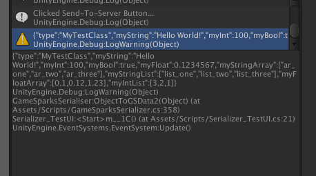

#### Serializing Dates

*GSRequestData* also allow you store *DateTime* objects. This is done using *AddDate()* method. Again, we'll check the field-type is *DateTime* before adding this object to *GSData*:

```
else if(field.FieldType  == typeof(DateTime))
                {
                    gsData.AddDate(field.Name, (DateTime)field.GetValue(obj));
                }

```

#### Testing

So we'll need a *DateTime* field in our test-class. For this, we'll create a new *DateTime* object with the current date:

```
public class MyTestClass
{
    public string myString;
    public int myInt;
    public bool myBool;
    public float myFloat;

    public string[] myStringArray;
    public List<string> myStringList;

    public float[] myFloatArray;
    public List<int> myIntList;

    public DateTime myDate;

    public MyTestClass()
    {
        this.myString = "Hello World!";
        this.myInt = 100;
        this.myBool = true;
        this.myFloat = 0.1234567f;

        this.myStringArray = new string[]{ "ar_one", "ar_two", "ar_three" };
        this.myStringList = new List<string>(){ "list_one", "list_two", "list_three" };

        this.myFloatArray = new float[]{ 0.1f, 0.12f, 1.23f };
        this.myIntList = new List<int>(){ 3, 2, 1 };

        this.myDate = DateTime.Now;
    }
}

```

In the JSON log, we see:

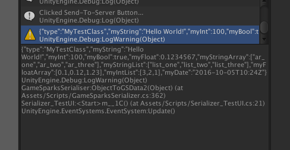

### Serializing Nested Objects

Serializing basic-types or lists of basic-types is easy using *GSRequestData*, but what if we want to serialize an object contained within the object we want to serialize?

For this example, we're going to create a new class which we'll add to our test-class:

```
public class PlayerInfo
{
    public string name;
    public int level;
    public int xp;

    public PlayerInfo(string name, int level, int xp)
    {
        this.name = name;
        this.level = level;
        this.xp = xp;
    }
}

```
Then we need to add this object to our test-class. We won’t review an example of this code, because these examples will begin to take up a lot of space. All we're doing is creating a new field and then instantiating the field in the test-class constructor.

The first thing we need to do in our serializing code is to check if the object is a class. Luckily, reflection in C# has a Boolean on the field type that allows us to check this. All we need to do is to pass the class back to *ObjectToGSData()* again so we can use the same code to serialize this object to the original *GSData* variable:

```
else if(field.FieldType.IsClass)
                {
                    gsData.AddObject(field.Name, ObjectToGSData(field.GetValue(obj)));
                }

```

#### Testing

With our *PlayerInfo* field in the test-class, we should expect to see the field added to the JSON with the class-type added as it was at the start of this tutorial:

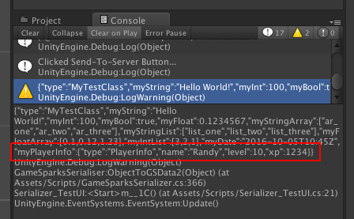

### Lists of Objects

Now we have almost everything we need to get the basics of a data-serializer working with the GameSparks SDK. The last type we are going to look at in this example is lists or arrays of objects.

For this example, we are going to create a list of items, such as you might find in a player’s inventory. So, using this example you could serialize the player’s entire inventory and send it to the server to save it. This is a quick and useful way to save data to the server without needing to edit or update items individually:

```
public class Item
{
    public string name;
    public int uses;
    public int health;

    public Item(string name, int uses, int health)
    {
        this.name = name;
        this.uses = uses;
        this.health = health;
    }
}

```

The above code is a very simple example of an item you might use in an inventory. We'll create a list of these in our test-class and then create a few unique items to prove the item gets serialized:

```
public class MyTestClass
{
    public string myString;
    public int myInt;
    public bool myBool;
    public float myFloat;

    public string[] myStringArray;
    public List<string> myStringList;

    public float[] myFloatArray;
    public List<int> myIntList;

    public DateTime myDate;

    public PlayerInfo myPlayerInfo;

    public List<Item> inventory = new List<Item>();

    public MyTestClass()
    {
        this.myString = "Hello World!";
        this.myInt = 100;
        this.myBool = true;
        this.myFloat = 0.1234567f;

        this.myStringArray = new string[]{ "ar_one", "ar_two", "ar_three" };
        this.myStringList = new List<string>(){ "list_one", "list_two", "list_three" };

        this.myFloatArray = new float[]{ 0.1f, 0.12f, 1.23f };
        this.myIntList = new List<int>(){ 3, 2, 1 };

        this.myDate = DateTime.Now;

        this.myPlayerInfo = new PlayerInfo("Randy", 10, 1234);

        inventory.Add(new Item("Shield", -1, 100));
        inventory.Add(new Item("Potion", 1, 100));
        inventory.Add(new Item("Sword", 100, 0));
    }
}

```

Back in our serializer code, we're again going to check that we have the correct type. The first thing we need to do is check if we have a generic type. This is because technically our list can be interpreted as a class with the way we have our code written. So we'll first use *FieldType.IsGenericType* to make sure our class serializer is checking for a class or list.

We're going to use the *GetGenericTypeDefinition* instead of just *FieldType* to make sure we have a list and not some other generic-type:

```
else if(field.FieldType.IsClass && !field.FieldType.IsGenericType)
                {
                    gsData.AddObject(field.Name, ObjectToGSData(field.GetValue(obj)));
                }
               else if (field.FieldType.IsGenericType && field.FieldType.GetGenericTypeDefinition() == typeof(List<>))
                {
                    // our code will go here
                }

```


Within this if-statement we'll create a new list of *GSData*. This is going to be added to our main gsData variable as an object-list (we’ll see this in the JSON data later).

Then we'll iterate through object-list and add new *GSData* objects for each element in the list using *ObjectToGSData()* again, as we did when we were saving nested objects.

Something important to note is that we don’t know what type of list we might be serializing, so instead of a list we'll cast our list to *IList*. This allows us to forget about the type of the list and just iterate through it:

```
else if (field.FieldType.IsGenericType && field.FieldType.GetGenericTypeDefinition() == typeof(List<>))
        {
          List<GSData> gsDataList = new List<GSData>();
          foreach(var elem in field.GetValue(obj) as IList)
        {
          gsDataList.Add(ObjectToGSData2(elem));
        }
          gsData.AddObjectList(field.Name, gsDataList);
        }

```

#### Testing

Now you should be able to run your code and check out what we get from the JSON log:

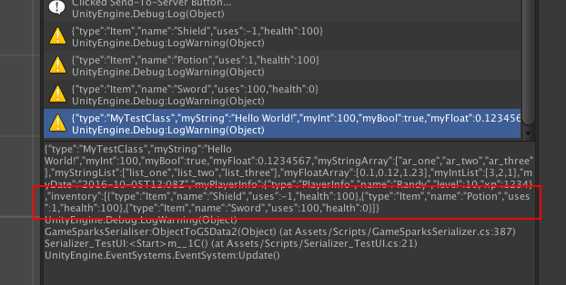


### Arrays of Objects

Lastly, we should add some code to allow arrays to be serialized as well. Since we use the *IList*, we don’t have to do anything special with arrays, because *IList* will have them the same once we cast them.

All we need to do is add some code to the object-check to make sure it doesn’t try to serialize arrays (as we made sure it didn’t serialize lists). After that, we add a cast to our object-list check to make it also accept arrays:

```
else if(field.FieldType.IsClass && !field.FieldType.IsGenericType && !field.FieldType.IsArray)
      {
        gsData.AddObject(field.Name, ObjectToGSData(field.GetValue(obj)));
      }
        else if (field.FieldType.IsGenericType && field.FieldType.GetGenericTypeDefinition() == typeof(List<>) || field.FieldType.IsArray)
      {
        List<GSData> gsDataList = new List<GSData>();
        foreach(var elem in field.GetValue(obj) as IList)
      {
        gsDataList.Add(ObjectToGSData2(elem));
      }
        gsData.AddObjectList(field.Name, gsDataList);
      }

```

## JSON File Size

Something that might be useful is to know what your size your JSON data is before sending it to the server.

You can get an approximate size of the JSON string by multiplying the length of the string by the size of a single character:

```
GSRequestData data = GameSparksSerialiser.ObjectToGSData2(new MyTestClass());
            Debug.Log("JSON Size: "+(data.JSON.Length*sizeof(char))/1000+"Kb");

```

<q>**NOTE 1:** Although this process for saving data to the server is easier, you should also keep in mind the amount of data you are sending to the server. GameSparks limits the size of data that can be send through a request (<256Kb).</q>

<q>**NOTE 2.** Also keep in mind that although you may not reach this limit, a large amount of data will have a significant effect on the speed of requests and responses.</q>

## Sending Data to the Server

The next step is to actually send this serialized JSON to the server and save it in a collection. For this example, we're going to keep it simple - we're going to create an Event where we'll send this data, and we'll insert the data from the client into the collection:


In our *save_data* event we add the following Cloud Code:
* We'll use *collection.findAndModify()* to search for a player’s ID and then insert the new data.
* We'll use the *upsert* functionality to automatically create a new doc for this player if they don’t have one already:

```
var playerData = Spark.getData().data;
// find an modify the doc for this player in the 'playerData' collection using their playerId //
// if there is no doc for the player then we use upsert to create one //
var doc = Spark.runtimeCollection('playerData').findAndModify({ "playerId" : Spark.getPlayer().getPlayerId() }, null, {}, false, {
    $set : {
        'updated' : new Date(),
        'data' : playerData
    }
}, false, true); // <- upsert is the last option in this function, set to 'true'
// last, return the player data to prove it was updated //
Spark.setScriptData('playerData', doc)


```

<q>**Note!** We have a line at the end to return the doc we are saving. This is just for this tutorial, you can remove it later if you like. All it does is to prove the doc was saved correctly for us by returning it back.</q>

Now we just need to put some code in to send our GSData to GameSparks using the log-event we just created.

You can put this code where you like when implementing your own requests. For this example, we use a button listener:

```
sendObjectToServer_bttn.onClick.AddListener(()=>{

            Debug.Log("Clicked Send-To-Server Button...");
            GSRequestData data = GameSparksSerialiser.ObjectToGSData(new MyTestClass());

            new GameSparks.Api.Requests.LogEventRequest().SetEventKey("save_data")
                .SetEventAttribute("data", data)
                .Send((response) => {
                    if(!response.HasErrors)
                    {
                        Debug.Log("Data Saved!");
                        Debug.LogWarning(_resp.JSONString);

                    }
                    else
                    {
                        Debug.LogError(response.Errors.JSON);
                    }
                });
        });

```
We see:

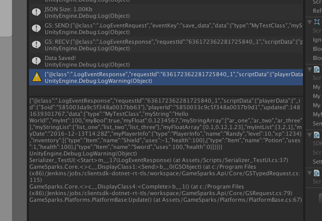

## Requesting Data Back

Now that we have the data saved to the server, the first thing we need to do is to get it back. For this we need another log-event request. You can create on through the GameSparks portal Events tab:


The Cloud Code for this Event is going to be simple:
* All we need to do is find the document in the collection for this player, and return it.
* If there is no document for the player, we will return an error:


```
// use 'findOne' to get the player doc //
var playerData = Spark.runtimeCollection('playerData').findOne({ 'playerId' : Spark.getPlayer().getPlayerId() });
if(playerData){ // if we have player data in that collection, return it //
    Spark.setScriptData('@getPlayerData', playerData.data);
}else{ // if no player data exists, return an error //
    Spark.setScriptError('@getPlayerData', 'no-player-data');
}
// I used @ to denote the event name, but you can name tha data whatever you like


```

Now we'll create the request on the client-side to get this information back:

```
new GameSparks.Api.Requests.LogEventRequest().SetEventKey("getPlayerData")
                    .Send((response) => {
                        if(!response.HasErrors)
                        {
                            MyTestClass testData = GameSparksSerialiser.GSDataToObject(response.ScriptData.GetGSData("@getPlayerData")) as MyTestClass;

                        }
                        else
                        {
                            Debug.LogError(response.Errors.JSON);
                        }
                    });

```


## GSDataToObject

Now we need to create the *GSDataToObject* method. Again, this will be a static method, returning an object and taking *GSData*.

The first thing we'll do is just to print out the JSON for the *GSData* we get back to make sure it is correct. It will help us with debugging and make sure our request is working correctly:

```
public static object GSDataToObject(GSData gsData)
{
    Debug.LogWarning(gsData.JSON);

    return null;
}

```

If we run this code now, you should see the same JSON data you sent to the server in the last section again:

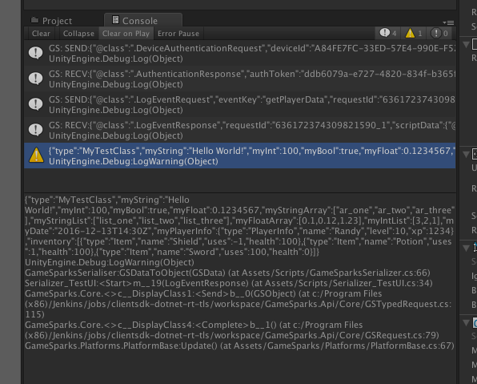


### Recreating the Object

This method is very similar to ObjectToGSData, only in reverse. The steps are:

*1.* Parse the type field for this object into a Type.

*2.* Create an object of that type (this is what is returned from the method).

*3.* Go through all fields for this object-type and find the matching field-names in our GSData.

*4.* Convert the GSData to an object using the Get functions.

The first step will be to get the type. This is pretty simple as we can create a type from a string and we stored the type of each object in a JSON field. The next step will be to use the Activator class to create an instance of an object from that type.

Then we'll iterate through each field, excluding those fields that cannot be serialized:

```
public static object GSDataToObject(GSData gsData)
{
    Debug.LogWarning(gsData.JSON);

    Type objType = Type.GetType(gsData.GetString("type"));
    object obj = Activator.CreateInstance(objType);
    foreach(var typeField in objType.GetFields())
    {
        if(!typeField.IsNotSerialized)
        {
            // check our types here
        }
    }

    return obj;
}

```

### De-Serializing the Basics (String, Int, Bool, Float)

We'll start with a few basic types to test how this works. The logic works the same as with *ObjectToGSData*. We just check the field-type and then use the appropriate method. In this case we use *GSData.GetNumber()*, *GetString*, and so on.

Once we have the data from the *GSData*, we need to apply it to our object. We do this with *FieldInfo.SetValue()*. This is a very useful method that allows you to set the value of fields in your object and, given that we know the field name, we can be sure the right fields get the right values:

```
foreach(var typeField in objType.GetFields())
    {
      if(!typeField.IsNotSerialized)
      {
        if(typeField.FieldType == typeof(string))
        {
          typeField.SetValue(obj, gsData.GetString(typeField.Name));
        }
        else if(typeField.FieldType == typeof(int))
        {
          typeField.SetValue(obj, (int)gsData.GetNumber(typeField.Name).Value);    
        }
        else if(typeField.FieldType == typeof(float))
        {
          typeField.SetValue(obj, (float)gsData.GetFloat(typeField.Name).Value);    
        }
        else if(typeField.FieldType == typeof(bool))
        {
          typeField.SetValue(obj, gsData.GetBoolean(typeField.Name));    
        }
      }
  }

```

#### Testing

Testing that the data has been de-serialized requires us to add a method to our *MyTestClass* class. We're calling this method Print(), and we're going to call it just after we cast the object from *GSDataToObject()* back into *MyTestClass*.

All we need to do here is print out the values for any fields in the class we are de-serializing:
* If the value did not de-serialize properly for some reason, we can expect that value to be null and so we should get a null-reference error.
* If the data is de-serialized correctly, we'll expect to see the same value as the JSON we print at the top of the method:

```
public void Print()
{
    Debug.Log("MyString:"+myString);
    Debug.Log("MyInt:"+myInt);
    Debug.Log("MyFloat:"+myFloat);
    Debug.Log("MyBool:"+myBool);
}

```

Another thing to note is that constructors for *MyTestClass*, *PlayerInfo* and *Item* contain setup code already. And at the moment, this code is the same as the *GSData* we are getting back from the server. So when our de-serialization code creates these objects, it will instantiate them with the same values we expect to get back from the server. Therefore, it is redundant to test unless you remove those constructors:

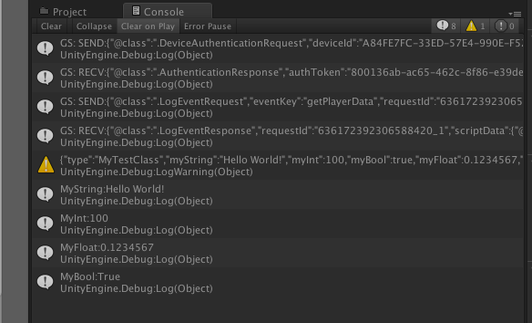

And there it is! We have our first few primitive types back from the server after converting them to JSON. From here, you should be able to figure the rest of the process out by yourself, but we will go through the next few steps anyway.

### DateTime

*DateTime* objects are simple to de-serialize, because *GSData* has a *GetDate()* method. In order to test this, we'll have to get the *DateTime* field of our test-class to print out the value for *myDate*:

```
else if(typeField.FieldType == typeof(DateTime))
                {
                    typeField.SetValue(obj, gsData.GetDate(typeField.Name));    
                }

```

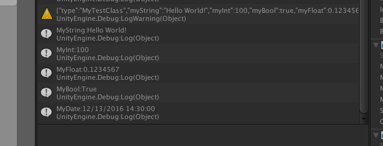


### List and Arrays

Because we already covered how to get lists and arrays back, there is no need to go in-depth with it again here. *GSData* will only return List types, so we'll use a conditional-operator to find the right type (List or Array):

```
else if((typeField.FieldType == typeof(List<string>) || typeField.FieldType == typeof(string[]) ))
                {
                    typeField.SetValue(obj, (typeField.FieldType == typeof(List<string>)) ? (object)gsData.GetStringList(typeField.Name) : gsData.GetStringList(typeField.Name).ToArray());  
                }
                else if((typeField.FieldType == typeof(List<int>) || typeField.FieldType == typeof(int[])) )
                {
                    typeField.SetValue(obj, (typeField.FieldType == typeof(List<int>)) ? (object)gsData.GetIntList(typeField.Name) : gsData.GetIntList(typeField.Name).ToArray());    
                }
                else if((typeField.FieldType == typeof(List<float>) || typeField.FieldType == typeof(float[])) )
                {
                    typeField.SetValue(obj, (typeField.FieldType == typeof(List<float>)) ? (object)gsData.GetFloatList(typeField.Name) : gsData.GetFloatList(typeField.Name).ToArray());    
                }

```

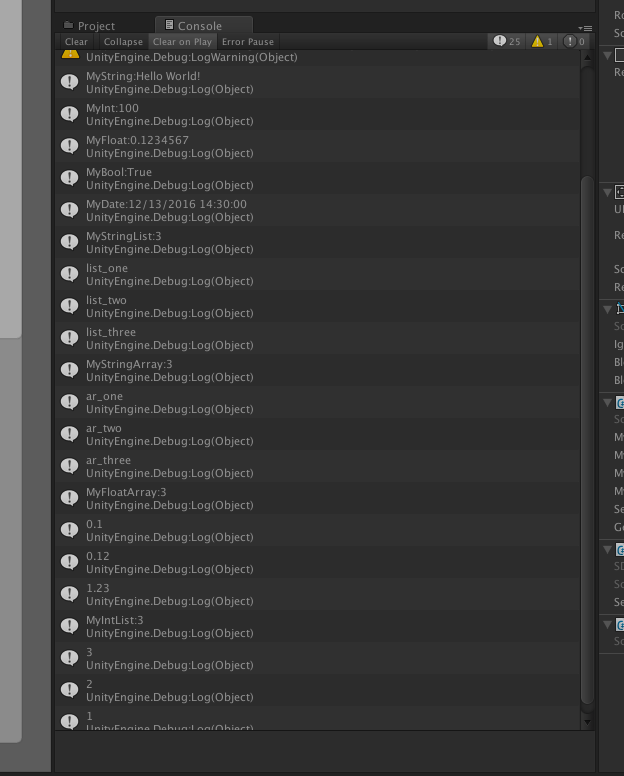


In the image above, all we did to the *Print()* method was print out the count or length of the array or list to check it was correct. To be doubly-sure, we iterated through the elements and printed those out too.

### Nested Objects

As with *ObjectToGSData()*, nested objects can be de-serialized by passing in the *GSData* to the *GSDataToObject()* method again. We'll check that it is a class, and that it is not generic or an array. This will allow us to de-serialize arrays or lists of nested objects next:


```
else if(typeField.FieldType.IsClass && !typeField.FieldType.IsGenericType && !typeField.FieldType.IsArray)
                {
                    typeField.SetValue(obj, GSDataToObject(gsData.GetGSData(typeField.Name)));
                }

```

### List of Nested Objects

This section is separate from arrays unlike in the previous section. This is because we cannot use the *Activator* class to create arrays with a certain type, while we can for lists. Instead we'll use *Array.CreateInstance()* to make the array of the objects. We'll then de-serialize the *GSData* into that array and copy that array into the array of the correct type:

```
else if(!typeField.FieldType.IsArray && typeof(IList).IsAssignableFrom(typeField.FieldType))
                {
                    IList genericList = Activator.CreateInstance(typeField.FieldType) as IList;
                    foreach(GSData gsDataElem in gsData.GetGSDataList(typeField.Name))
                    {
                        object elem = GSDataToObject(gsDataElem);
                        genericList.Add(elem);
                    }
                    typeField.SetValue(obj, genericList);
                }
                else if(typeField.FieldType.IsArray)
                {
                    List<GSData> gsArrayData = gsData.GetGSDataList(typeField.Name);
                    // create a new instance of the array. The Activator class cannot do this for arrays //
                    // so this will create a new array of types inside the array, with the count of what is in the gsdata list //
                    Array newArray = Array.CreateInstance(typeField.FieldType.GetElementType(), gsArrayData.Count);
                    object[] objArray = new object[gsArrayData.Count]; // create a new array of objects where the serialised objects will be kept
                    for(int i = 0; i < gsArrayData.Count; i++)
                    {
                        objArray[i] = GSDataToObject(gsArrayData[i]); // convert the JSON data inside the list to an object
                    }
                    Array.Copy(objArray, newArray, objArray.Length); //covert the object[] to the original type
                    typeField.SetValue(obj, newArray);
                }

```

## Conclusion

And this is our GameSparks serializer complete. Once again, there some types missing here that you can now add yourself, because any types will follow the same pattern as we have covered in this tutorial.
