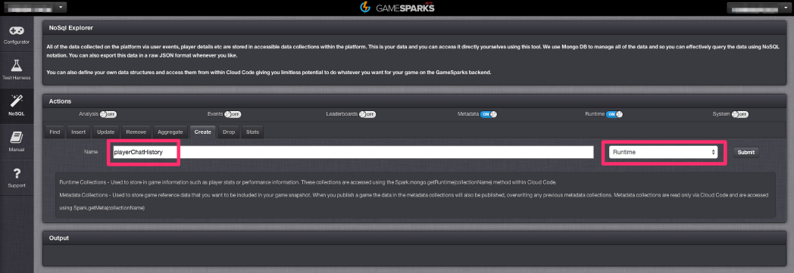
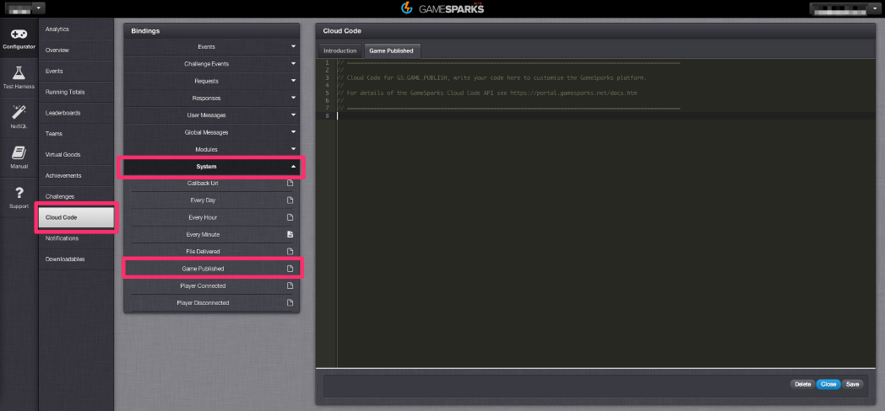

# How to create indices for custom game collections

Indexes on collections allow MongoDB to process queries more efficiently and will speed up the time it takes to execute your Cloud Code scripts. For queries that don't use an index, MongoDB must scan all documents in a collection for documents that match the query. For large collections this can be an expensive operation. In this 'how to' guide we will create a custom collection and add an index to it via a Cloud Code script.

## Creating an Index

First lets create a runtime collection using the [NoSQL Explorer](/Documentation/NoSQL Explorer.md):

*1.* Navigate to the *NoSQL* page in the developer portal and select the *Create* tab.

*2.* Enter a name for your collection and select the Runtime collection type.

*3.* Press the Submit button to create your custom collection.



This will have created a new collection called script.playerChatHistory which your game can use to store data custom in. For this example, let's assume that this collection contains documents that look like this:

```    
    {
     "_id": {
     "$oid": "53b155dfe4b04cfe90ec2315"
     },
     "player": "537f08e1e4b01fdedfa52c49",
     "dateOfChat": "2014-06-30T15:03:40.661Z",
     "chatData": "Hi buddy, fancy a game of Pong?"
    }
```

The next step is to write some Cloud Code that will create an index on this collection. A sensible place to attach this type of script is the Game Published event. Navigate to the *Configurator->Cloud Code* page in the developer portal and select the *System* bindings menu. Click on the *Game Published* option to access that script.




Enter the following Javascript in the editor window and click the *Save* button.

```    
    var playerChatHistoryCollection = Spark.runtimeCollection('playerChatHistory');
    playerChatHistoryCollection.ensureIndex({"dateOfChat" : -1});
```

This script uses the [SparkMongoCollectionReadWrite](/API Documentation/Cloud Code API/Mongo/SparkMongoCollectionReadWrite.md) API *ensureIndex* method to add an index to the collection on the chatDate field. The ensureIndex method only creates an index if an index of the same specification does not already exist. A value of 1 specifies that the index orders items in ascending order. A value of -1 specifies an index that orders items in descending order. This index will support queries that use the chatDate field.

You can also create compound index across multiple fields. For example:

```    
    var playerChatHistoryCollection = Spark.runtimeCollection('playerChatHistory');
    playerChatHistoryCollection.ensureIndex({"dateOfChat" : -1, "player" : 1});
```

To test our script we need to publish the game. Navigate to the *Configurator->Overview* page and click on the  icon to create a new snapshot.


Enter a name for your new snapshot.


Now publish the snapshot by clicking on the  icon.


Publishing the game will have triggered the Cloud Code script that we attached to the Game Published event.

<q>**Tip!** You can check for Cloud Code script errors in the script.log collection from within the NoSQL Explorer tool.</q>
