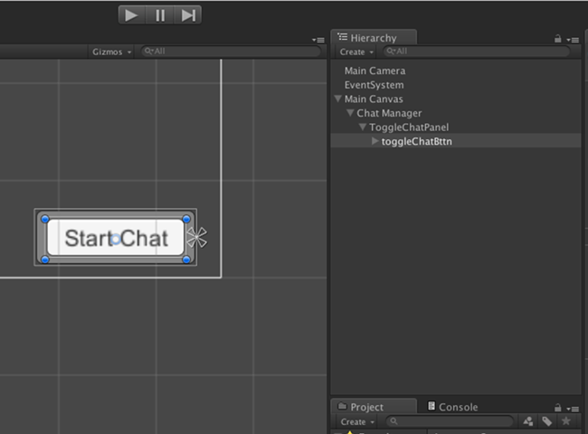
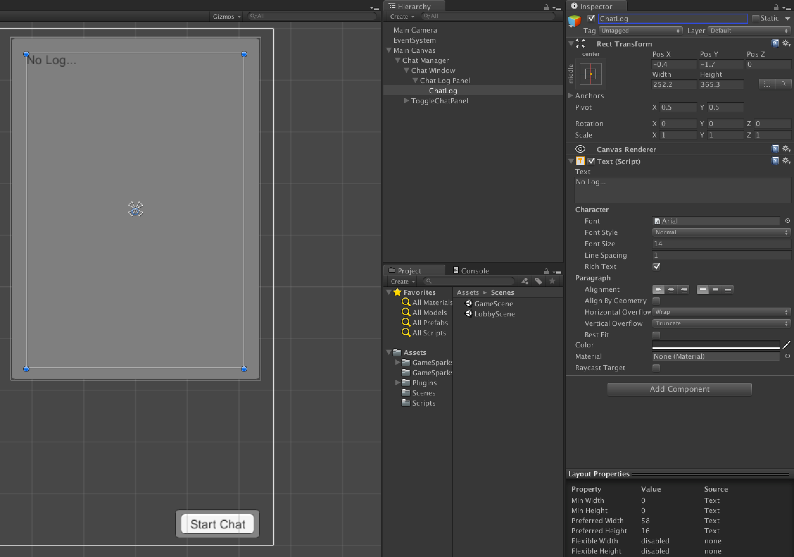
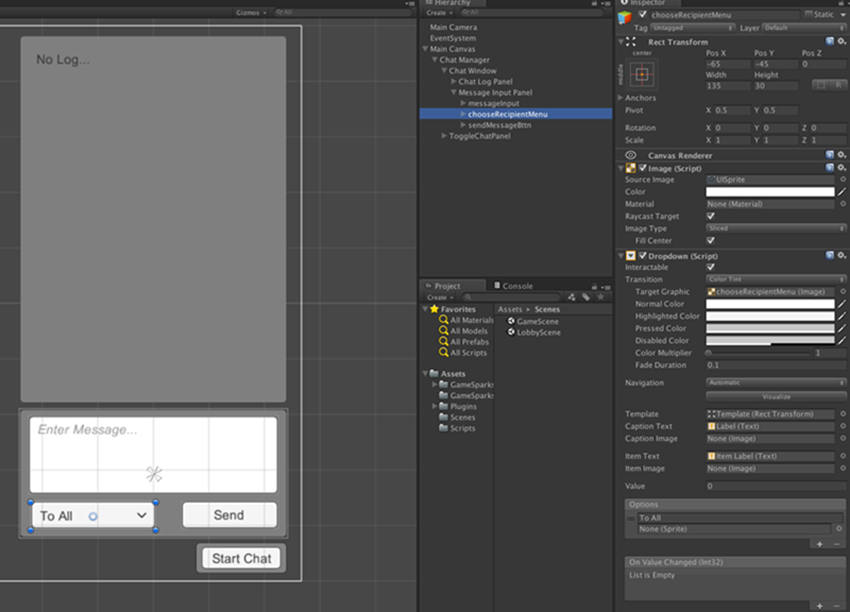
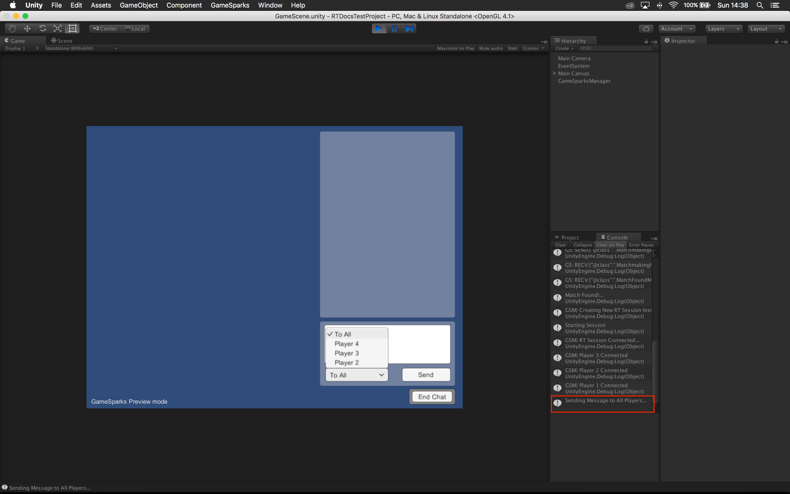
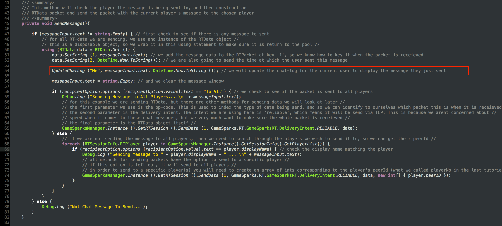
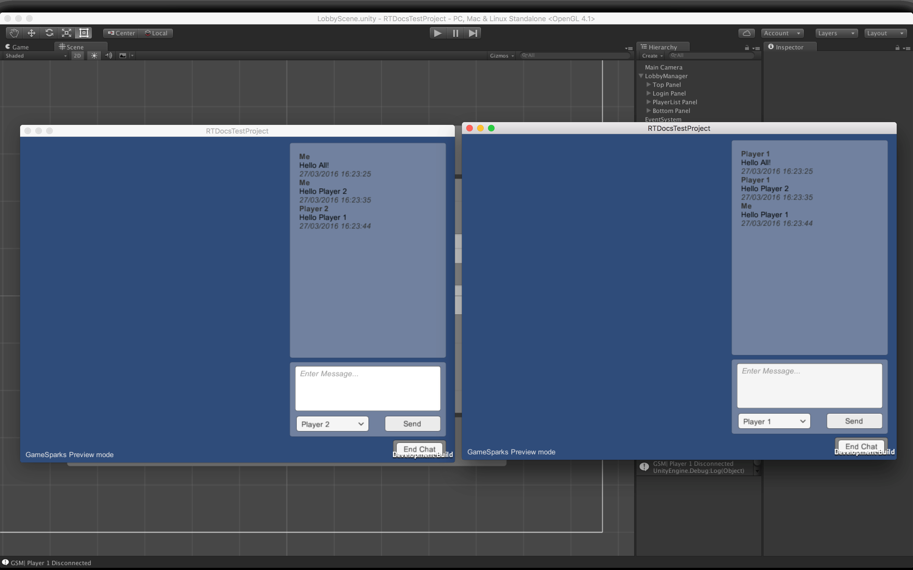

# Implementing Real-Time Chat Services


In the last tutorial, we looked at how we can setup real-time sessions as well as the matchmaking request used to find players for your real-time sessions. In this tutorial, we'll start some real-time programming to implement a peer-to-peer chat system. This will be done as an introduction to sending/receiving real-time packets and before we move on to multiplayer network programming in the next tutorial.

## Introduction

For this tutorial we will be focusing on building a very simple chat system. The chat dialogue will be toggled using a button in our game-scene and from there you will have the option to send messages to everyone or to a selected player.

## Chat Manager Layout

We'll keep the layout simple but where possible will point out where the chat manager can be expanded and how to do so. It will have 3 windows and we'll focus on:
* The **Chat Window Toggle Button**. For turning the chat window on and off.
* The **Chat-Log Panel**. Where all the chat history will be displayed.
*	The **Message-Input Panel**. Where the user will be able to create the messages they want to send, as well choose who they want to send messages to.

We'll create these using out-of-the-box Unity UI elements.

### The Chat Toggle Button

We start with the simplest of these panels.
1. In your main-game scene, create a new *Canvas UI* element. For the example, call it ‘Main Canvas’.

2. Create an empty *GameObject* for all the chat-windows and call it ‘Chat Manager’.
3. Then create a new *Panel* and name it ‘ToggleChatPanel’, and add a button to that panel. For this example, position this button in the bottom corner of the screen so that it will interfere with gameplay as little as possible:

  

<q>**Note:** For the toggle-button and the chat-windows we'll create separate objects in the canvas. This is because in the next tutorial we'll be using the same canvas to draw the scores HUD for each player.</q>

### The Chat Log Window

Again, for this example we'll keep the chat log window very simple. We'll create a panel and a text-field. All chat-logs are going to be put into a queue, so that the text-field cannot contain more text than the size of the panel.
1. To start, create another new empty *GameObject* called ‘Chat Window’, which will be where our chat window panel and text-field will go.
2. You can dock this panel to the right-hand side of the screen above the toggle-button, but leave room for the message-window at the bottom. Don’t worry about the size of the space, you can adjust your windows later:




<q>**Note:** Another way of doing this could be with a *ScrollView* object and a text-field in the content area with a content-fitter element. This would allow you to scroll through your chat-history and fit more chat-logs in the window. However, to keep this example brief we won't use a scrolling chat window.</q>

### The Message-Input Window

Three elements will make up the message-input panel:

|Element   |Description   |
|---|---|--------------------------------|
|**Input-Field** |This will be where the user types out the message. A 75-character limit will be put on this field, so that a decent amount of messages can be displayed here without the text-field cutting text off from view. You can play around with font sizes and character limit, if you like. For now, we'll use the default font size.   |
|**Send Button**    |We'll add an OnClick-listener to this button, which will check which player is selected and then send the message to them.|
|**Dropdown Selector** |We'll use a drop-down selector, so that we can choose which player to send the messages to.|


Lay out these elements as shown here.




The drop-down menu object will automatically fill in three options when it is created. For this example we only need one option right now, called ‘To All’. Later, in our *ChatManager.cs* script we'll programmatically add other players to the drop-down menu options.

## The Chatmanager Script

Now we'll create a new class called *ChatManager.cs* and add this class to the chat manager empty game-object we created earlier:

*1.* The first thing we'll do is setup the toggle-button so that we can show/hide the chat-manager window:

So:
* In the *ChatManager.cs* script we'll add a public variable for the button and a public variable for the chat-window GameObject.
* We also need a bool to toggle the window on and off.
* Once you've linked these variables to the objects in the editor, we can start coding the toggle button:

```

public GameObject chatWindow;
public Button chatToogleBttn;
private bool isChatWindowOpen;

```

*2.* In the Start() method we'll disable the chat window so that, when the game loads, the chat window will automatically disappear. We'll then add an OnClick listener to the *chatToggleBttn* variable. This will be linked to a method called, for example, ‘ToggleChatWindow’.

This method is pretty simple. It simply toggles the *isChatWindowOpen* bool, checks if the bool is true, and then enables the window or disables it. This method will also change the text-element of the button, so that the button has a different message for when the chat window is shown and for when the chat window is hidden.

```
// Use this for initialization
void Start () {
    chatWindow.SetActive (false); // we don't want the chat window to show at the start of the level, so we disable it here
    chatToogleBttn.onClick.AddListener (ToogleChatWindow); // assign the toggle-button to the chat-toggle method which will enable and disable the chat window
}

/// <summary>
/// This is called by the chatToggleBttn and it will enable/disable the chat window
/// </summary>
private void ToogleChatWindow(){
    isChatWindowOpen = !isChatWindowOpen;
    if (isChatWindowOpen) {
        chatWindow.SetActive (true); // toggle the gameobject on and off
        chatToogleBttn.transform.GetComponentInChildren<Text>().text = "End Chat"; // set the text on the button to show the chat window is on or off
    } else {
        chatWindow.SetActive (false);
        chatToogleBttn.transform.GetComponentInChildren<Text>().text = "Start Chat";
    }
}

```


Now that we have the toggle-button hooked up, we'll need a few more variables so that we can continue onto the next section and start sending and receiving messages.

We're going to need the following public variables:

|Variable   |Description   |
|------------------|--------------------------------|
|Input-Field, *messageInput* |We'll use this to get the text the user has input and that they want to send.   |
|Dropdown, *recipientOption* |When we link this to the drop-down menu in the editor, we'll be able to add options to it, as well as check the ID of the recipient before sending the message.|
|Button, *sendMessageBttn* |We'll add a listener to this button, which will be used to decide who the message should be sent to.|
|Text, *chatLogOutput* |As we send and receive new messages we'll print them out to this text-field.|
|Int, *elementsInChatLog* |We’ll use this public variable to tweak the number of chat-messages that stay in the log before being replaced by new ones.|

There is one last variable we need to create before we can start and that is the chat-log itself.

For this, we use the *Queue* class, because it allows new messages to be added to a collection in the order we would expect from the chat-log (that is, the last-message at the bottom) without extra programming.

```

public InputField messageInput;
public Dropdown recipientOption;
public Button sendMessageBttn;

public Text chatLogOutput;
public int elementsInChatLog = 7;
private Queue<string> chatLog = new Queue<string>();

```

The *ChatManager.cs* script is going to be pretty small, so this is all we need. Once you have linked these public variables to the objects in your editor, we are good to go.

### Setting Up the Drop-Down Menu

The next step before we start sending messages is to set up the rest of the drop-down menu details.

*3.* Currently, we only have the option ‘To All’ in the drop-down menu, but we want to add an option there for each player (excluding ourselves). The code for this is simple, we just need to loop through the player/participants list we created in the *GameSparksManager.cs* script in the *RTSessionInfo* variable we created and add an option for each player in that list that isn’t us.

We’ll put this code in the Start() method:

```

// Use this for initialization
    void Start () {
        chatWindow.SetActive (false); // we don't want the chat window to show at the start of the level so we disable it here
        chatToogleBttn.onClick.AddListener (ToogleChatWindow); // assign the toggle-button to the chat-toggle method which will enable and disable the chat window

        // we need to set up the drop-down menu so that it lists the correct names for each player //
        foreach (RTSessionInfo.RTPlayer player in GameSparksManager.Instance().GetSessionInfo().GetPlayerList()) {
            // we don't want to add the option to send a message to ourselves, so we'll use our own peerId to exclude this option; we'll only be able to send messages to others //
            if (player.peerID != GameSparksManager.Instance().GetRTSession().PeerId) {
                recipientOption.options.Add (new Dropdown.OptionData () { text = player.displayName });
            }
        }
    }


```

### Send-Message Button Listener

While we're working in the Start() method, let's finish up here and create a listener for the send-message button.

*4.* What we are also going to do is make sure the chatLogOutput text-field is empty when the level is loaded so that any debug-text we might put there is cleared.

The Start() method now looks as follows:

```

// Use this for initialization
void Start () {

    chatLogOutput.text = string.Empty; // we want to clear the chat log at the start of the game in case there is any debug text in there
    chatWindow.SetActive (false); // we don't want the chat window to show at the start of the level, so we disable it here
    chatToogleBttn.onClick.AddListener (ToogleChatWindow); // assign the toggle-button to the chat-toggle method which will enable and disable the chat window

    // we need to set up the drop-down menu so that it lists the correct names for each player //
    foreach (RTSessionInfo.RTPlayer player in GameSparksManager.Instance().GetSessionInfo().GetPlayerList()) {
        // we don't want to add the option to send a message to ourselves, so we'll use our own peerId to exclude this option; we'll only be able to send messages to others //
        if (player.peerID != GameSparksManager.Instance().GetRTSession().PeerId) {
            recipientOption.options.Add (new Dropdown.OptionData () { text = player.displayName });
        }
    }
    sendMessageBttn.onClick.AddListener (SendMessage); // we add a listener to the send message button so we can choose what happens when this button is clicked
}

private void SendMessage(){

}

```

We are now all-set to start sending our messages!

## Sending Real-Time Data

Once you have your real-time session instance setup you are ready to start sending real-time data. There are two types of data you can send using our real-time services: structured and unstructured.

### Structured Data

Structured data is created using the *RTData* class. This is a class that allows you to add some basic data-types to the *RTData* object you want to send. When using the *RTData* class to add these different data-types, you're also required to denote a ‘key’ for each type you wish to add. This key is used to retrieve the correct data-type at each index when the packet is received.

Below is a list of the kind of data you can add using the RTData class.

|Data Type   |API   |Description   |
|------|-------|--------------------------------|
|**int**   |.SetInt(index, integer);   |This allows you to send a 32-bit integer.|
|**float**   |.SetFloat(index, float); |This allows you to send a 32-bit floating-point number with 7 digits of precision.|
|**double**   |.SetDouble(index, double); |This allows you to send a 64-bit floating-point number with 16 digits of precision.|
|**long**   |.SetLong(index, long); |This allows you to send a 64-bit integer.|
|**string**   |.SetString(index, string); |This allows you to send a string of characters.|
|**Vector2**   |.SetVector2(index, new Vector2(x, y)); |This allows you to set a Unity Vector2 type which takes two floats for x and y. This can be used to send angles or 2-dimensional coordinates.|
|**Vector3**   |.SetVector3(index, new Vector3(x, y, z)); |This allows you to set a Unity Vector3 type which takes three floats for x, y, z. This can be used to send transform elements such as position, scale and Euler-rotation.|
|**Vector4**   |.SetVector4(index, new Vector4(x, y, z, w)); |This allows you to set a Unity Vector4 type which takes four floats for x, y, z, and w. This can be used to send Quaternions or colours.|
|**RTVector**   |.SetRTVector(index, new RTVector(x, y, z, w)); |The RTVector class accepts floats for x, y, z, and w. The difference between this type and other Vector types is that RTVector can accept any or all of these floats.|
|**RTData**   |.SetData(index, RTData.Get().SetInt(index, 1)); |Using the RTData class you can create nested data from without your initial RTData structure.|

For all *RTData* we are sending we want to use the one instance of the *RTData* object, rather than creating a new instance each time.  *RTData* is a disposable object too, so when using it, we wrap the instance in a ‘using’ statement to make sure is it returned to the pool.

Constructing RTData therefore looks as follows:

```

using (RTData data = RTData.Get()) {

            data.SetInt (1, 10); // add int at index 1
            data.SetFloat(2, 20f); // add float at index 2                        
            data.SetDouble(3, 30d); // add double at index 3                  
            data.SetLong(4, 4294967296L); // add long at index 4                         
            data.SetString(5, "Hello World!"); // add string at index 5    
            data.SetVector2(6, new Vector2(1f, 2f)); // add vector2 at index 6
            data.SetVector3 (7, new Vector3(1f, 2f, 3f)); // add vector3 at index 7
            data.SetVector4 (8, new Vector4(1f, 2f, 3f, 4f)); // add vector4 at index 8
            data.SetRTVector (9, new RTVector(1f, 2f, 3f, 4f)); // add RTVector at index 9
            data.SetData(10, RTData.Get().SetInt(1, 1)); // add nested data at index 10
 }


```

### Sending Structured Data

In order to send your *RTData* you will need a reference to the *gameSparksRTUnity* object that you used to configure your real-time session.

The method to send structured data is gameSparksRTUnity.SendData() and it takes the following parameters:

|Parameter   |Type   |Description   |
|---|---|--------------------------------|
|**opCode**   |uint   |Each packet you send to the server has a corresponding opCode. This opCode is available when the packet is received by the other player(s). This must be a non-negative integer   |
|**deliveryIntent**   |GameSparksRT.DeliveryIntent |There are 3 options when sending a packet to the session: **1. RELIABLE** - The packet will be queued, sent and received by the target players. The packets will be received in the order they are sent. **2. UNRELIABLE** - The packet will be sent with no guarantee of it being received. The receivers may get the packets in a different order than they are sent. **3. UNRELIABLE_SEQUENCED** - The packet will be sent with no guarantee of it being received. If it is received out of order, it will be discarded.|
|**structuredData**   |RTData (optional) |This is a structured dictionary keyed with integers that can contain doubles, floats, ints, longs, strings, or nested RTData objects|
|**targetPlayers**   |params int[]   |The peerId's of the players you want to send to. If omitted, the packet is broadcast to all others players in the session   |

So, leading on from the previous RTData example, sending this data would look as follows:

```

using (RTData data = RTData.Get()) {

            data.SetInt (1, 10); // add int at index 1
            data.SetFloat(2, 20f); // add float at index 2                        
            data.SetDouble(3, 30d); // add double at index 3                  
            data.SetLong(4, 4294967296L); // add long at index 4                         
            data.SetString(5, "Hello World!"); // add string at index 5    
            data.SetVector2(6, new Vector2(1f, 2f)); // add vector2 at index 6
            data.SetVector3 (7, new Vector3(1f, 2f, 3f)); // add vector3 at index 7
            data.SetVector4 (8, new Vector4(1f, 2f, 3f, 4f)); // add vector4 at index 8
            data.SetRTVector (9, new RTVector(1f, 2f, 3f, 4f)); // add RTVector at index 9
            data.SetData(10, RTData.Get().SetInt(1, 1)); // add nested data at index 10

            gameSparksRTUnity.SendData (120, GameSparksRT.DeliveryIntent.RELIABLE, data); // send the RTData with op-cdoe '120' and to all players.
            gameSparksRTUnity.SendData (121, GameSparksRT.DeliveryIntent.RELIABLE, data, new int[]{ 1, 2 }); // send the RTData with op-code '121' to only players 1 and 2
        }


```


* **RTData Size**. The SendXXXX methods are also set up to return information about the size of the packet you are sending. They will return an int which corresponds to the size of the packet in bytes.

And that’s it. You can mix and match this setup using the *RTData* class to send whatever structures for your data you like.

### Sending Unstructured Data

When we talk about sending unstructured a data we mean that instead of using the *RTData* class we create a byte-array out of the data we want to send.

In this example,  we will be converting a string to a byte-array and sending that.

Unstructured data is actually of type *ArraySegment* instead of byte[], so any byte arrays will have to be converted before sending them. The reason behind this is because *ArraySegment* is a struct and so we will conserve memory by having it allocated on the stack.

We recommend you use the same *ArraySegment* variable for sending all data and have different sets of byte arrays converted to array segments before sending them.

```

ArraySegment<byte> unstructuredData = new ArraySegment<byte> (Encoding.ASCII.GetBytes("Hello World!"));
        GameSparksManager.Instance ().GetRTSession ().SendBytes (1, GameSparksRT.DeliveryIntent.RELIABLE, unstructuredData);


```

All data, be it structured or unstructured, is send as a byte array in the end. The advantage of sending byte arrays over structured data is that there is no extra space used in the packet to give each of the elements their keys, as there is when using *RTData*.

## Sending Chat Messages

For this tutorial we are only going to be sending two strings; the message the user entered and the time-stamp for when it was sent.
So in our SendMessage() method we will:
1.	First check to make sure there is a message to send, because we don’t want to send an empty string to players if the user hits the send-button by accident.
2.	Construct the *RTData* object with the message and the date.
3.	Check to see if the ‘To All’ option is set, or if there is a specific player set to be the recipient of the message.
4.	If the recipient option is set to ‘To All’, then send the data as-is.
5.	If another player is set to be the recipient, then loop through the player/participant list and check the corresponding display-name. Then send the data to that player’s peer ID.

<q>**Note:** We use the *DeliverIntent.Reliable* for this message because we want the packet to arrive in order and intact.</q>


```


/// <summary>
/// This method will check the player the message is being sent to, and then construct an
/// RTData packet and send the packet with the current player's message to the chosen player
/// </summary>
private void SendMessage(){
    if (messageInput.text != string.Empty) { // first check to see if there is any message to send
        // for all RT-data we are sending, we use an instance of the RTData object //
        // this is a disposable object, so we wrap it in this using statement to make sure it is returned to the pool //
        using (RTData data = RTData.Get ()) {
            data.SetString (1, messageInput.text); // we add the message data to the RTPacket at key '1', so we know how to key it when the packet is receieved
            data.SetString(2, DateTime.Now.ToString()); // we are also going to send the time at which the user sent this message
            messageInput.text = string.Empty; // and we clear the message window

            if (recipientOption.options [recipientOption.value].text == "To All") { // we check to see if the packet is sent to all players
                Debug.Log ("Sending Message to All Players... \n" + messageInput.text);
                // for this example we are sending RTData, but there are other methods for sending data we will look at later //
                // the first parameter we use is the op-code. This is used to index the type of data being send, and so we can identify to ourselves which packet this is when it is received //
                // the second parameter is the delivery intent. The intent we are using here is 'reliable', which means it will be send via TCP. This is because we aren't concerned about //
                // speed when it comes to these chat messages, but we very much want to make sure the whole packet is received //
                // the final parameter is the RTData object itself //
                GameSparksManager.Instance ().GetRTSession ().SendData (1, GameSparks.RT.GameSparksRT.DeliveryIntent.RELIABLE, data);
            } else {
                // if we are not sending the message to all players, then we need to search through the players we wish to send it to, so we can get their peerId //
                foreach (RTSessionInfo.RTPlayer player in GameSparksManager.Instance().GetSessionInfo().GetPlayerList()) {
                    if (recipientOption.options [recipientOption.value].text == player.displayName) { // check the display name matching the player
                        Debug.Log ("Sending Message to " + player.displayName + " ... \n" + messageInput.text);
                        // all methods for sending packets have the option to send to a specific player //
                        // if this option is left out, it will send to all players //
                        // in order to send to a specific player(s) you will need to create an array of ints corresponding to the player's peerId (what we called playerNo in the last tutorial)
                        GameSparksManager.Instance ().GetRTSession ().SendData (1, GameSparks.RT.GameSparksRT.DeliveryIntent.RELIABLE, data, new int[] { player.peerID });
                    }
                }
            }
        }
    } else {
        Debug.Log ("Not Chat Message To Send...");
    }
}


```


This is a good time to save your scene and load-up the lobby-scene again. We should test that the drop-down menu is creating options for the right players and that our messages are being sent properly.

If configured correctly, you should see an option for each player except yourself in the drop-down menu. You will also see the correct message in the console for when you send to another player or to all players.




## Receiving Real-Time Data

In order to receive your *RTData*, you will need a reference to the *gameSparksRTUnity* object you used to configure your real-time session.

When any packets are received, the *OnPacketRecieved* callback will be called and the details of that packet can be processed.

```

gameSparksRTUnity.Configure(response,
            (peerId) =>  {    OnPlayerConnectedToGame(peerId);  },
            (peerId) => {    OnPlayerDisconnected(peerId);    },
            (ready) => {    OnRTReady(ready);    },
            (packet) => {    OnPacketReceived(packet);    });
        gameSparksRTUnity.Connect();

private void OnPacketReceived(RTPacket _packet){

    }


```


The *RTPacket* class contains the following members:

|Parameter   |Type   |Description   |
|---|---|--------------------------------|
|**opCode**   |int   |The opCode set by the sending player.   |
|**Sender**   |int |The peerId of the sender.|
|**Data**   |RTData |The RTData object sent.|
|**Stream**   |Stream   |A Stream object that represents the unstructuredData sent.   |
|**StreamLength**   |int   |The number of bytes in the stream.   |
|**PacketSize**   |int   |The size of the RTData attribute of the packet in bytes.   |


### Receiving Structured Data

Any structured data in the packet received are available in the *Data* parameter. Consult the previous section on Sending Real-Time Data to see what kinds of data-types can be sent. Here's the example from that section to show how data can be parsed back.

```

private void OnPacketReceived(RTPacket _packet){

        int myInt = (int)_packet.Data.GetInt (1); // get int at key 1
        float myFloat = (float)_packet.Data.GetFloat(2); // get float at key 2                        
        double myDouble = (double)_packet.Data.GetDouble(3); // get double at key 3                  
        long myLong = (long)_packet.Data.GetLong(4); // get long at key 4                         
        string myString = _packet.Data.GetString(5); // get string at key 5    
        Vector2 myVector2 = (Vector2)_packet.Data.GetVector2(6); // get vector2 at key 6
        Vector3 myVector3 = (Vector3)_packet.Data.GetVector3 (7); // get vector3 at key 7
        Vector4 myVector4 = (Vector4)_packet.Data.GetVector4 (8); // get vector4 at key 8
        RTVector myRTVector = (RTVector)_packet.Data.GetRTVector (9); // get RTVector at key 9
        int myNestedInt = (int)_packet.Data.GetData(10).GetInt(1); // get nested data at key 10
    }


```


### Receiving Unstructured Data

Unstructured data are accessible through the Stream parameter of the *RTPacket* received. In the sending unstructured data example, you can get the data back into a string using a *StreamReader* class.


```

private void OnPacketReceived(RTPacket _packet){
        StreamReader reader = new StreamReader (_packet.Stream);
        string message = reader.ReadToEnd ();
        reader.Close ();
    }


```


## Receiving Chat Messages

In order to receive the chat message, we'll first have to put a reference to the *ChatManager.cs* class in our *GameSparksManager.cs* script.

```

private ChatManager chatManager;


```

Now, in the OnPacketReceived() method we created when we setup the real-time session instance we'll check that the op-code corresponds to the op-code we have chosen for all chat-messages (op-code 1).

We'll also have to check to see if the *ChatManager* reference is initialized yet, and if it isn't, we'll find the ‘Chat Manager’ object and give it that reference. We are then going to send the packet to an *OnMessageReceived()* method in the *ChatManager.cs* class.

```

private void OnPacketReceived(RTPacket _packet){
        switch (_packet.OpCode) {
        // op-code 1 refers to any chat-messages being received by a player //
        // from here, we'll send them to the chat-manager //
        case 1:
            if (chatManager == null) { // if the chat manager is not yet setup, then assign the reference in the scene
                chatManager = GameObject.Find ("Chat Manager").GetComponent<ChatManager> ();
            }
            chatManager.OnMessageReceived (_packet); // send the whole packet to the chat-manager
            break;
        }
    }


```

Then, back in the *ChatManager.cs* class, we can add that new method. We'll put a *Debug.Log* call in this method for the moment, which will print out the message that has just been received while we are testing.


```

public void OnMessageReceived(RTPacket _packet){
        Debug.Log (_packet.Data.GetString(1));
    }


```

You should now be able to test messages being sent between players and see the received message being printed out in the console:


## Updating the Chat Log

The next step is to print these messages to the chat-log:

* We're going to create a method for this called ‘UpdateChatLog’. This method is going to take the name of the sender, the body of the message, and the date. It will create a formatted string from this data so that the sender-name and body can be highlighted, and it will add this string to the queue.
* We’ll check the length of the queue so that new messages are added and old ones removed.
* Finally, we'll print all of these messages to the *chatLogOutput* text-field.

```

/// <summary>
    /// This method will update the current user's chat log and print the new log to the screen.
    /// </summary>
    /// <param name="_sender">The name (display-name) of the sender</param>
    /// <param name="_message">the body of the message</param>
    /// <param name="_date">the date of the message</param>
    private void UpdateChatLog(string _sender, string _message, string _date){
        // In this example, the message we want to display is formatted so that we can distinguish each part of the message when //
        // it is displayed, all the information is clearly visible //
        chatLog.Enqueue("<b>"+_sender+"</b>\n<color=black>"+_message+"</color>"+"\n<i>"+_date+"</i>");
        if (chatLog.Count > elementsInChatLog){ // if we have exceeded the amount of messages in the log, then remove the top message
            chatLog.Dequeue ();
        }
        chatLogOutput.text = string.Empty; // we need to clear the log, otherwise we always get the same messages repeating
        foreach(string logEntry in chatLog.ToArray()){ // go through each chat item and add the entry to the output log
            chatLogOutput.text += logEntry+"\n";
        }
    }


```


Now we need to get this information from the *OnMessageReceived()* method. We can get the date and the message from the packet, but the packet doesn't contain the player-display name. So, we are going to use the Sender parameter of the packet to check the name of the player with the same peerId as the sender.

```

/// <summary>
/// This is called from the GameSparksManager class.
/// It send any packets with op-code '1' to the chat manager so the chat manager can parse the necessary details out for display in the chat log window
/// </summary>
/// <param name="_data">Data.</param>
public void OnMessageReceived(RTPacket _packet){
    Debug.Log ("Message Received...\n"+_packet.Data.GetString(1)); // the RTData we sent the message with used an index '1' so we can parse the data back using the same index
    // we need the display name of the sender. We get this by using the packet sender id and comparing that to the peerId of the player //
    foreach (RTSessionInfo.RTPlayer player in GameSparksManager.Instance().GetSessionInfo().GetPlayerList()) {
        if (player.peerID == _packet.Sender) {
            // we want to get the message and time and print those to the local users chat-log //
            UpdateChatLog (player.displayName, _packet.Data.GetString (1), _packet.Data.GetString (2));
        }
    }
}


```


You should now be able to test sending and receiving chat messages between players.


There is one last thing we need to do, however. This chat-system does not show the player sending the data what they have just said. In order to fix this, we can add a line to that start of the *SendMessage()* method:

```

UpdateChatLog ("Me", messageInput.text, DateTime.Now.ToString ()); // we will update the chat-log for the current user to display the message they just sent


```

This should be put below where we set the *RTData* for the message and date, and above where we clear the *messageInput* text-field.



You now have all the elements you need for this chat service to work. Test it out with as many players as you want by changing the number of players in your match through the game-portal:



In the next [next tutorial](/Tutorials/Real-Time Services/Real-Time Game Example.md), we'll use real-time services to create a simple multiplayer game.
