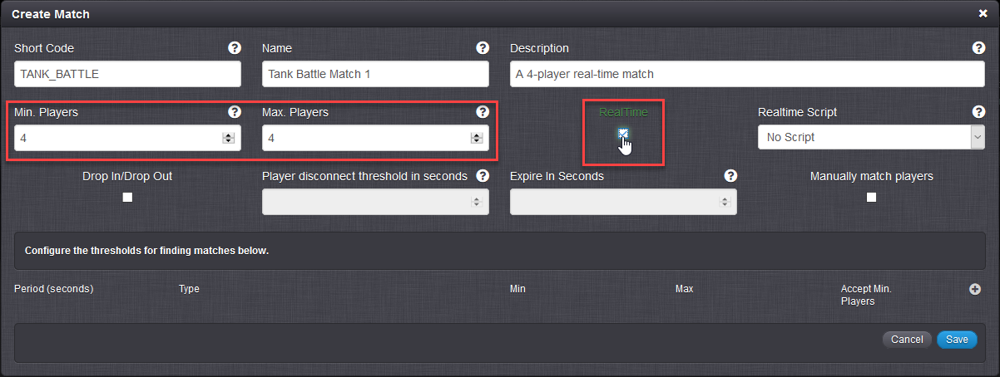

# Setting Up Real-Time Matchmaking

## Setting Up the SDK

Before we begin you will need a project with the main GameSparks SDK integrated and setup. The real-time services SDK is bundled in with the Unity SDK:
* [Unity SDK Package download](http://repo.gamesparks.net/unity-sdk/Gamesparks_Unity_5.3.5.209.unitypackage)

You can find a tutorial on how to setup the Unity SDK [here](/SDK Center/Unity.md). Once you have set up the Unity SDK, you are ready to go.

## Setting Up Real-Time Matches

In our real-time services we refer to a multiplayer game-instance as a real-time session. In order to find players for the real-time session, we create a match.
Matches group your players together by a skill-level you choose. In this section, we won't be going through the basics of matchmaking but instead we will just show how to make our normal matches work with our real-time services. If you would like to learn how to set up matches, you can check out the [Matching Players](/Tutorials/Multiplayer/Matching Players.md) tutorial.

To set up a real-time match, you follow the same steps as for normal matches:

1. Under *Configurator* on your game's portal, click *Multiplayer*.
2. On the *Matches* panel, click the  icon.
3. Enter the match details as normal and select the *RealTime* check box:

For this example:
* You have the option to add a *Realtime Script* to the match. However, in this example we will not be covering real-time scripts.
* To suit the real-time 4-player game we'll be building in a subsequent tutorial, we don't want the match to start until all players have joined the game, so we've set both the *Min.Players* and the *Max.Players* to 4.

That is all that is needed to setup a real-time match in GameSparks!

In the [next tutorial](/Tutorials/Real-Time Services/Real-Time Matchmaking.md), we'll see how we can create these matches in the client and get players to connect to the match before we create a real-time session.
