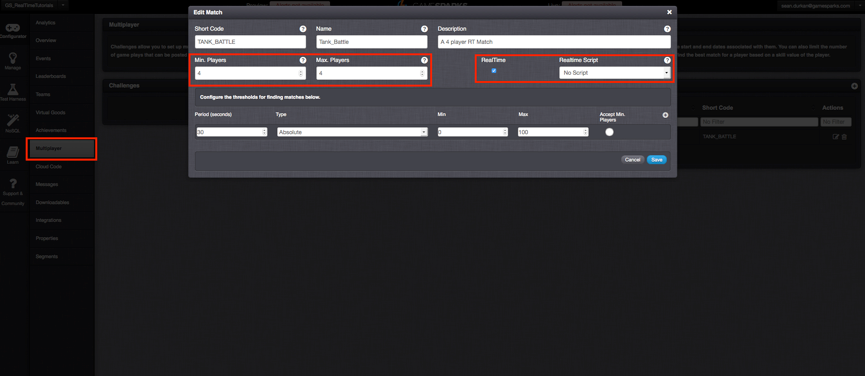

# Setting Up the Realtime SDK

## Setting Up the Real-Time SDK

Before we begin you will need a project with the main GameSparks SDK integrated and setup. We will not be going through this process in this tutorial, but you can find a tutorial on how to setup the main SDK here.
You will first need to download the GameSparks RT SDK package. It is available here.

* [RT SDK Package download](http://repo.gamesparks.net/unity-sdk/Gamesparks_Unity_5.3.5.209.unitypackage)

The RT SDK is separate from the main SDK, so all you will need to do is import the RT package and you are good to go. There is no additional setup required in the Unity3D editor in order for our RT services to work.

## Setting Up Real-Time Matches

In our RT services we refer to a multiplayer game-instance as an RT-Session and in order to find players for the RT session we create a match.
Matches group your players together by a skill-level you choose. In this tutorial we will not be going through the basics of matchmaking but instead we will just show how to make our normal matches work with our RT services. If you would like to learn how to setup matches you can check out our docs here.
Setting up an RT-match is the same process as for normal matches. You go to the Multiplayer tab of your game’s portal and create a new match.

In order to setup an RT-match you need to make sure the ‘RealTime’ toggle is on. You have the option to add a  ‘RealTime Script’ to the match however in this example we will not be covering RT-scripts.
For the example game we will get to later in this series of tutorials, we are building a match for 4 players, and we don’t want the match to start until all players have joined, so i've set the min and mac number of players to 4.
All that is needed to setup an RT-match in GameSparks. In the next tutorial we will see how we can create these matches in the client and get players to connect to the match before we create an RT-session.
