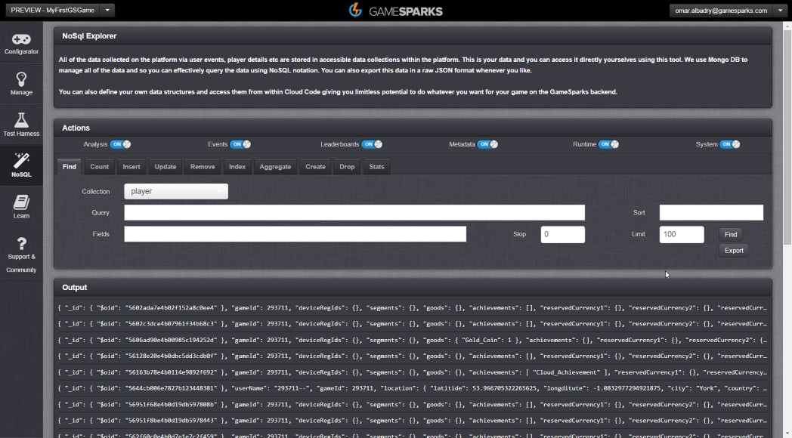
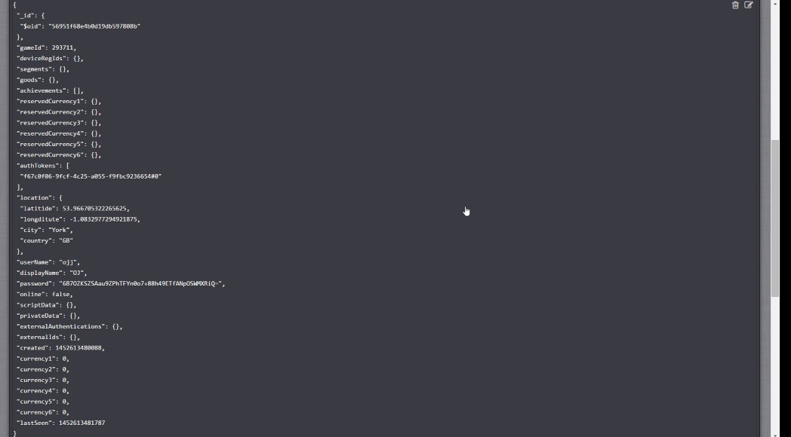
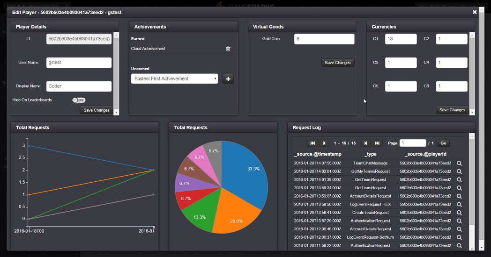

# Accessing and Updating Player Records

## Introduction

An important part of a back-end is the ability to access your player's info in real-time and have the ability to change it. GameSparks gives you the ability to do this using multiple approaches. This tutorial will explore how to access records using the NoSQL Explorer, Player management screen, and cloud code.  

## The NoSQL Explorer

The NoSQL Explorer is a powerful tool used to access and find any collection of data you have in your game. It can be found in its own tab on the left side of the portal. To access player data from it, select the 'player' collection and query for specific players or run the search for every player. Once records are retrieved you can click on them to expand them. Once expanded you can see all the data that is linked to the player including data you can't normally see when you call an account details request - data such as auth tokens, external IDs, reserved currency, and private data, which you may not see and use often. For more information about the SQL Explorer, click [here](/Documentation/NoSQL Explorer.md).




An example of a newly created player's record.



## Player Management Screen

You can use the player management screen to offer a visual experience while you access player data and change variables realtime. The player management screen can be found in the manage section of the portal. This screen can be customized however you like through the dynamic forms builder. You can tailor your team's experience in whatever way you like. You can offer special screens for customer service, for example, where they are allowed to change certain values while programmers have access to a different screen. For more info about dynamic forms, click [here](/Documentation/Manage/Working with Dynamic Forms.md).



## Through Cloud Code

You can use Cloud code to retrieve players and access their records. You can do this through a specified ID which you can retrieve from [AccountDetailsRequest](/API Documentation/Request API/Player/AccountDetailsRequest.md) or do a query based search on the player collection. You can edit or pass on the details you retrieve.

```
//Player search
//Getting a player based on Query
var players = Spark.systemCollection("player");

var playerData = players.findOne({"displayName" : "Coder"}; //Find the display name 'Coder' and return the players that have it.

//Or you can have the player ID saved or manually passed in
var playerID = "5602c3dce4b07961f34b68c3" //Manually set the ID

//Finding the player through their ID
var playerVar = Spark.loadPlayer(playerData.$oid); //or (playerID) //Make a reference for that player through their ID.
```
