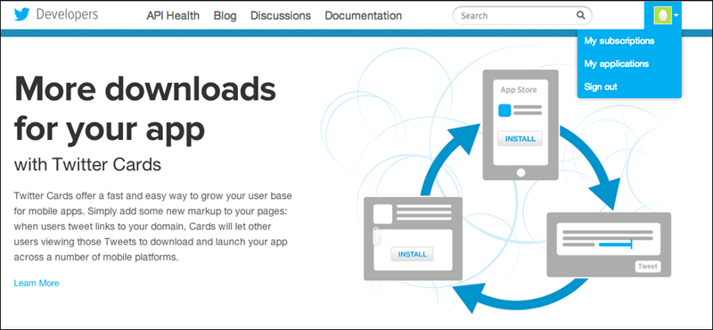
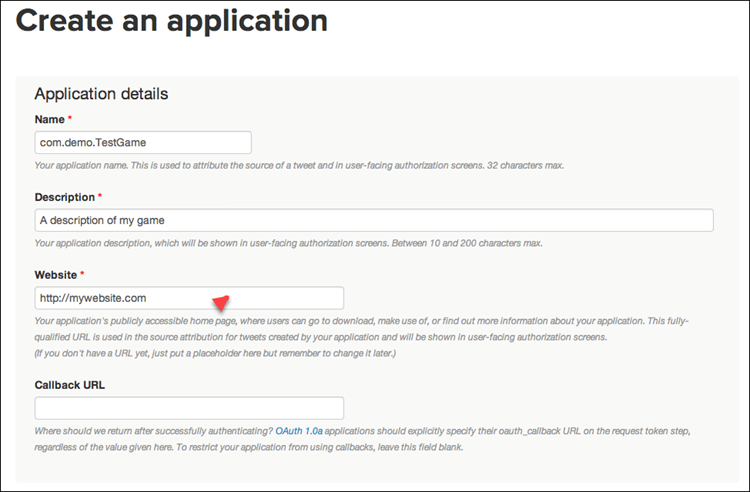

# How to Authenticate a Player Using their Twitter Account

Twitter authentication allows you to provide your players with a simple way to sign in with their Twitter account, and allows the GameSparks platform to then use the player's profile to drive its social features. In this exercise you'll go through setting up the necessary configuration with Twitter and how you can then use that to connect your players.

## Setting up a Twitter Application

First things first, you need a Twitter account. Head over to [Twitter's dev portal](https://dev.twitter.com/user/login?destination=home) and sign in if you have one, or sign up if you don't (if you've just signed up, make sure you've clicked the link in the confirmation email or you won't be able to sign in as a dev!).

You should now be back on the [dev home page](http://dev.twitter.com): in the top right corner of the screen is a drop-down list, click the link to "My Applications".



Now you're ready to create your app. Click 'Create New App', give it "Name", "Description" and "Website". For now you can leave "Callback URL" blank, you won't be needing that for this guide. Make sure you agree with Twitter's Developer Rules, then click "Create your Twitter application".



And that's it, you now have a Twitter application. There are various configuration options you can play around with, but for now all you're interested in are the API keys so click the tab "API Keys".


 In a separate tab/window head over to [the GameSparks developer portal](https://portal.gamesparks.net) and click the overview of your game. Click the 'Edit' icon and enter the API Key and API Secret from the Twitter portal into the fields "Twitter App ID" and "Twitter App Secret" and then click "Save".

  In a separate tab/window head over to the [Integrations](/Documentation/Configurator/Integrations.md) page, click to edit the Twitter Integration enter the API Key and API Secret from the Twitter portal into the fields "Twitter App ID" and "Twitter App Secret" and then click "Save".


   Your GameSparks game is now configured to use your newly created Twitter app: you're setup to authenticate your players via Twitter, and the GameSparks platform can access their profile to drive its social features.

## Authenticating a Player Using their Twitter Account

Authentication via Twitter is done using the "[TwitterConnectRequest](/API Documentation/Request API/Authentication/TwitterConnectRequest.md)". To do this you need to obtain an Access Token and an Access Secret for your player. Twitter authentication uses oAuth 1.0 which, when negotiated correctly, results in the client receiving an Access Token and Access Secret. There are numerous client libraries that have been written to make this easier, Twitter provide a list of some of these [here](https://dev.twitter.com/docs/twitter-libraries). What they have in common is that they provide a mechanism where you supply your Twitter API Key and API Secret, obtain a token, submit that token to Twitter at which point the player is prompted to allow access to your application. Once granted they return with the Access Token and Access Secret needed for GameSparks to connect to the player's Twitter profile.

For the purpose of this guide you can just get hold of the access token and access secret for the user who owns the game you created. Back on the "API Keys" tab for your Twitter app, at the bottom of the page is an option to generate your access token.


Click the button, if no token has appeared wait a few seconds then refresh the page. You should now see an access token and access secret.  These will allow you to connect as your user. Back in the GameSparks developer portal, click on the "Test Harness". Within 'Authentication', click "TwitterConnectRequest", and fill in the "accessToken" and "accessSecret". Click "Send". You should see an ".AuthenticationResponse" containing a "displayName" for the player that the platform has looked up from the Twitter profile.

```
{
"@class": ".TwitterConnectRequest",
"accessToken": "accessToken",
"accessSecret": "accessSecret"
}
```

If the authentication with Twitter is successful you will see a response like:

```
{
"@class": ".AuthenticationResponse",
"authToken": "cfcd0fa4-fae7-4739-9fcb-5224505ef895",
"displayName": "David Clark",
"scriptData": null,
"userId": "533996d11c26d7a9968ec724"
}
```

Click on "User" > "ListInviteFriendsRequest" and you should see a list of friends from the account that you have just connected. Success!

```
{
"@class": ".ListInviteFriendsResponse",
"friends": [
{
"id": "TW:16665197",
"displayName": "Martin Fowler",
"profilePic": "http://pbs.twimg.com/profile_images/79787739/mf-tg-sq_normal.jpg"
},
{
"id": "TW:61135090",
"displayName": "Joshua Bloch",
"profilePic": "http://pbs.twimg.com/profile_images/378800000681563273/d3b6c6ec2dab04b26e340b521d16f57c_normal.jpeg"
},
{
"id": "TW:9505092",
"displayName": "Uncle Bob Martin",
"profilePic": "http://pbs.twimg.com/profile_images/1102364992/clean_code_72_color_normal.png"
},
...
]
}
```
Now head on over to [Social Capabilities](/Documentation/Key Concepts/Social Capabilities.md) to see how you can make the most of social integration.
