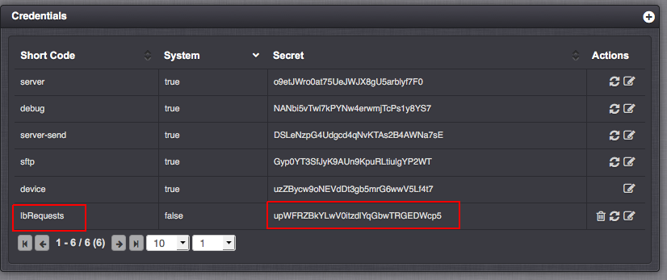
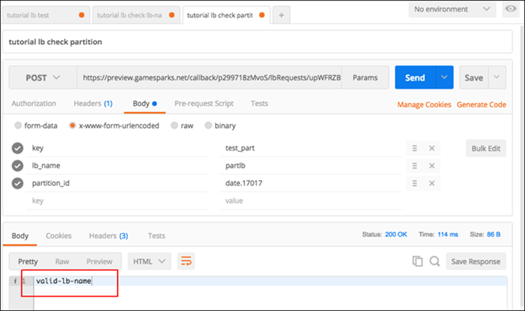

# Pulling Leaderboard Data Using Python and Rest

## Introduction

Many of our customers like to use their Leaderboard data for analytics or comparison. This can be difficult to do through the portal because the maximum number of documents you can request through the NoSQL explorer is 1000. The solution to this is to use the [NoSQL REST API](/API Documentation/NoSQL REST API.md) to pull-down the Leaderboard data. However, if your Leaderboard has a huge amount of data, this can take some time.

This tutorial attempts to solve this problem by offering a method to speed up Leaderboard data extraction. We'll use a custom callback and a simple python-script to automatically check your Leaderboard and paginate the response from the server into a single document (text-file) containing the information you need for analysis.

<q>**General Method for Data Extraction!** This tutorial applies to Leaderboards, but the method used can easily be modified to pull data from any collection for your own backup or analysis.</q>


## Custom Callback Script

We'll first need to create a custom-callback script, which will be the endpoint our python program will post data to and receive a response from.

For more information on how to create a custom callback, check out the tutorial [here](/Tutorials/Cloud Code and the Test Harness/Using Custom Callback Urls.md).

For this tutorial, let's call this callback ‘lbRequests’. It's is not important what you call your callback. However, you'll have to keep track of the name and secret of your callback:




## Leaderboard Request Script

This script is designed in several parts which are tied into the separate stages that the python program will go through. The script is designed this way so that you use the program to test multiple endpoints, Leaderboards, and Partitions instead of hard-coding all these parameters.

The callback script will have the following steps:

*1.* Test that the endpoint is valid.
* *If this endpoint is hit, then we'll return a message.*

*2.* Given a Leaderboard name, we'll check to make sure that the Leaderboard exists.

*3.* After we test the Leaderboard name, we'll determine if the Leaderboard is partitioned.
* *If the Leaderboard is partitioned, we should ask the program for the partition-id.*

*4.* If we need a Partition, we should test that the Partition also exists.

*5.* We'll pull the Leaderboard data.

*6.* Lastly, we'll print the appended Leaderboard data to a file.


### Testing the Endpoint

To start:
* We'll get the request-data that hits this endpoint and check the key that was sent from the program.
* The key we'll send for endpoint testing is ‘test_endpoint’.

```

var requestRaw = Spark.getData();
Spark.getLog().debug("TEST RAW_REQUEST:"+JSON.stringify(requestRaw));
if(requestRaw.key === 'test_endpoint'){
    // this is used to test the endpoint is working correctly
    Spark.setScriptData("RESPONSE_RAW", "endpoint-valid");
}


```

You can then test this using whatever method you want. However, we recommend the Postman App because you can generate the code you'll need for python later on in this tutorial.

You can just add the key to the body of the request as url-encoded form data:


### Testing the Leaderboard

Next we're going to test a Leaderboard name sent to this script from the python program. While we are doing this, we'll check to see if the Leaderboard is partitioned and then either return a message indicating that a partition-id is needed or that the leaderboard name is correct and the program can continue.

```

else if(requestRaw.key === 'test_lb'){
    // check that this lb is valid
    var lb = Spark.getLeaderboards().getLeaderboard(requestRaw.lb_name);
    if(lb){
        if(lb.isPartitioned()){
            Spark.setScriptData("RESPONSE_RAW", "requires-partition");
        }else{
            Spark.setScriptData("RESPONSE_RAW", "valid-lb-name");
        }
    }else{
        Spark.setScriptData("RESPONSE_RAW", "invalid-lb-name");
    }
}


```

In this case, we're sending the Leaderboard name as the attribute ‘lb_name’ and the key this time will be ‘test_lb’.

So this example in Postman would look like this:


### Testing the Partition

If the previous test requested a partition-id, then we'll send one from the program. In this case, we'll be sending the fields: partition_id, lb-name and the key will be ‘test_part’.

This code will be very similar to the code for the Leaderboard name check, only that here the Leaderboard name is the lb_name and partition_id fields together to create the full Leaderboard name. We'll also have to add a period in between the name and partition-id because the shortcode of a partitioned Leaderboard includes this. For example, the leaderboard name ‘lbpart’ has the partition ‘partition_1’, so the full name is ‘lbpart.partition_1’.

```

else if(requestRaw.key === 'test_part'){
var lb = Spark.getLeaderboards().getLeaderboard(requestRaw.lb_name+’.’+requestRaw.partition_id);
    if(lb){
        Spark.setScriptData("RESPONSE_RAW", "valid-lb-name");
    }else{
        Spark.setScriptData("RESPONSE_RAW", "invalid-partition-id");
    }
}

```




## Pulling Leaderboard Data 1


## Python Script

### Variables


### User Prompts


## Pulling Leaderboard Data 2


## Summary


### Downloadables
