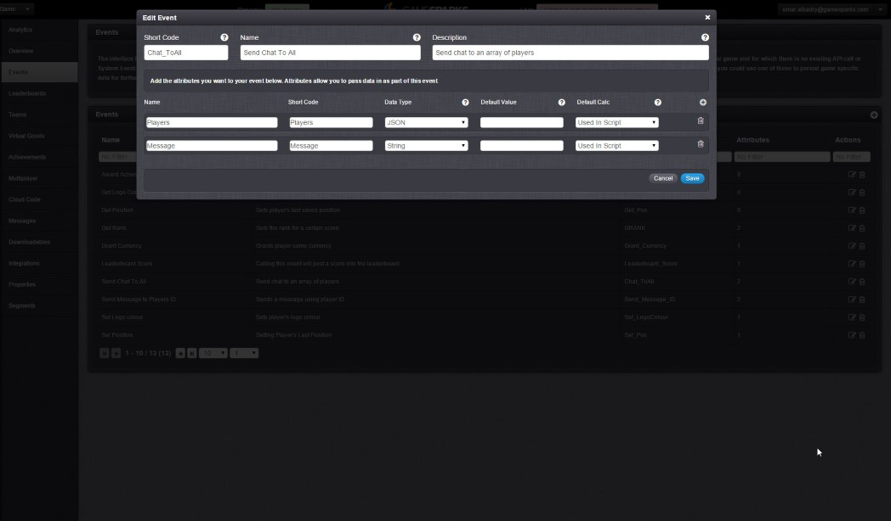

# Match Making Basics - Chat Messages

## Introduction

Once you match players together you will have reference to other player's PlayerIDs and account variables to use in Cloud code and use of useful platform features. One of these features would be the exchange of messages. Once you have a reference to the player's PlayerID you will be able to send them messages which are later intercepted using listeners.  

## Setup

###

  * Create an event.
  * Add a JSON attribute. This will be used to store and access an array of string to use in the Cloud Code.
  * Add a String attribute. This will be used to store and access the message string.


 

### Cloud code

This cloud code is simple, it takes the message passed in and send it together with the display name of sender to the list of players passed in. To recreate it:

  * Declare a variable which is set to the value of the array stored in the JSON attribute
  * Declare a variable which is set to the value of the string attribute
  * Declare a variable which is set to the display name of the sender (Current player)
  * Declare a JSON with the first keypair value being the message variable and the second being the display name variable
  * Using Spark.sendMessageById(json, PlayerIDs) send the message to the list of players.

  ```    
    //JSON of Player IDs
    var ID= Spark.getData().Players;
    //Message string
    var chatString = Spark.getData().Message;
    //Sender displayName
    var dName = Spark.getPlayer().getDisplayName();

    //Group the display name and the message in one JSON
    var json = {"displayName":dName, "Message":chatString};

    //Send the message to all the players in the list
    Spark.sendMessageById(json, ID.pArray);
    ```

 

## Using the event

To simulate an SDK we'll use the Test Harness to test our event setup.

  * Open three tabs, one for every player. Authenticate 3 players.
  * For every player, call the MatchmakingRequest to match them up.
  * Once all players are matched up and a matchID is returned, call the MatchDetails request using that matchID.
  * Use the response to access the playerIDs (In a real SDK you'd use a loop) and copy them.
  * Once you have the PlayerIDs pass them into a Log event request (for the event we made for the messages) through the JSON Attribute in a string array. Type a message in for the string attribute and click send.
  * After the request is sent check the other player's tabs, you should see that those players have received orange messages. These orange messages are intercepted by using listeners on the SDKs and that's what you'll be looking to use to relay message to clients.
  * Once the messages are received via a listener access the 'Data' JSON variable which we sent through the Spark.sendMessageByID(). This JSON will include the message and any other variables passed through from cloud code.


    Example request:
    ```
    {
    "@class": ".LogEventRequest",
    "eventKey": "Chat_ToAll",
    "Players": {"pArray":["563b423ce4b0f85acff00a61",
    "563b4243e4b0f85acff00a69"]},
    "Message":"Hi!"
    }

    ```
    Response:
    ```
    {
    "@class": ".ScriptMessage",
    "messageId": "565f1bbce4b01ebee94e2e8c",
    "notification": true,
    "summary": "ScriptMessage",
    "data": {
    "displayName": "Dummy1",
    "Message": "Hi!"
    },
    "playerId": "563b423ce4b0f85acff00a61" //The receiving player's ID
    }
    ```
