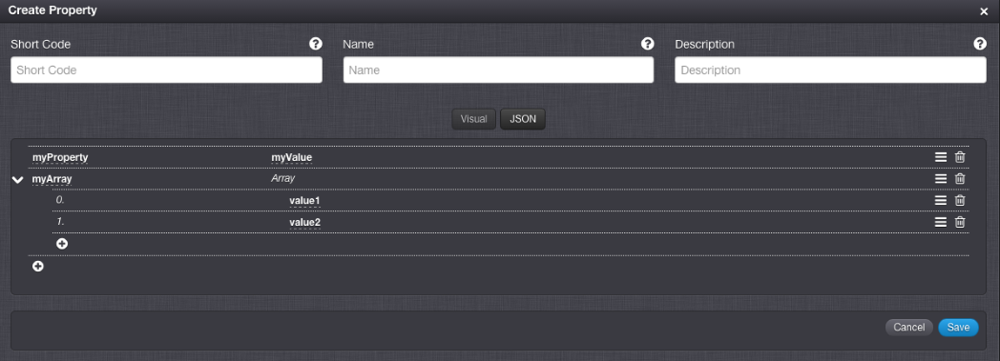
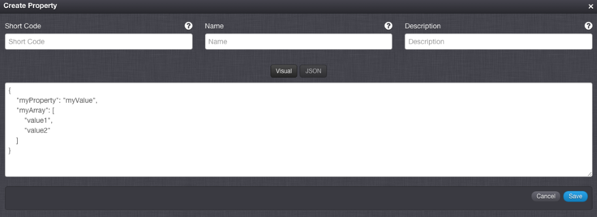
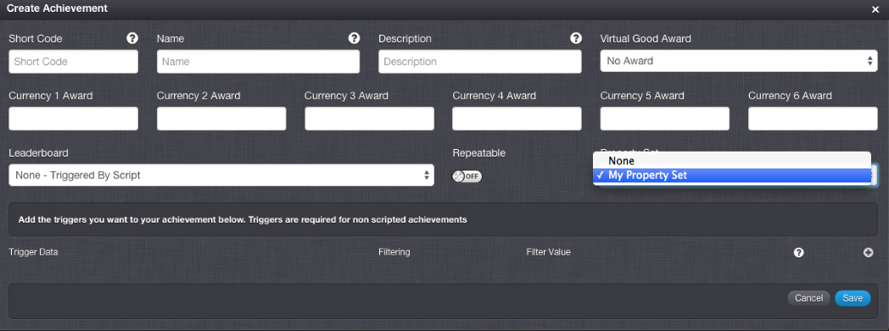

# Segmented Properties

The GameSparks platform exposes various configurable objects to drive further customisation on the platform. Until now, configuration has been driven by platform capabilities and there hasn't been a first-class feature allowing you to provide your own custom configuration, which drives your own custom behaviour for these objects. That's why we've introduced *Properties*. In short, GameSparks Properties provide you the ability to store your own JSON configuration in the Portal, and attach them to GameSparks objects to be surfaced when you are using these objects. You can also access Properties directly, either in Cloud Code or via the web socket API, enabling you to deliver your custom configuration wherever you need it. Let's take a look at how to set up Properties and then how to access those values later on when we want to read them.

# Properties

*1.* Go to the *GameSparks Developer Portal* and under *Configurator*, click *Properties*.

From here you can manage your *Properties* and *Property Sets* \- more on these later. First, let's add a Property.

*2.* Click the icon on the Properties Panel.


In the Create Property form, there are two styles of editor, that can be used to help you build your object.  They can be any valid JSON object, including nested objects and arrays as well.

The *JSON* editor allows you to manually type in your JSON structure whilst offering real-time validation on your input, only allowing you to save if your JSON configuration is correct.

The *Visual* editor provides an error-free method of adding your JSON configuration by entering it in fields and choosing the data types from a select range.

Switching back and forth between the two views will update them accordingly, allowing you to use both views when writing either simpler or more complex parts of your JSON configuration.

*3.* Give your property a Short Code, Name and Description. As usual you'll refer to the Property by its ShortCode when your accessing it programmatically.





Once you're ready, click 'Save'. You can now access this Property using Cloud Code:

```
var property = Spark.getProperties().getProperty("propertyShortCode")

```

Or deliver it to your clients through the web socket API using:

```
{ "@class": ".GetPropertyRequest", "propertyShortCode": "propertyShortCode" }
```

```
{ "@class": ".GetPropertyResponse", "property": { "myProperty": "myValue" }, "scriptData": null }
```

# Property Sets

Now that you've seen how to set up and use a single Property, it's time to start looking at some more powerful ways to use them. A Property Set is a configuration object that lets you pull together different, but related, properties. Let's create a Property Set. Click the __ icon on the Property Set Panel.


Give your Property Set a Short Code, Name and Description. Now let's add some Properties. Click the __ icon at the bottom right.


Give the Property a name. This is how you will access the value of this property from the Property Set. Now select one of your Properties. If you haven't already, create some more Properties and come back and add them to this Property Set. Now that you have a Property Set you can access it in a similar way to a single Property:

```
var propertySet = Spark.getProperties().getPropertySet("propertySetShortCode")
```

Or through the web socket API using:

```
{ "@class": ".GetPropertySetRequest", "propertySetShortCode": "propertySetShortCode" }
```
```
{ "@class": ".GetPropertySetResponse", "propertySet": { "property1": { "myProperty": "myValue" }, }, "scriptData": null }
```

# Linking Property Sets

Once you've created a Property Set you can then attach it to *Leaderboards*, *Achievements* and *Virtual Goods* and it will be available wherever you use those objects. Let's create an Achievement and our Property Set to it. Navigate to 'Achievements' and create a new one. On the Achievements edit page, you'll see a new field: 'Property Set'. From this drop-down you can see all the Property Sets you have available.



Select the one we just created, and click 'Save'. You can now access this Property Set whenever you have access to this Achievement. Within Cloud Code you can access this Achievement using:

```
var achievement = Spark.getConfig().getAchievement("achievementShortCode");
```
and you can now access you Property Set:
```
var propertySet = achievement.getPropertySet();
```
Similarly, a ListAchievementsRequest will now also return the PropertySet associated to each achievement in the response:
```
{ "@class": ".ListAchievementsRequest" }
```

```
{ "@class": ".ListAchievementsResponse", "achievements": [ { "earned": false, "shortCode": "achievementShortCode", "propertySet": { "property1": { "myProperty": "myValue" }, }, "description": "desc", "name": "name" } ], "scriptData": null }

```

# Segmentation

The last thing to mention, and the thing that we think makes Property Sets really powerful, is segmentation. One you have some *Segments* configured within the Portal, whenever you add a Property to a Property Set you also have the option to add segmented values for that property. This makes it trivial for you to deliver different property values to different groups of players. Make sure you have some Segments configured, and let's go back to the Properties page.


Now when you edit our Property Set, by each Property is a __ icon. Clicking this lets you override the value that will be surfaced under each 'Name', depending on the segments of the current player. Now wherever you access that Property Set, if the Player belongs to a segment whose value you've overridden, they will see that overridden value. The obvious example here is delivering language-specific properties to a Player, but the possibilities really are boundless!
