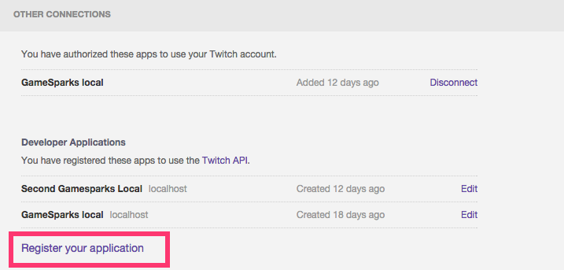
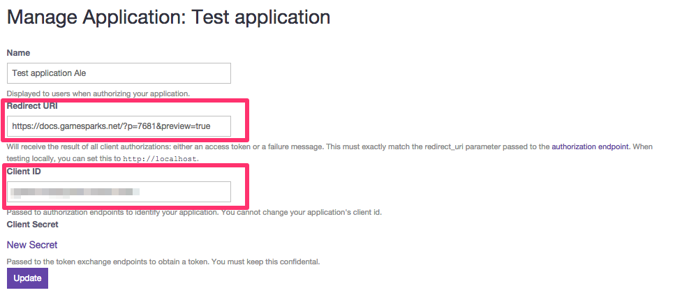

# How to authenticate a player using their Twitch account

Twitch authentication allows you to provide your players with a simple way to sign in with their Twitch account, and allows the GameSparks platform to then use the player’s profile to drive its social features. In this exercise you’ll go through setting up the necessary configuration with Twitch and how you can then use that to connect your players.

## Setting up a Twitch application

Go to [Twitch Connections](http://www.twitch.tv/settings/connections) and sign in. Now click the *Register your application* link at the bottom of the page.



Fill in your application name and the Redirect URI. Twitch implements oAuth 2.0 for authorisation, so this Redirect URI is the one that is involved in the authentication flow. After these details have been filled in, press *Register*.


After the application was created, you will be redirected to a page where you can obtain your client details.



You will need the highlighted details for obtaining an access token from Twitch, that you will later need to pass as parameter to the TwitchConnectRequest.

For more details about the authentication flow, you can refer to the [Twitch documentation](https://github.com/justintv/Twitch-API/blob/master/authentication.md).

## Configuring your GameSparks game

The only configuration you will need to make in the GameSparks portal is whether to save the player's Twitch access token or not. By default, the access token is saved.

 If you want to change this, go to *Configurator→Integrations→Twitch*. You will see the following screen:

 

 You can press Edit and change this setting.

## Make a TwitchConnectRequest

The first thing you need to do is get an access token for your player and your application using the oAuth 2.0 flow. You can use a sample application from [here](/?p=7681). Please make sure that the Redirect URI field matches the Redirect URI set in Twitch.

 In the GameSparks developer portal, click on the *Test Harness* button. Within *Authentication* click *TwitchConnectRequest*.

  At this point, if you are using the sample application all you need to do is copy the request provided. Otherwise, you need to replace the "accessToken" field with your own token. Here is an example of a request:

    ```
    {
     "@class": ".TwitchConnectRequest",
     "accessToken": "6xpdb71zt9a7euk87nm9awksc58gd3",
     "doNotLinkToCurrentPlayer": false,
     "errorOnSwitch": false,
     "switchIfPossible": false,
     "syncDisplayName": false
    }
    ```

And here is an example of a successful response:

    ```
    {
     "@class": ".AuthenticationResponse",
     "authToken": "2636933a-6943-40a5-ba6e-871c7b24a4be",
     "displayName": "alexandracoldea",
     "newPlayer": true,
     "scriptData": null,
     "userId": "5565cd4ae4b01ae882fa82da"
    }
    ```
