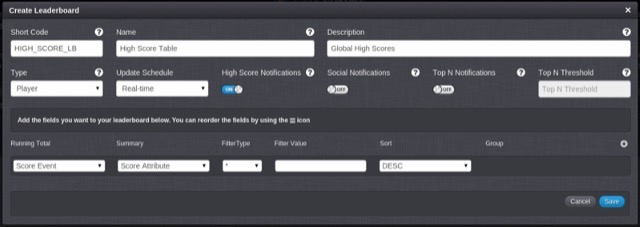
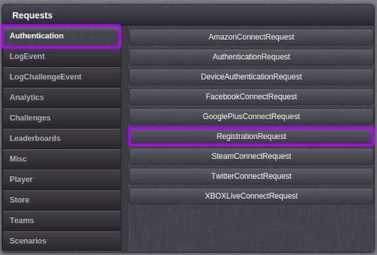
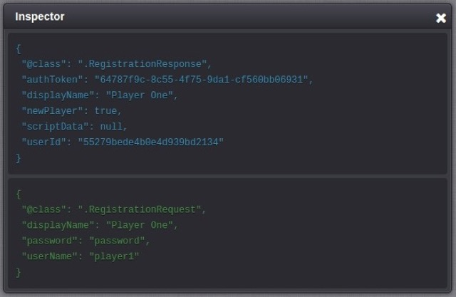
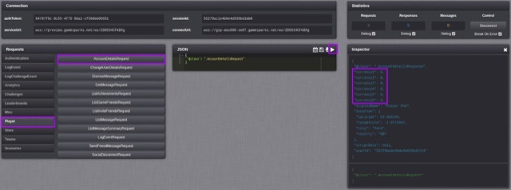

# How to create and award Achievements via a Leaderboard?

[toc]

In this exercise we will create an Achievement that is awarded to a player when they beat their current high score in a game. As well as the Achievement we will need to create an Event and a Leaderboard. We will then test the configuration via the Test Harness.

# Create an Event

In this section we will use the Configurator to create an event that will allow your game code to log a score for the player with the GameSparks platform.

Click the plus icon in the Events section on the Event page to bring up the Create Event dialog.

Now fill in the Event details, and add an attribute row.

Event attribute: The Short Code that you specify will be used as the key for the score that you post into the platform from your game code. Set the Data Type to Number in the case of a high score table because the incoming scores are integers and we want to be able to sort them into numerical order. In the case of a high score table we want to track the highest score posted by each of the game's players hence for Default Calc we choose the option Maximum. This will result in one record per player been stored in the GameSparks platform and that record will contain the player's highest score.

# Create a Leaderboard

In this section we will create a Leaderboard which will arrange all the player's scores in order from highest to lowest.

Create a Leaderboard to represent the game's high score table. Click the plus icon in the Leaderboards section on the Leaderboards page to bring up the Create Leaderboards dialog.

Now fill in the leaderboard's details and click the Save button. Note that you will use the short code when your game code posts scores in to the GameSparks platform.

The Running Total field should be set to the 'Score Event' that we created in the previous section. A Running Total was automatically created when you created the event in the section above.

[Running Totals](..\Social Features\Running Totals.html) are an advanced topic that we don't need to worry about for this exercise. In the Summary field select the event attribute 'Score Attribute'. The Filtering field is set to * (wildcard) so that all values are included. The Filter Value field is not relevant in this exercise. Finally the Sort field is set to DESC (descending) to order the Leaderboard from highest player score to lowest.

# Create an Achievement

In this section we will create an Achievement that can be triggered by a new high score been posted to the Leaderboard. Click the Plus icon in the Achievements section of the Achievements page to bring up the Create Achievement dialog.

Now fill in the Achievement's details and click the Save button.

We set the Leaderboard field to 'High Score Table' for this exercise to link to the Leaderboard we set up in the previous section. We set the Virtual Good Award to 'No Award' for this exercise but if we had Virtual Goods in our game configuration it would be possible to link the Achievement to them via this field. We set Currency awards to 100, this will award 100 of each currency when the player gets this Achievement, finally we add a trigger filtering by >=100, this will award the Achievement when the player scores 100 or more on that Leaderboard.

# Testing the Achievement, Leaderboard and Event with the Test Harness

In this section we will use the Test Harness to register a test player with the preview version of the game, authorise this player and post a new high score to the GameSparks platoform. We will see the JSON requests and responses. We will then request the player's details to see that they have been gifted with some in-game currency.

## Register a test player

Select RegistrationRequest from the Test Harness Authentication menu.

Now change the userName and disaplyName as shown below and send this JSON request to the GameSparks platform by pressing the Play icon.

The Inspector shows the request (in green text) that was sent sent to the GameSparks platofrm via the WebSocket and the response (in blue text).

## Check the Player's current details

Select AccountDetailsRequest from the Test Harness User menu. Examine the currency values for this player in the reponse, notice that they are all zero.

## Log Event

Select the LogEventRequest option on the LogEvent tab. Now select the 'Score Event' menu option from the submenu. Notice that the eventKey field is set to SCORE_EVT which is the short code of the Event that we created at the start of the exercise. Set the SCORE_ATTR value to 100. Click the Play icon to send the request to the GameSparks platform.

In the Inspector you can see the request you sent in green text and the response in blue text. There will also be two Messages an AchievementEarnedMessage and NewHighScoreMessage both are asynchronous messages that the GameSparks platform has sent to this player.

## Check the Player's updated details

Finally repeat the AccountDetailsRequest you performed earlier and notice that the player now has the new Achievement and 100 of each currency.

