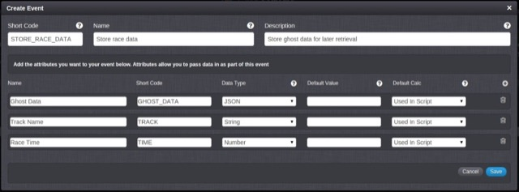
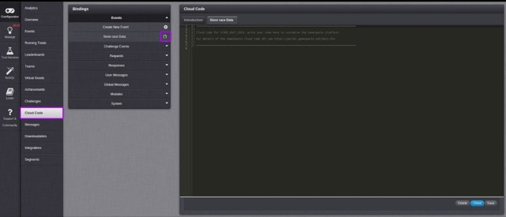

# Sharing Data betwen Players

The GameSparks platform makes it easy for developers to be able to share game data between players. You may want to use this to implement features such as ghost data replay in a racing game or for implementing the sharing of player-created game levels.

In this article, we will examine how to share ghost race data that would allow a game to display another player's previous attempt at a track/level within a simple racing game. To do this, we will create Event and Cloud Code scripts within the GameSparks Developer Portal and then test the configuration using the developer portal Test Harness.

## Key concepts

We will need to create an Event which we can use to post the ghost data into GameSparks when a player completes a race on a given track. This Event will have a Cloud Code script attached to it that stores the ghost data in the Mongo database. A second Event and Cloud Code script will be used to allow the game to query the ghost data collection for a given track and retrieve the player's ghost that represents the fastest time on this track.

For the purpose of this article we will assume that the ghost race data can be represented by the following JSON document. The 'tick' field is the game's animation counter, ''xPosition'' and ''yPosition'' are the coordinates of the player in the game world and the 'heading' field represents the direction that the player is facing within the game world.

```    
[
  {
    "tick":number,
    "xPosition":number,
    "yPosition":number,
    "heading":number
  }
]
```  

## Creating the Event and Cloud Code Script for Storing Ghost Data

*1.* Create an Event that allows the game to submit the JSON ghost race data, the track name and the race time (how long the race took):
* Log in to the GameSparks Portal and navigate to Configurator-> Events.
* Click on the plus icon to add a new Event.
* Set up the Event as follows:



*2.* Create the Cloud Code script to store this data in a MongoDB collection:
* In the Portal navigate to Configurator->Cloud Code->Bindings->Events
* Select the Event we created in the previous section called 'Store race data':



* Copy and paste in the following Cloud Code script in to the JavaScript editor and click the 'Save' button.

```    
  // Get the incoming Event Attributes
  var ghostData = Spark.getData().GHOST_DATA;
  var trackName = Spark.getData().TRACK;
  var timeTaken = Spark.getData().TIME;

  // Create a Mongo collection in which to store the data
  var raceData = Spark.runtimeCollection('raceData');

  // Store the Event data along with the playerId
  var playerId = Spark.getPlayer().getPlayerId();
  raceData.save({"ghostData":ghostData, "trackName":trackName, "timeTaken":timeTaken, "playerId":playerId});
```    

### Testing the configuration

We will now use the Portal Test Harness and NoSQL Explorer to test the configuration and check the results.

*1.* Navigate to the Developer Portal Test Harness and register a player, Player1, by sending a *RegistrationRequest* like this:

```    
  {
   "@class": ".RegistrationRequest",
   "displayName": "Player One",
   "password": "password",
   "userName": "player1"
  }
```

*2.* Now send a 'Store race data' Event by sending the following *LogEventRequest*.

* Note that for simplicity in this example we are only sending an array of ghost data containing three items in this article but in reality this array would be much larger.

```    
  {
   "@class": ".LogEventRequest",
   "eventKey": "STORE_RACE_DATA",
   "GHOST_DATA": [
   {
   "tick": 1,
   "xPosition": 0,
   "yPosition": 0,
   "heading": 90
   },
   {
   "tick": 2,
   "xPosition": 10,
   "yPosition": 0,
   "heading": 92
   },
   {
   "tick": 3,
   "xPosition": 20,
   "yPosition": 0,
   "heading": 94
   }
   ],
   "TRACK": "Track1",
   "TIME": "90"
  }
```
If successful you will have received a LogEventResponse similar to this.

```    
  {
   "@class": ".LogEventResponse",
   "scriptData": null
  }
```

*3.* Navigate to the Developer Portal NoSQL Explorer and select the 'script.raceData' collection from the collection drop down then press the 'Submit' button. You will see the document that was saved as a result of our Cloud Code script executing when the Event was received. You can click on the document to expand, edit or delete it.


*4.* Repeat the sending of the 'Store race data' Event but change the data each time, especially the TIME field. This will result in several documents being stored in MongoDB for Player1.

*5.* Now register a second player, Player2, by sending a *RegistrationRequest* and repeat the sending of the 'Store race data' Event. Change the data each time, especially the TIME field. This will result in several documents being stored in MongoDB for Player2.

## Creating the Event and Cloud Code Script for Retrieving Ghost Data

Now we need to create an Event that allows the game to retrieve the fastest player's JSON ghost race data for a given track name.

*1.* Log in to the GameSparks Portal and navigate to Configurator-> Events.

*2.* Click on the plus icon to add a new Event.

*3.* Set up the Event as follows:


Next we create the Cloud Code script to retrieve the data from the MongoDB collection and return it in the LogEventResponse.

*1.* In the Portal navigate to Configurator->Cloud Code->Bindings->Events.

*2.* Select the Event we created in the previous section called 'Get race data'.

*3.* Copy and paste the following JavaScript code into it:

```    
  // Get the incoming Event Attribute
  var trackName = Spark.getData().TRACK;

  // Find the fastest race data for the given track
  var fastestRaceData = Spark.runtimeCollection('raceData').find({"trackName":trackName}).sort({"timeTaken":1}).limit(1);

  // Return the race data in the response
  Spark.setScriptData("fastestRaceData", fastestRaceData);

```
### Testing the configuration

We will now use the Portal Test Harness to test the configuration and check the results.

*1.* Navigate to the Developer Portal Test Harness and send an AuthenticationRequest for Player2 like this.

```    
  {
   "@class": ".AuthenticationRequest",
   "userName": "player2",
   "password": "password"
  }
```

*2.* Now send a 'Retrieve race data' Event for track 1 with this request.

```    
  {
   "@class": ".LogEventRequest",
   "eventKey": "GET_RACE_DATA",
   "TRACK": "Track1"
  }

```

The response will look similar to this and should be the fastest 'timeTaken' document from the collection for the given track.

```    
      {
      "@class": ".LogEventResponse",
      "scriptData": {
      "fastestRaceData": [
      {
      "_id": {
       "$oid": "537cc256e4b0e44047e56100"
      },
      "ghostData": [
       {
        "tick": 1,
        "xPosition": 0,
        "yPosition": 0,
        "heading": 90
       },
       {
        "tick": 2,
        "xPosition": 10,
        "yPosition": 0,
        "heading": 92
       },
       {
        "tick": 3,
        "xPosition": 20,
        "yPosition": 0,
        "heading": 94
       }
      ],
      "trackName": "Track1",
      "timeTaken": "90",
      "playerId": "537cc064e4b0e44047e554d8"
      }
    ]
  }
}

```
