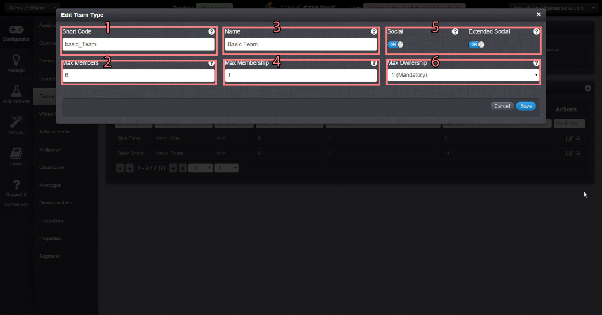

# Setting up a Team/Clan/Party including Chat

## Introduction

GameSparks allows your players to easily create teams which act as parties in which players can join and quickly send chat messages to each other, pass information between each other and submit a score as a team instead as separate entities which would come in handy in team based challenges or games. This system can be used to for parties, Clans, teams etc and is very easy to set up, this tutorial will show you how to set up a Team through owner and have another player join and chat between each other in the test harness.  

### Setting up a Team type

To set up a team type, head to the Teams tab in the configurator and click the 'Add new' button. You'll be prompted with a screen to configure your Team type, in this screen you'll find:

  1. ShortCode - The reference to this type in code.
  2. Max Members - How many members are allowed to belong to this team. 0 would declare no limit.
  3. Name - The name of your function for your reference.
  4. Max Membership - How many teams of this type a player can join simultaneously.
  5. Social options - If enabled, these options will regard the owner as a friend of the player joining or/and other players already in the Team.
  6. Max Ownership - How many teams of the same type can the owner have simultaneously.
Once you're happy with your configuration. That's all you have to do to create a Team type for your players to use. More details on team type creation and management, click [here](/Documentation/Configurator/Teams.md).


 

### Creating a Team

Once the Team type has been created players can create instances or Teams that fall under that category or type that follows the configurations set. Players can use the 'Create Team' request to create a team. As long as the player inputs the Team type they wish to use and the Team name that will be enough to create a Team. However the player can also specify a unique ID for their Team which makes it easier to find and search for, if none is stated then GameSparks auto generates a unique string ID.  The response will come back including data about the the owner, the Team ID, Team type and members (Currently only the owner). You will allow your players to execute this request from the game using the SDK's API(CreateTeamRequest).

```
    Request default:
    {
     "@class": ".CreateTeamRequest",
     "teamId": "",
     "teamName": "",
     "teamType": ""
    }
    Request example:
    {
     "@class": ".CreateTeamRequest",
     "teamId": "GSTeam",
     "teamName": "GSTeam",
     "teamType": "basic_Team"
    }

    Response:
    {
     "@class": ".CreateTeamResponse",
     "scriptData": null,
     "owner": {
      "online": true,
      "id": "569fa047e4b0504a803a60ad",
      "displayName": "GSTTwo"
     },
     "teamId": "GSTeam",
     "teamType": "basic_Team",
     "members": [
      {
       "online": true,
       "id": "569fa047e4b0504a803a60ad",
       "displayName": "GSTTwo"
      }
     ]
    }
```


###

### Joining a Team

Once the Team has been created other players can join it by simply using the 'JoinTeam' request and passing in the teamID or OwnerID.Once the response comes back it will include the data for the owner, team details and members which will now be the owner and the player that sent the join request.

```
    Request default:
    {
     "@class": ".JoinTeamRequest",
     "ownerId": "",
     "teamId": "",
     "teamType": ""
    }

    Request example:
    {
     "@class": ".JoinTeamRequest",
     "teamId": "GSTeam"
    }

    Response:
    {
     "@class": ".JoinTeamResponse",
     "scriptData": null,
     "owner": {
      "online": false,
      "id": "569fa047e4b0504a803a60ad",
      "displayName": "GSTTwo"
     },
     "teamId": "GSTeam",
     "teamType": "basic_Team",
     "members": [
      {
       "online": false,
       "id": "569fa047e4b0504a803a60ad",
       "displayName": "GSTTwo"
      },
      {
       "online": true,
       "id": "569fa02ae4b0504a803a5e21",
       "displayName": "GSTOne"
      }
     ]
    }
```


###

### Team Chat

GameSparks allows players to send messages to the team easily using the native request 'SendTeamChatMessage' request which sends a message to every player that is part of the Team. When the message is sent, it can be caught by listeners in the SDK and outputted to the player easily as it contains data about the sender, the Team, the message and Team owner ID.


```
    Request example:
    {
     "@class": ".SendTeamChatMessageRequest",
     "message": "Hi guys!",
     "teamId": "GSTeam"
    }

    Message:

    {
     "@class": ".TeamChatMessage",
     "messageId": "569fbbd8e4b04706471c9f84",
     "notification": true,
     "summary": "TeamChatMessage",
     "message": "Hi guys!",
     "chatMessageId": "569fbbd8e4b04706471c9f83",
     "teamType": "basic_Team",
     "teamId": "GSTeam",
     "ownerId": "569fa047e4b0504a803a60ad",
     "fromId": "569fa047e4b0504a803a60ad",
     "who": "GSTTwo",
     "playerId": "569fa047e4b0504a803a60ad"
    }
```
