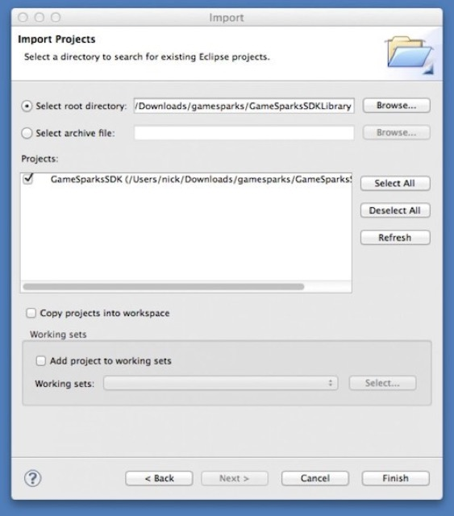
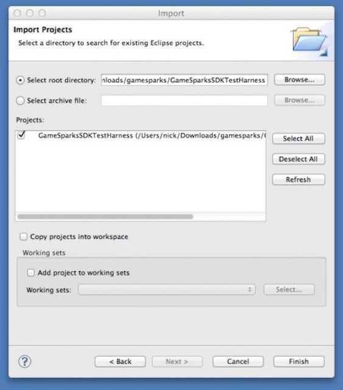
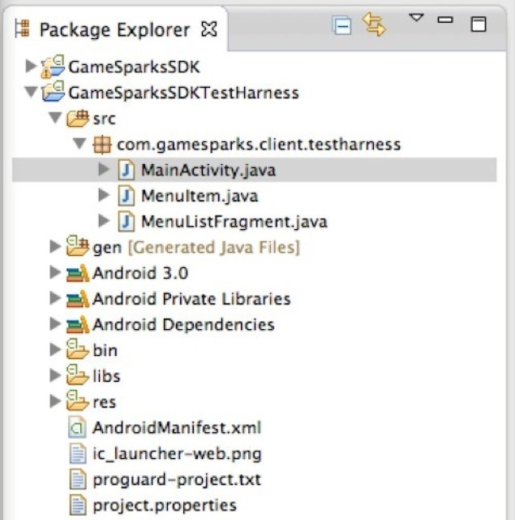
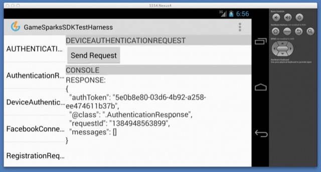
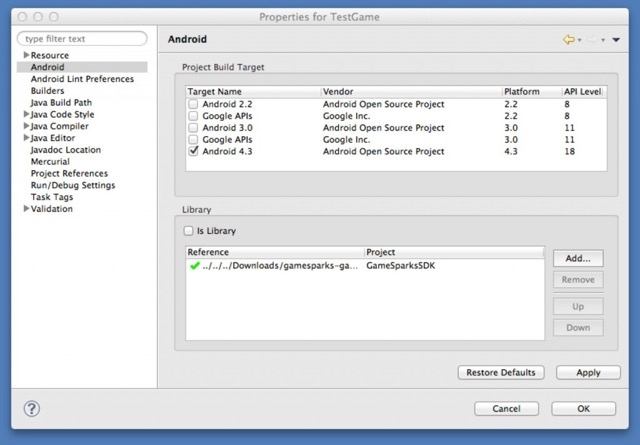

# Android SDK Setup

The steps described below detail how to setup the GameSparks Android SDK and Test Harness application in the Eclipse Android Developer Tools IDE. You will need to have already setup Eclipse ADT with the Android SDK (the GameSparks Android SDK requires API 8 or greater and the Test Harness requires API 11 or greater) and have a working emulator setup or a real device on which to run the Test Harness application.

## Download the SDK

[wpdm_file id=3]

## Import the GameSparks Android SDK library into Eclipse ADT

Go to the menu option, *File->Import then select General->Existing Projects into Workspace.* Browse to the directory where you unzipped the SDK bundle. Select the GameSparksSDKLibrary directory.



Click *Finish* to import the project in to your workspace. If there are build errors in the Eclipse Problems view then select *Project->Clean->Clean All Projects* and click *OK*. The GameSparksSDKLibrary supports Android 2.2 (API 8) and above.

## Import the GameSparks Android SDK Test Harness project into ADT

Go to the menu option, *File->Import then select General->Existing Projects into Workspace.* Browse to the directory where you unzipped the SDK bundle. Select the GameSparksSDKTestHarness directory.



Click Finish to import the project in to your workspace. The GameSparksSDKTestHarness supports Android 3.0 (API 11) and above.

## Configure the Test Harness to use you game’s credentials

Use the GameSparks Developer portal, *Configurator->Overview* to find your game API Secret.


Use the GameSparks Developer portal, *Test Harness* to find your game service URL.


Locate the MainActivity.java class in the GameSparksSDKTestHarness project.



Edit the two static constants at the top of the file to use your game’s Service URL and API Secret.

```
private static final String GAMESPARKS_SERVICE_URL = "<Enter you service URL here>";
private static final String GAMESPARKS_API_SECRET = "<Enter your game API secret here>";
```

## Testing the Configuration

Right click on the GameSparksSDKTestHarness project and select *Run As->Android Application*. Select the [DeviceAuthenticationRequest](/API Documentation/Request API/Authentication/DeviceAuthenticationRequest.md) item in the Advanced section of the left hand menu and press the Send button.



If all is well you should see a response like the one above with a valid authToken returned from the server. You can now try out any of the other GameSparks API methods that the test harness supports.

## Next Steps

### Configuring your own game to use the GameSparks SDK library

Given that you have you own game project in the Eclipse ADT IDE, right click on the project and select Properties then select the Android. In the Library section click the Add button and select the GameSparksSDKLibrary, click OK to add the SDK as a library reference to your project. Click OK to close the properties dialog.



### Using GameSparks SDK API in your game

Add the following permissions to your game’s AndroidManifest.xml file.

```
    <uses-permission android:name="android.permission.INTERNET" />
    <uses-permission android:name="android.permission.ACCESS_NETWORK_STATE" />
```

In your main Activity use the GameSparksAndroidApi class’s static initialise method passing in your game’s Service URL and API Secret. Then call the getInstance method to obtain a reference to the API instance. Finally register as a listener with the API if you want your game to receive asynchronous messages from the GameSparks platform for example if your game uses multiplayer Challenges. Notice that you must implement the MessageReceivedListener interface to achieve this.

```
    private static final String GAMESPARKS_SERVICE_URL = "";
    private static final String GAMESPARKS_API_SECRET = "";

    private GameSparksAndroidApi gamesparksApi;

      public class MainActivity extends Activity implements MessageRecievedListener {
        @Override
        public void onCreate(Bundle savedInstanceState) {

          GameSparksAndroidApi.initialise(GAMESPARKS_SERVICE_URL, GAMESPARKS_API_SECRET, getApplication());
          gamesparksApi = GameSparksAndroidApi.getInstance();
          gamesparksApi.setMessageRecievedListener(this);
        }

        @Override
        public void onMessage(Map<string, object> message) {
          // Handle the server message here
        }
    }
```

Once initialised in this way the GameSparksAndroidApi can be used anywhere in your game to communicate with the GameSparks platform. The methods in GSApi (which is the base class of GameSparksAndroidApi can be used as convenience methods to call any of the GameSparks service API. For example this is how to synchronously call the DeviceAuthenticationRequest API method.

```
    Map<string, object> response = gamesparksApi.deviceAuthenticationRequest().send();
```

To make the an call asynchronous and have the response update an Activity’s UI you must use the sendAsync method and pass in an Activity and an implementation of the GSAndroidRunnableTask class. The GSAndroidRunnableTask that you define will be passed to the Activity via the Activity.runOnUiThread method when the response is received from the GameSparks platform.

```
    ((GSAndroidSender)gamesparksApi.deviceAuthenticationRequest()).sendAsync(myActivity, new GSAndroidRunnableTask() {
      @Override
      public void run() {
        updateMyActivityUI(getData());
      }
    });
```

To make the an call asynchronous in cases where you do not need the SDK to call Activity.runOnUiThread you must use the sendBackground method like this and pass in an implementation of the GSListener interface.

```
    gamesparksApi.deviceAuthenticationRequest().sendBackground(new GSListener() {
      @Override
      public void onMessage(Map<string, object> responseData) {
        updateMyBackgroundThing(responseData);
      }
    });
```

You can also form your own requests rather than using the convenience methods. Simple create a Map containing the necessary API data like this.

```
    Map<string, object> data = new HashMap<string, object>();
    data.put("@class", ".RegistrationRequest");
    data.put("userName", "nick");
    data.put("password", "g4mePa55");
    data.put("displayName", "Retro Dude");
    Map<string, object> result = gamesparksApi.send(data);
```

See the GSApi for further examples of GameSparks API calls.

### Hooking into Android lifecycle callbacks

Add the GSApi onPause and onResume calls to your main activity’s corresponding methods in order to put the SDK to sleep (and end the current session for reporting purposes) and wake it up again when these Android lifecycle events occur.

```
@Override
protected void onPause() {
  super.onPause();
  gamesparksApi.onPause();
}

@Override
protected void onResume() {
  super.onResume();
  gamesparksApi.onResume();
}
```
